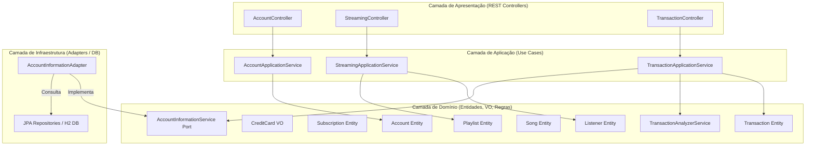

# Music Streamer & Transaction Authorization API

Este projeto é o Assessment (AT) desenvolvido para a disciplina de **Design Patterns e Domain-Driven Design (DDD) com Java [26E2_2]**. Ele simula uma API para uma plataforma de streaming de música integrada com um sistema de autorização de transações financeiras com validações antifraude.

A solução foi estruturada seguindo os conceitos de **DDD**, **Arquitetura Limpa (Clean Architecture)** e **Arquitetura Hexagonal (Ports & Adapters)**, com foco no desacoplamento entre as regras de negócio de diferentes domínios e a camada de infraestrutura.

---

## Estrutura e Arquitetura do Projeto

O sistema é dividido em Contextos Delimitados (Bounded Contexts) bem definidos, cada um com suas próprias camadas de Domínio, Aplicação e Apresentação:



### Contextos Delimitados (Bounded Contexts)

1. **account (Contexto de Contas e Assinaturas)**:
   - Gerencia o cadastro de usuários, cartões de crédito e assinaturas (Planos FREE e PREMIUM).
   - Regra de Negócio: Um usuário deve possuir um cartão de crédito válido no cadastro e pode ter apenas uma assinatura ativa por vez.

2. **streaming (Contexto de Música e Playlists)**:
   - Controla os ouvintes (Listener), suas músicas favoritas e suas playlists personalizadas.
   - Contém uma carga inicial de dados (DatabaseSeeder) que pré-popula músicas prontas para uso.

3. **transaction (Contexto de Transações e Antifraude)**:
   - Analisa e autoriza transações de cartão de crédito associadas às contas criadas.
   - Integração entre Contextos: O contexto de Transações precisa verificar se o cartão de um cliente está ativo. Isso é feito de forma desacoplada através da porta AccountInformationService (no Domínio) e do adaptador AccountInformationAdapter (na Infraestrutura), que consulta o repositório de Contas.

---

## Regras do Analisador de Transações (Antifraude)

As transações são avaliadas pelo TransactionAnalyzerService com base em três regras estritas de segurança:

1. **Cartão Ativo**: A transação será rejeitada com a mensagem "cartão não ativo" caso o cartão de crédito associado à conta não esteja ativo.
2. **Alta Frequência em Pequeno Intervalo**: Bloqueia a transação caso o usuário faça 3 ou mais transações nos últimos 2 minutos. A rejeição retorna "alta-frequência-pequeno-intervalo".
3. **Transação Duplicada**: Bloqueia a transação se o usuário tentar fazer duas transações similares (mesmo estabelecimento/merchant e mesmo valor) nos últimos 2 minutos. A rejeição retorna "transação duplicada".

---

## Como Executar o Projeto

### Pré-requisitos
- Java 21 instalado.
- Maven (utiliza o wrapper ./mvnw incluso no projeto).

### Execução local
Na pasta raiz do projeto, execute o comando:

```bash
# Windows
./mvnw spring-boot:run

# Linux / macOS
./mvnw spring-boot:run
```

A aplicação estará disponível em http://localhost:8080.

### Execução dos Testes
Para rodar os testes unitários das regras de negócio do analisador de transações:

```bash
./mvnw test
```

Os testes estão localizados na classe TransactionAnalyzerServiceTest e cobrem todas as regras antifraude descritas.

---

## Guia de Endpoints da API

### 1. Contexto de Conta (/api/accounts)

| Método | Endpoint | Descrição | Exemplo de Payload / Parâmetros |
| :--- | :--- | :--- | :--- |
| **POST** | `/api/accounts` | Cria um novo usuário com cartão de crédito | `{ "name": "Marcus Boni", "email": "marcus@email.com", "cardNumber": "1234-5678-9012-3456", "cardLimit": "5000", "cardActive": true }` |
| **POST** | `/api/accounts/{id}/subscriptions` | Inscreve a conta em um plano (FREE ou PREMIUM) | Parâmetro na query: `?plan=PREMIUM` |

### 2. Contexto de Streaming (/api/streaming)

| Método | Endpoint | Descrição | Parâmetros / Observações |
| :--- | :--- | :--- | :--- |
| **POST** | `/api/streaming/listeners/{listenerId}/favorites/{songId}` | Adiciona uma música aos favoritos do ouvinte | O listenerId é o mesmo id gerado na criação da conta |
| **POST** | `/api/streaming/listeners/{listenerId}/playlists` | Cria uma playlist para o ouvinte | Parâmetro na query: `?name=Minha Playlist Favorita` |
| **POST** | `/api/streaming/playlists/{playlistId}/songs/{songId}` | Adiciona uma música a uma playlist específica | IDs das músicas já populadas podem ser usados |

> [!NOTE]
> Músicas pré-semeadas na base de dados (DatabaseSeeder) para testes imediatos:
> - Bohemian Rhapsody (Queen): `a5f3cbda-3ff6-455b-b9ab-76f5b9d3bdf9`
> - Imagine (John Lennon): `afcafeaa-2a7e-4b41-9f56-c9d542e30b78`

### 3. Contexto de Transações (/api/transactions)

| Método | Endpoint | Descrição | Exemplo de Payload |
| :--- | :--- | :--- | :--- |
| **POST** | `/api/transactions/authorize` | Solicita autorização de uma nova transação financeira | `{ "accountId": "UUID-da-conta-criada", "merchantName": "Spotify", "amount": 19.90 }` |

---

## Como Testar com Postman ou Insomnia

Para testar o funcionamento da API utilizando ferramentas como Postman ou Insomnia, você pode criar uma nova coleção local apontando para `http://localhost:8080` e utilizar os corpos das requisições documentados no Guia de Endpoints.

### Fluxo de Teste Sugerido

1. **Criação de Conta**:
   - Faça uma requisição **POST** para `/api/accounts` com o JSON do cadastro do usuário.
   - Verifique o cabeçalho de resposta `Location` (por exemplo: `/api/accounts/a5f3cbda-...`). Copie o ID gerado no final do caminho. Ele representará o seu `accountId` nos próximos passos.

2. **Assinatura do Plano**:
   - Faça uma requisição **POST** para `/api/accounts/{accountId}/subscriptions?plan=PREMIUM` utilizando o ID copiado.

3. **Criação de Playlist**:
   - Faça uma requisição **POST** para `/api/streaming/listeners/{accountId}/playlists?name=Minha Playlist Favorita`.
   - Copie o ID da playlist gerada através do cabeçalho `Location` retornado na resposta.

4. **Adicionar Músicas à Playlist**:
   - Faça um **POST** para `/api/streaming/playlists/{playlistId}/songs/a5f3cbda-3ff6-455b-b9ab-76f5b9d3bdf9` usando o ID da playlist e um ID de música pré-populado.

5. **Testar as Regras Antifraude (Transações)**:
   - Faça uma requisição **POST** para `/api/transactions/authorize` com o JSON contendo o `accountId`.
   - **Caso de Sucesso**: Envie uma transação normal. Ela deverá retornar sucesso com o ID da transação.
   - **Teste de Alta Frequência**: Envie 4 transações consecutivas rapidamente. A partir da quarta tentativa, ela deverá retornar rejeitada com a mensagem `"alta-frequência-pequeno-intervalo"`.
   - **Teste de Duplicidade**: Envie duas transações idênticas (mesmo merchant e mesmo valor) em menos de 2 minutos. A segunda tentativa deverá retornar rejeitada com a mensagem `"transação duplicada"`.
   - **Teste de Cartão Inativo**: Crie uma conta com `"cardActive": false` e tente realizar uma transação para ela. A transação deverá ser rejeitada com a mensagem `"cartão não ativo"`.

*Obs: Para referência rápida das requisições brutas (raw requests), os payloads também encontram-se estruturados no arquivo `api-tests.http` na raiz do projeto.*
