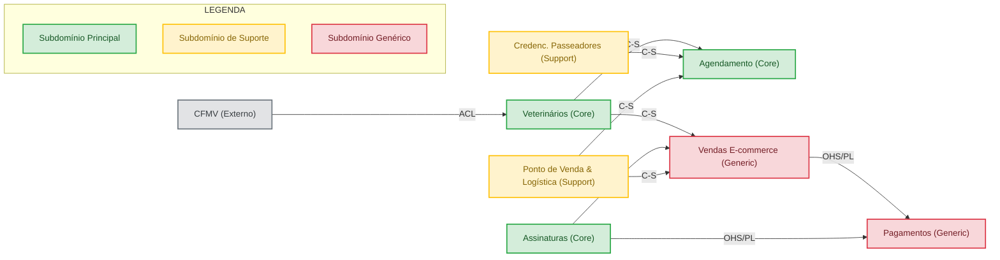

# TP3 - Design Estratégico DDD: Foco em Gestão de Veterinários (Pet Friends)

Este documento apresenta a minha entrega do **Teste de Performance 3 (TP3)** para a disciplina de **Design Patterns e Domain-Driven Design (DDD) com Java**. O foco deste meu estudo é o design estratégico de um ecossistema complexo sob a minha ótica no contexto de **Gestão de Veterinários** da rede **Pet Friends**.

---

## 1. Introdução ao Cenário Pet Friends

A **Pet Friends** é uma grande rede de franquias de pet shops no Brasil, contando com mais de 1000 lojas físicas estruturadas por regiões geográficas exclusivas (sem sobreposição de CEPs). Além da venda física e e-commerce de produtos (incluindo modelos de assinatura recorrente), a Pet Friends oferece serviços agendados como banho, tosa, passeios (dog walking) e consultas veterinárias integradas com o sistema de validação profissional do Conselho Federal de Medicina Veterinária (CFMV).

Como responsável pelo desenvolvimento do contexto de **Gestão de Veterinários**, meu objetivo é modelar estrategicamente as fronteiras do meu domínio (Bounded Contexts), classificar a criticidade de cada subdomínio de negócio e desenhar o meu **Mapa de Contexto (Context Map)** focado em integrações eficientes, de baixo acoplamento e resiliência.

---

## 2. Bounded Contexts (Contextos Delimitados) da Empresa

Para organizar o desenvolvimento e delimitar as responsabilidades no modelo de domínio da Pet Friends, dividi o sistema nos seguintes **Bounded Contexts**:

### 1. Contexto de Gestão de Veterinários (`Veterinary Management Context`)
* **Escopo:** Cadastro completo dos profissionais veterinários (dados pessoais, especialidades, conselho regional/CRMV) e emissão de receitas digitais para medicamentos controlados.
* **Linguagem Ubíqua (Termos Chave):** `Veterinário`, `CRMV`, `Especialidade`, `Ficha Cadastral`, `Receita Médica (Prescription)`.

### 2. Contexto de Agendamento (`Scheduling/Booking Context`)
* **Escopo:** Gestão unificada das agendas e alocação de horários. Controla os slots de tempo de atendimento para banho/tosa, a agenda de horários livres dos veterinários e a disponibilidade declarada de passeadores.
* **Linguagem Ubíqua (Termos Chave):** `Slot de Tempo`, `Agendamento (Booking)`, `Reserva`, `Disponibilidade`, `Cancelamento`.

### 3. Contexto de Credenciamento de Passeadores (`Walker Accreditation Context`)
* **Escopo:** Cadastro, ficha de informações técnicas e avaliações de passeadores (dog walkers) avulsos na região de atendimento de cada loja.
* **Linguagem Ubíqua (Termos Chave):** `Passeador (Walker)`, `Avaliação (Rating)`, `Porte Suportado`, `Status de Credenciamento`.

### 4. Contexto de Assinaturas (`Subscription Context`)
* **Escopo:** Gestão do modelo recorrente de ração e produtos. Permite configurar o pacote por tipo de animal, periodicidade de entrega e geração automática de novos pedidos.
* **Linguagem Ubíqua (Termos Chave):** `Assinatura (Subscription)`, `Frequência de Entrega`, `Pacote de Ração`, `Pedido Recorrente`.

### 5. Contexto de Vendas e E-commerce (`Sales & E-commerce Context`)
* **Escopo:** Busca de produtos, gerenciamento de carrinho de compras, checkout, processamento do pedido de produtos gerais e validação de medicamentos que exigem receita médica digital.
* **Linguagem Ubíqua (Termos Chave):** `Carrinho de Compras (Cart)`, `Catálogo de Produtos`, `Pedido (Order)`, `Remédio Controlado`, `Checkout`.

### 6. Contexto de Ponto de Venda e Logística (`POS & Logistics Context`)
* **Escopo:** Gerenciamento geográfico das 1041 lojas. Mapeia a lista de CEPs atendidos por cada franquia e decide se um pedido será retirado na loja local ou entregue em domicílio.
* **Linguagem Ubíqua (Termos Chave):** `Loja Regional`, `Lista de CEPs`, `Entrega Domiciliar`, `Retirada (Pick-up)`.

### 7. Contexto de Pagamentos (`Payment Context`)
* **Escopo:** Processamento financeiro integrado com gateways externos para compras pontuais, faturamento de planos de serviços mensais e assinaturas.
* **Linguagem Ubíqua (Termos Chave):** `Transação`, `Método de Pagamento`, `Faturamento (Billing)`, `Gateway de Pagamento`.

### 8. Contexto Externo do CFMV (`CFMV External Context`)
* **Escopo:** Sistema público pertencente ao Conselho Federal de Medicina Veterinária, utilizado para atestar se um determinado CRMV fornecido no cadastro está ativo e regularizado.
* **Linguagem Ubíqua (Termos Chave):** `Consulta de Profissional`, `Status Cadastral CFMV`, `Regularidade`.

---

## 3. Classificação e Justificativa dos Subdomínios

Cada contexto delimita um subdomínio de negócio. Abaixo, classifiquei estes subdomínios em termos de valor estratégico e diferenciação competitiva para a Pet Friends:

| Subdomínio / Contexto | Classificação | Minha Justificativa de Negócio |
| :--- | :---: | :--- |
| **Gestão de Veterinários** | **Principal (Core Domain)** | Essencial para a estratégia de serviços especializados de saúde da rede. A validação correta e integração com a venda de remédios controlados trazem confiabilidade e responsabilidade médica que diferenciam a Pet Friends de pet shops comuns. |
| **Agendamento de Serviços** | **Principal (Core Domain)** | A conveniência de agendar consultas, banho, tosa e passeios de forma integrada e otimizada por geolocalização é um pilar de experiência do cliente de alto valor, retendo o tutor no ecossistema da marca. |
| **Assinatura de Ração e Produtos** | **Principal (Core Domain)** | Indicado expressamente como o grande diferencial competitivo da marca. A recorrência de receita e fidelização do cliente através de um pacote personalizado representam o coração financeiro do e-commerce da Pet Friends. |
| **Credenciamento de Passeadores** | **Suporte (Supporting)** | Necessário para alimentar o banco de profissionais aptos a passear com os cães, mas a funcionalidade de cadastro em si não confere vantagem competitiva exclusiva; funciona apenas para apoiar o subdomínio principal de Agendamento. |
| **Ponto de Venda e Logística** | **Suporte (Supporting)** | O mapeamento de CEPs sem sobreposição apoia a operação logística e garante que a loja correta receba o pedido. É vital para o funcionamento físico, mas não é onde reside a inovação de negócio. |
| **Venda de Produtos (E-commerce)** | **Genérico (Generic)** | O fluxo tradicional de e-commerce (buscar, adicionar ao carrinho, pagar) é um padrão de mercado consolidado. Pode ser resolvido por softwares prontos de prateleira (SaaS) sem necessidade de reengenharia proprietária complexa. |
| **Pagamentos** | **Genérico (Generic)** | Necessário para processar transações financeiras. É resolvido via integração padronizada com gateways e adquirentes do mercado (ex: Stripe, PagSeguro). |
| **Validação com CFMV (Externo)** | **Genérico (Generic)** | Um serviço externo de conformidade regulatória. Trata-se de uma consulta externa de dados governamentais sem lógica interna diferenciada. |

---

## 4. Esboço do Mapa de Contexto (Context Map)

Apresento abaixo o esboço do meu **Mapa de Contexto** da Pet Friends. Conforme as diretrizes arquiteturais do curso, apliquei o relacionamento **Fornecedor-Cliente (Customer-Supplier)** prioritariamente nas integrações internas para evidenciar a cooperação lógica entre os times.

Para evitar qualquer tipo de sobreposição visual nos textos das setas e garantir legibilidade perfeita nas plataformas de visualização do GitHub, adotei uma orientação horizontal (`graph LR`) e codifiquei os tipos de acoplamento com siglas curtas explicadas logo abaixo:



### Convenção e Legenda das Relações
* **Direção da Seta (Upstream → Downstream):** Todas as setas apontam do **Upstream (U)** (Fornecedor da informação/serviço) para o **Downstream (D)** (Consumidor impactado por mudanças).
* **C-S (Customer-Supplier / Fornecedor-Cliente):** Indica uma relação cooperativa de equipe onde as entregas e testes do downstream são alinhados e priorizados pelo upstream.
* **ACL (Anti-Corruption Layer / Camada Anti-Corrupção):** Indica que o Downstream (Veterinários) implementa um adaptador para traduzir o modelo de dados do Upstream (CFMV), protegendo seu próprio domínio limpo de poluições externas.
* **OHS/PL (Open Host Service / Published Language):** Indica que o Upstream (Pagamentos) fornece um serviço público aberto e estável com uma linguagem de integração padronizada e estável.

---

## 5. Estratégias de Comunicação e Integração para o Contexto de Veterinários

Como o meu contexto de **Gestão de Veterinários** interage diretamente com três fronteiras principais (Agendamento, E-commerce de Vendas/Remédios e CFMV Externo), adotei as seguintes estratégias técnicas e de comunicação para garantir resiliência e baixo acoplamento:

### A. Veterinários → Agendamento (Consulta de Profissional e Escala)
* **Padrão de Relação:** Fornecedor-Cliente (Customer-Supplier).
* **Integração Síncrona (REST/gRPC):**
  * **Objetivo:** O Agendamento faz chamadas síncronas de leitura HTTP GET ou gRPC para buscar a ficha detalhada e especialidades de um veterinário específico na hora de exibir as opções de agendamento na interface do cliente.
  * **Resiliência:** Utilizo *Circuit Breakers* (via Resilience4j) no microsserviço de Agendamento para evitar lentidão em cascata caso o microsserviço de Veterinários passe por instabilidade.
* **Integração Assíncrona (Eventos de Domínio via Message Broker):**
  * **Objetivo:** Sempre que um veterinário tiver sua escala cadastrada, for inativado ou mudar de especialidade, o contexto de Veterinários publica um evento (ex: `VeterinarioEscalaAlteradaEvent` ou `VeterinarioInativadoEvent`).
  * **Implementação:** O contexto de Agendamento consome esses eventos e atualiza sua base de dados local de slots. Isso desacopla os microsserviços, permitindo que a agenda funcione mesmo se o serviço de Veterinários estiver temporariamente offline.

### B. Veterinários → Vendas/E-commerce (Validação de Receitas de Remédios Controlados)
* **Padrão de Relação:** Fornecedor-Cliente (Customer-Supplier).
* **Integração Síncrona (REST/HTTP):**
  * **Objetivo:** Um medicamento do tipo "Remédio Controlado" só pode ter seu checkout concluído se associado a uma receita médica válida emitida por um veterinário cadastrado no sistema.
  * **Implementação:** No fechamento da compra de um remédio controlado, o microsserviço de Vendas faz um POST síncrono para o endpoint `/api/receitas/validar` de Veterinários, enviando o ID da receita e o CPF do cliente.
  * **Resiliência:** Se a API de validação síncrona de receitas falhar (timeout/erro 5xx), o checkout do medicamento é retido temporariamente com uma mensagem explicativa para o cliente tentar novamente, garantindo a conformidade legal.

### C. CFMV (Sistema Externo) → Veterinários (Validação de CRMV)
* **Padrão de Relação:** Upstream/Downstream com Camada Anti-Corrupção (ACL).
* **Integração Síncrona (REST/SOAP HTTPS):**
  * **Objetivo:** No cadastramento de um novo veterinário, a Pet Friends valida em tempo real se o profissional está regularizado junto ao CFMV.
  * **Implementação da ACL:** Criei um módulo adaptador (ACL) no microsserviço de Veterinários. Este adaptador consome o serviço do CFMV, valida a assinatura e traduz o resultado para o modelo interno da Pet Friends:
    ```java
    // Tradução da ACL na prática:
    public StatusVeterinario traduzirStatusCFMV(CFMVResponse response) {
        if ("REG-ATV-100".equals(response.getCodigoStatus())) {
            return StatusVeterinario.ATIVO;
        }
        return StatusVeterinario.INATIVO;
    }
    ```
  * **Resiliência:** Como é um serviço público sujeito a indisponibilidades, o fluxo de cadastro da Pet Friends não impede o progresso se o CFMV estiver offline. O cadastro é criado com status `PENDENTE_VALIDACAO` e uma fila de retentativas assíncrona (Dead Letter Queue/Retry Pattern) no RabbitMQ tenta reprocessar a validação periodicamente.

---

## 6. Conclusão e Preparação para o AT

Este desenho de arquitetura estratégica estabelece fronteiras claras para cada contexto de negócio do ecossistema Pet Friends. Classificar os subdomínios permitiu que eu priorizasse esforços no que é verdadeiramente estratégico (Veterinários, Agendamento e Assinaturas), mitigando riscos e custos em subdomínios genéricos.

As estratégias de integração síncronas/assíncronas e o isolamento de dependências com a ACL do CFMV blindam o domínio de Gestão de Veterinários que modelei, preparando uma fundação sólida para a modelagem tática (entidades, agregados, repositórios) e de microsserviços que serão solicitadas no **Assessment (AT)**.
