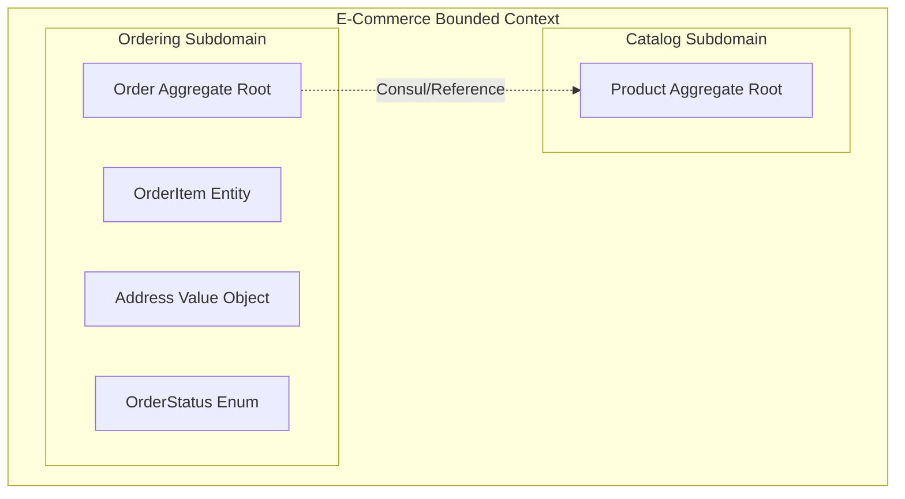
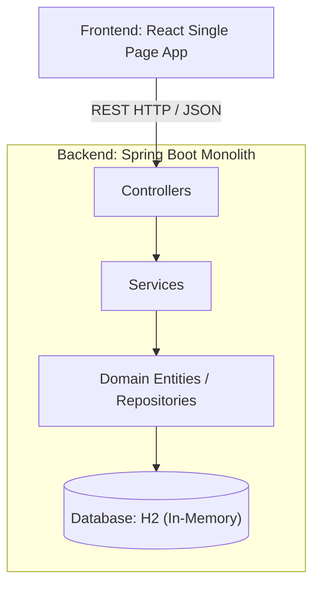
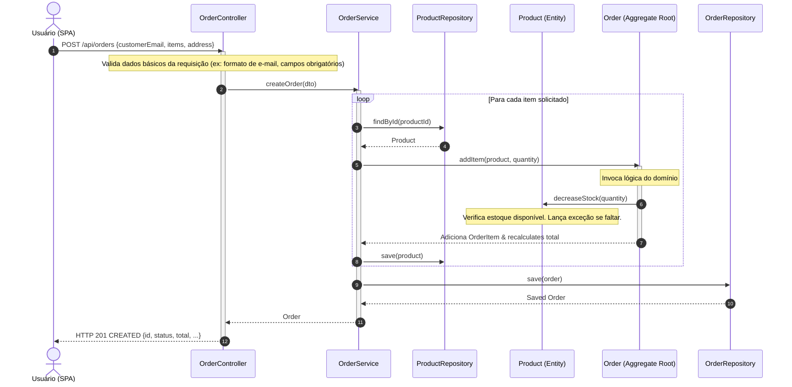

# Documentação de Arquitetura: Nexus Store

Este documento descreve a arquitetura da solução implementada no **TP1**, cobrindo o design de software, os conceitos de **Domain-Driven Design (DDD)** aplicados, e o mapeamento físico da aplicação monolítica.

---

## 1. Visão Geral da Solução

A aplicação é um monólito composto por duas partes principais no mesmo repositório:
- **Backend**: Desenvolvido com **Spring Boot 3.2.5** e **Java 21**, utilizando Maven para o gerenciamento de dependências e banco de dados em memória **H2**.
- **Frontend**: Desenvolvido com **React** (utilizando Vite), consumindo os endpoints REST expostos pelo backend e fornecendo uma interface com design premium e responsivo.

---

## 2. Domain-Driven Design (DDD) e Modelagem de Domínios

A aplicação foi estruturada em torno de dois principais Bounded Contexts (Contextos Delimitados):



### Elementos do Domínio
1. **Aggregates (Agregados)**:
   - **Product**: Raiz do agregado de catálogo. Controla o estoque (`stock`), preço, nome e descrição. Contém regras de negócio como `decreaseStock()` e `increaseStock()` para impedir estados inconsistentes.
   - **Order**: Raiz do agregado de pedidos. Controla seu ciclo de vida (`status`), itens do pedido, e o endereço de entrega.
2. **Entities (Entidades)**:
   - **OrderItem**: Representa um item específico contido dentro de um pedido. Registra o preço do produto no momento exato do checkout (`unitPrice`) para evitar oscilações retroativas de faturamento.
3. **Value Objects (Objetos de Valor)**:
   - **Address**: Representa o endereço de entrega do pedido. É imutável, sem identificador único próprio, e embutido (`@Embedded`) na tabela de pedidos.
4. **Enums**:
   - **OrderStatus**: Estados possíveis do pedido (`PENDING`, `SHIPPED`, `CANCELLED`).

---

## 3. Arquitetura em Camadas (Layered Architecture)

O backend segue um design rígido em camadas para separação de responsabilidades:

1. **Camada de Apresentação (Presentation / Web)**:
   - Classes: `ProductController`, `OrderController`, e os DTOs (`OrderRequest`, `OrderItemRequest`).
   - Responsabilidade: Expor os endpoints REST, realizar a validação de entrada (JSR-303) e mapear os dados para a camada de serviços.
2. **Camada de Aplicação / Serviço (Service)**:
   - Classes: `ProductService`, `OrderService`.
   - Responsabilidade: Orquestrar transações (`@Transactional`), carregar agregados através dos repositórios e invocar métodos de negócio dos agregados.
3. **Camada de Domínio (Domain)**:
   - Classes: `Product`, `Order`, `OrderItem`, `Address`, `OrderStatus`, `ProductRepository`, `OrderRepository`.
   - Responsabilidade: Conter a lógica de negócio central do sistema (Core Domain). Os repositórios são expostos como interfaces nesta camada para desacoplar a persistência física.
4. **Camada de Infraestrutura (Infrastructure)**:
   - Classes: `CorsConfig`, `DataLoader`, `GlobalExceptionHandler`.
   - Responsabilidade: Tratamento global de exceções, semente de dados iniciais no banco, e configuração do compartilhamento de recursos (CORS).

---

## 4. Diagrama de Componentes

O diagrama a seguir descreve a interação dos componentes físicos do sistema:



---

## 5. Diagrama de Sequência: Realização de Pedido

Este diagrama ilustra o fluxo de execução desde a ação do usuário no Frontend até a persistência no banco de dados, evidenciando as validações de estoque:



---

## 6. Configuração e Inicialização

### Pré-requisitos
- Java 21 ou superior
- Maven 3.9+
- Node.js 18+ e npm

### Executando o Backend
Abra o terminal na pasta `backend/` e execute:
```bash
mvn spring-boot:run
```
O backend iniciará na porta `8080`.

### Executando o Frontend
Abra o terminal na pasta `frontend/` e execute:
```bash
npm install
npm run dev
```
O frontend iniciará na porta `5173` (normalmente acessível via [http://localhost:5173](http://localhost:5173)).
