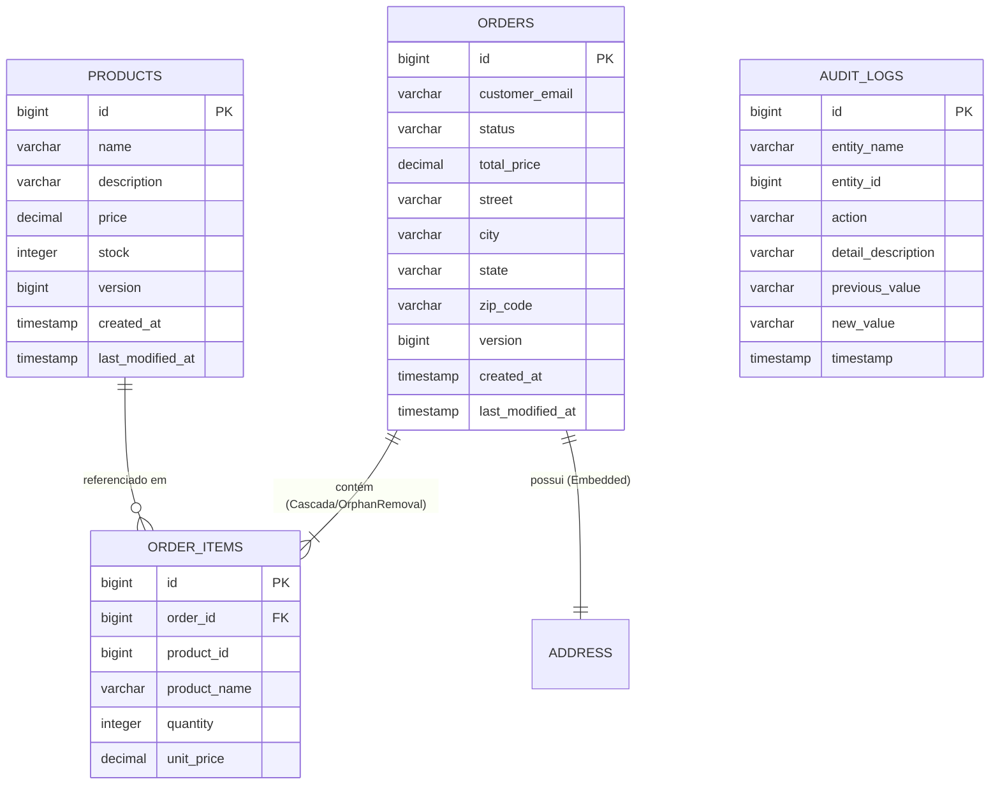

# Documentação de Arquitetura: Nexus Store (TP2)

Este documento descreve detalhadamente o design da camada de persistência e a funcionalidade de histórico de dados implementados no **TP2**, cobrindo o mapeamento Objeto-Relacional com **JPA**, **Spring Data**, **Auditoria de Histórico de Dados**, **Controle de Concorrência Otimista (`@Version`)** e **Estratégia de Testes**.

---

## 1. Visão Geral da Solução (TP2)

A aplicação evoluiu do monólito simples do TP1 para uma arquitetura com camada de persistência robusta no **TP2**:

- **Backend**: **Spring Boot 3.2.5** e **Java 21**, utilizando **Spring Data JPA**, **Hibernate ORM** e banco de dados **H2** em memória.
- **Histórico & Auditoria**: Sistema de auditoria de dados com gravação imutável de revisões (`AuditLog`) para rastreabilidade de estoque, alteração de preços e ciclo de vida de pedidos.
- **Controle de Concorrência**: Locking otimista (`@Version`) prevenindo escritas concorrentes inconsistentes.
- **Frontend**: Aplicação **React** (Vite) atualizada com painel exclusivo para **Trilha de Auditoria & Histórico de Dados**.

---

## 2. Diagrama de Entidade-Relacionamento (Modelo ER)



---

## 3. Mapeamento Objeto-Relacional (JPA & Spring Data)

### 3.1 Entidades e Anotações Principais

1. **`Product`**:
   - Mapeado com `@Entity` e `@Table(name = "products")`.
   - `@Version private Long version;`: Fornece controle de concorrência otimista via Hibernate/JPA.
   - `@EntityListeners(AuditingEntityListener.class)` com `@CreatedDate` e `@LastModifiedDate` para timestamps de modificação.
2. **`Order`**:
   - Mapeado com `@Entity` e `@Table(name = "orders")`.
   - Relacionamento `@OneToMany(cascade = CascadeType.ALL, orphanRemoval = true, fetch = FetchType.LAZY)` com os itens do pedido.
   - `@Embedded` para a classe imutável `Address` (Value Object).
   - `@Version` e auditoria temporal.
3. **`AuditLog`**:
   - Registra o histórico temporal imutável de alterações.
   - Campos: `entityName`, `entityId`, `action` (`CREATE`, `STOCK_CHANGE`, `PRICE_CHANGE`, `STATUS_CHANGE`, `DELETE`), `previousValue`, `newValue`, `timestamp`.

---

## 4. Otimização de Performance e Prevenção do Problema N+1

Para otimizar o acesso a dados no Spring Data JPA, a busca de pedidos no `OrderRepository` utiliza **`@EntityGraph`**:

```java
@EntityGraph(attributePaths = {"items"})
@Query("SELECT o FROM Order o ORDER BY o.createdAt DESC")
List<Order> findAllWithItems();
```

Isso garante que os itens do pedido sejam carregados via `LEFT JOIN` em uma única consulta SQL, eliminando o problema de N+1 consultas ao listar pedidos.

---

## 5. Histórico de Dados e Auditoria (`AuditLogService`)

Cada operação relevante no sistema gera um registro de auditoria em transação independente (`Propagation.REQUIRES_NEW`):

```java
@Transactional(propagation = Propagation.REQUIRES_NEW)
public AuditLog logChange(String entityName, Long entityId, String action, String description, String previousValue, String newValue)
```

### Eventos Auditados:
- **Criação de Produto / Pedido**: Registra estado inicial.
- **Alteração de Estoque**: Registra saldo anterior vs novo saldo ao efetuar ou cancelar pedido.
- **Alteração de Status do Pedido**: Registra transição (`PENDING` -> `SHIPPED`, `PENDING` -> `CANCELLED`).

---

## 6. Endpoints da API REST (TP2)

| Método | Endpoint | Descrição |
|---|---|---|
| `GET` | `/api/products` | Lista produtos (suporta busca `?search=`, `?minPrice=`, `?lowStock=`) |
| `GET` | `/api/products/{id}` | Busca produto por ID |
| `POST` | `/api/products` | Cadastra novo produto e gera log |
| `PUT` | `/api/products/{id}` | Atualiza produto |
| `PATCH` | `/api/products/{id}/stock?delta=N` | Ajusta estoque do produto e registra histórico |
| `GET` | `/api/products/{id}/history` | Consulta histórico de um produto |
| `GET` | `/api/orders` | Lista pedidos com itens (otimizado via `@EntityGraph`) |
| `POST` | `/api/orders` | Cria pedido, reduz estoque e gera auditoria |
| `PATCH` | `/api/orders/{id}/ship` | Altera status para ENVIADO |
| `PATCH` | `/api/orders/{id}/cancel` | Estorna pedido, devolve estoque e gera auditoria |
| `GET` | `/api/orders/{id}/history` | Consulta histórico de um pedido |
| `GET` | `/api/audit-logs` | Consulta toda a trilha de auditoria do sistema |
| `GET` | `/api/audit-logs/entity/{entityName}` | Consulta auditoria por tipo de entidade (`Product` ou `Order`) |

---

## 7. Suíte de Testes Automatizados

A camada de persistência foi validada através de suíte de testes com **JUnit 5**, **AssertJ** e **Spring Boot Test**:

1. **`ProductRepositoryTest` (`@DataJpaTest`)**: Valida queries customizadas de busca por nome (case-insensitive), faixa de preço e estoque baixo.
2. **`OrderRepositoryTest` (`@DataJpaTest`)**: Valida busca com carregamento antecipado de coleções via `@EntityGraph`.
3. **`AuditLogRepositoryTest` (`@DataJpaTest`)**: Valida gravação e consultas por entidade no histórico de auditoria.
4. **`OrderServiceTest` (`@SpringBootTest`)**: Testa criação de pedido, redução de estoque, estorno por cancelamento e criação de registros de auditoria.
5. **`OptimisticLockingTest` (`@SpringBootTest`)**: Valida que concorrência simultânea lança `ObjectOptimisticLockingFailureException` devidamente capturada pelo `GlobalExceptionHandler`.

---

## 8. Como Executar o Projeto

### Backend
1. Navegue até a pasta `TP2/backend/`.
2. Execute o comando:
   ```bash
   mvn spring-boot:run
   ```
3. O servidor iniciará em `http://localhost:8080`.

### Executando os Testes Automatizados
Navegue até a pasta `TP2/backend/` e execute:
```bash
mvn test
```

### Frontend
1. Navegue até a pasta `TP2/frontend/`.
2. Instale as dependências se necessário:
   ```bash
   npm install
   ```
3. Inicie a aplicação React:
   ```bash
   npm run dev
   ```
4. Acesse no navegador `http://localhost:5173` e explore as abas **Catálogo**, **Pedidos** e **Auditoria / Histórico**.
