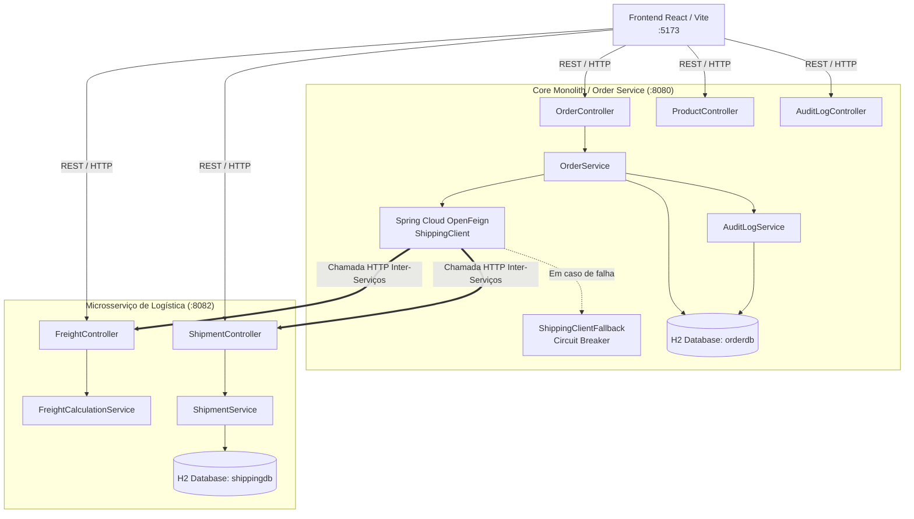
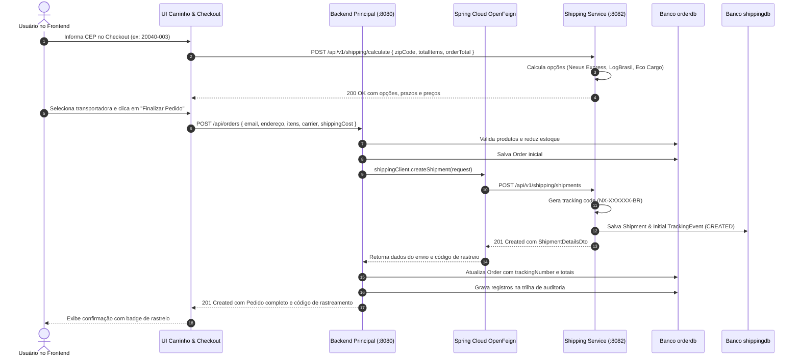
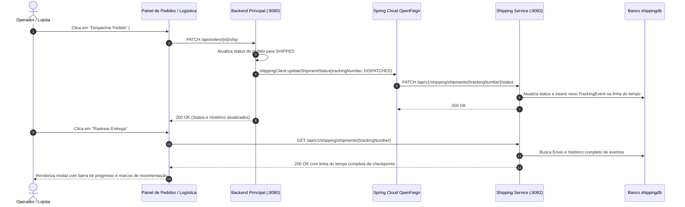
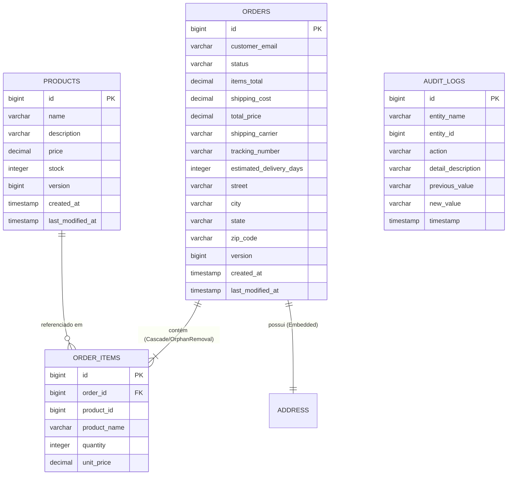
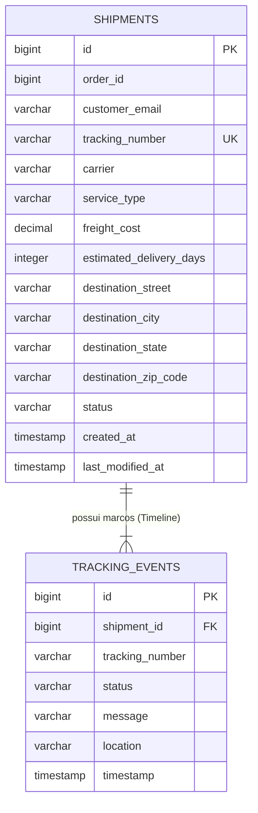

# Documentação de Arquitetura: Nexus Store (TP3)
## Expansão com Microsserviços e Spring Cloud

Este documento descreve a arquitetura distribuída implementada no **TP3**, detalhando a separação de responsabilidades, o desenvolvimento do novo **Microsserviço de Frete e Rastreamento de Entregas (`shipping-service`)**, a comunicação entre serviços com **Spring Cloud OpenFeign**, os mecanismos de **Resiliência e Fallback (Circuit Breaker)**, o isolamento de dados com **Database-per-Service**, a atualização do modelo de domínio, a nova interface de usuário e a cobertura de testes automatizados.

---

## 1. Visão Geral da Arquitetura Distribuída

O sistema evoluiu da arquitetura monolítica com persistência real (TP2) para uma **arquitetura de microsserviços distribuída e modularizada (TP3)**:

1. **Frontend SPA (React + Vite - Porta `5173`)**:
   - Interface com painel de **Catálogo**, **Carrinho com Calculadora de Frete em Tempo Real**, **Histórico de Pedidos com Rastreamento Visual**, **Central de Gestão Logística** e **Trilha de Auditoria**.
2. **Backend Principal / Order & Catalog Service (Porta `8080`)**:
   - Desenvolvido em **Spring Boot 3.2.5** e **Java 21**.
   - Gerencia produtos, estoque, pedidos e auditoria.
   - Atua como cliente distribuído utilizando **Spring Cloud OpenFeign** para se comunicar com o microsserviço de frete, incluindo **Fallback / Circuit Breaker** para garantir alta disponibilidade.
   - Possui seu próprio banco de dados relacional isolado (**`orderdb`** via H2 in-memory).
3. **Microsserviço de Logística e Frete / `shipping-service` (Porta `8082`)**:
   - Desenvolvido em **Spring Boot 3.2.5** e **Java 21**.
   - Responsável pelo motor de cálculo dinâmico de fretes por CEP, geração de etiquetas com códigos de rastreamento únicos (ex: `NX-894201-BR`), controle de etapas logísticas e gravação cronológica de checkpoints de transporte.
   - Possui seu próprio banco de dados relacional isolado (**`shippingdb`** via H2 in-memory), concretizando o padrão **Database-per-Service**.

---

## 2. Diagramas Arquiteturais e de Comunicação

### 2.1. Diagrama de Componentes e Topologia de Serviços



---

### 2.2. Diagrama de Sequência: Fluxo de Criação de Pedido com Frete e Rastreio Distribuídos



---

### 2.3. Diagrama de Sequência: Despacho e Atualização de Rastreio em Tempo Real



---

## 3. Padrões de Arquitetura Distribuída Aplicados

### 3.1. Database-per-Service
Cada serviço é proprietário absoluto de seu esquema de dados relacional:
- **`orderdb`**: Armazena entidades `Product`, `Order`, `OrderItem`, `Address` e `AuditLog`.
- **`shippingdb`**: Armazena entidades `Shipment`, `TrackingEvent`.

Nenhum serviço acessa as tabelas do outro diretamente via SQL, garantindo baixo acoplamento e permitindo escalabilidade e implantação independentes.

### 3.2. Spring Cloud OpenFeign & Interfaces Declarativas
A comunicação entre o `backend` e o `shipping-service` é realizada através do **Spring Cloud OpenFeign**:
```java
@FeignClient(
    name = "shipping-service",
    url = "${shipping.service.url:http://localhost:8082}",
    fallback = ShippingClientFallback.class
)
public interface ShippingClient {
    @PostMapping("/api/v1/shipping/calculate")
    ShippingCalculationResponse calculateRates(@RequestBody ShippingCalculationRequest request);

    @PostMapping("/api/v1/shipping/shipments")
    ShipmentDetailsDto createShipment(@RequestBody CreateShipmentRequest request);

    @GetMapping("/api/v1/shipping/shipments/{trackingNumber}")
    ShipmentDetailsDto getShipmentByTrackingNumber(@PathVariable("trackingNumber") String trackingNumber);

    @PatchMapping("/api/v1/shipping/shipments/{trackingNumber}/status")
    ShipmentDetailsDto updateShipmentStatus(@PathVariable("trackingNumber") String trackingNumber, @RequestBody UpdateShipmentStatusRequest request);
}
```

### 3.3. Resiliência e Fallback (Circuit Breaker)
Caso o microsserviço de frete esteja temporariamente indisponível ou ocorra lentidão na rede, o `ShippingClientFallback` é acionado automaticamente:
- **Cotação de Frete**: Retorna opções de contingência calculadas pelo sistema central, impedindo bloqueio no checkout.
- **Criação de Envio**: Gera um identificador de contingência temporário (`NX-OFFLINE-{orderId}-BR`) permitindo que o pedido seja concluído e posteriormente sincronizado.

---

## 4. Modelos de Domínio e Diagramas Entidade-Relacionamento

### 4.1. Esquema do Banco de Dados Principal (`orderdb`)



---

### 4.2. Esquema do Banco de Dados de Logística (`shippingdb`)



---

## 5. Especificação dos Endpoints REST

### 5.1. Backend Principal (Porta `8080`)

| Método | Endpoint | Descrição |
|---|---|---|
| `GET` | `/api/products` | Lista catálogo com suporte a filtros (`?search=`, `?minPrice=`, `?lowStock=`) |
| `GET` | `/api/products/{id}` | Busca produto por ID |
| `POST` | `/api/products` | Cadastra novo produto e gera log de auditoria |
| `PUT` | `/api/products/{id}` | Atualiza produto |
| `PATCH` | `/api/products/{id}/stock?delta=N` | Ajuste manual de estoque |
| `GET` | `/api/products/{id}/history` | Consulta trilha de auditoria do produto |
| `GET` | `/api/orders` | Lista pedidos com itens (otimizado via `@EntityGraph`) |
| `POST` | `/api/orders` | Cria pedido, deduz estoque e registra envio no microsserviço |
| `PATCH` | `/api/orders/{id}/ship` | Altera status para ENVIADO e atualiza microsserviço de frete |
| `PATCH` | `/api/orders/{id}/cancel` | Cancela pedido, estorna estoque e notifica microsserviço |
| `GET` | `/api/orders/{id}/tracking` | Orquestra consulta de rastreamento via OpenFeign |
| `POST` | `/api/shipping/calculate` | Endpoint proxy para cálculo de frete via Feign |
| `GET` | `/api/audit-logs` | Lista toda a trilha de auditoria imutável do sistema |
| `GET` | `/api/audit-logs/entity/{name}` | Filtra auditoria por entidade (`Product` ou `Order`) |

---

### 5.2. Microsserviço de Frete (`shipping-service` - Porta `8082`)

| Método | Endpoint | Descrição |
|---|---|---|
| `POST` | `/api/v1/shipping/calculate` | Calcula opções de frete baseadas no CEP, volume e total |
| `POST` | `/api/v1/shipping/shipments` | Cria o envio vinculado ao pedido e gera código `NX-XXXXXX-BR` |
| `GET` | `/api/v1/shipping/shipments/{trackingNumber}` | Obtém detalhes completos do envio e linha do tempo de eventos |
| `GET` | `/api/v1/shipping/shipments/order/{orderId}` | Obtém o envio correspondente a um determinado pedido |
| `PATCH` | `/api/v1/shipping/shipments/{trackingNumber}/status` | Avança status do envio e anexa novo evento de rastreio |
| `GET` | `/api/v1/shipping/shipments` | Lista todos os envios registrados na central logística |

---

## 6. Cobertura de Testes Automatizados

Foram implementados testes unitários e de integração em ambos os módulos com **JUnit 5**, **AssertJ**, **Mockito** e **Spring Boot Test**:

### 6.1. Microsserviço de Frete (`shipping-service`)
1. **`FreightCalculationServiceTest`**: Validação dos algoritmos de cotação regional por CEP e regra de frete grátis para compras acima de R$ 350.
2. **`ShipmentRepositoryTest` (`@DataJpaTest`)**: Validação de persistência e consultas customizadas por código de rastreio e orderId.
3. **`TrackingEventRepositoryTest` (`@DataJpaTest`)**: Validação da ordem cronológica de checkpoints de transporte.
4. **`ShipmentControllerTest` (`@SpringBootTest` + `MockMvc`)**: Teste de integração de contratos REST para cotação, criação de envio e transição de status.

### 6.2. Backend Principal (`backend`)
1. **`ShippingClientFallbackTest`**: Validação das respostas de contingência e geração de rastreio offline em caso de indisponibilidade do microsserviço.
2. **`OrderServiceDistributedTest`**: Validação ponta a ponta da criação de pedidos com integração via Feign Client, decremento de estoque e auditoria.
3. **`OrderRepositoryTest` (`@DataJpaTest`)**: Validação de busca otimizada de coleções com `@EntityGraph`.
4. **`ProductRepositoryTest` (`@DataJpaTest`)**: Validação de buscas por palavra-chave, estoques críticos e intervalos de preços.
5. **`AuditLogRepositoryTest` (`@DataJpaTest`)**: Validação de registro de histórico.
6. **`OptimisticLockingTest` (`@SpringBootTest`)**: Validação de controle de concorrência com `@Version`.

---

## 7. Instruções de Execução do Projeto

### 7.1. Inicialização do Microsserviço de Logística (`shipping-service`)
1. Abra um terminal na pasta `TP3/shipping-service/`.
2. Execute o comando:
   ```bash
   mvn spring-boot:run
   ```
3. O serviço iniciará na porta **`8082`** com o banco H2 em memória em `jdbc:h2:mem:shippingdb`.

---

### 7.2. Inicialização do Backend Principal (`backend`)
1. Abra outro terminal na pasta `TP3/backend/`.
2. Execute o comando:
   ```bash
   mvn spring-boot:run
   ```
3. O serviço principal iniciará na porta **`8080`** integrado via OpenFeign ao serviço da porta `8082`.

---

### 7.3. Executando os Testes Automatizados
Para rodar todas as suítes de testes:
```bash
# No diretório TP3/shipping-service/
mvn test

# No diretório TP3/backend/
mvn test
```

---

### 7.4. Inicialização do Frontend React (SPA)
1. Abra um terminal na pasta `TP3/frontend/`.
2. Inicie o servidor de desenvolvimento Vite:
   ```bash
   npm run dev
   ```
3. Acesse `http://localhost:5173` no navegador e explore as abas:
   - **Catálogo & Carrinho**: Realize cotação de frete interativa por CEP e finalize compras.
   - **Pedidos**: Visualize os pedidos cadastrados, copie códigos de rastreamento e abra a **Timeline de Rastreamento em Tempo Real**.
   - **Logística & Rastreio**: Explore a central de despachos e simule o avanço de status de encomendas em trânsito.
   - **Auditoria**: Acompanhe a trilha imutável de eventos operacionais e logísticos.
