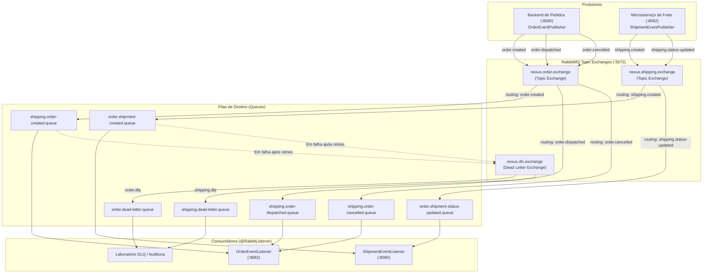
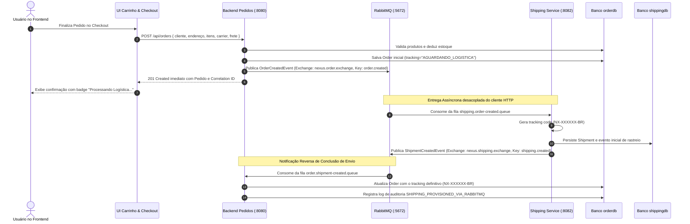
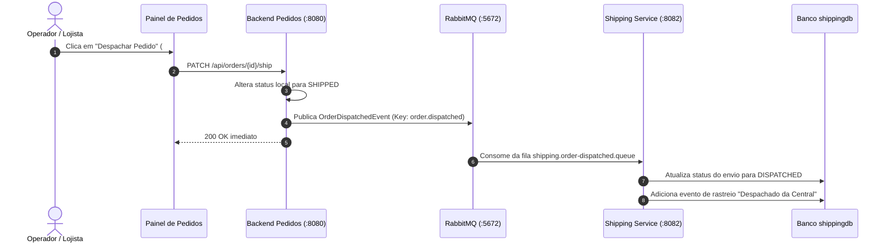
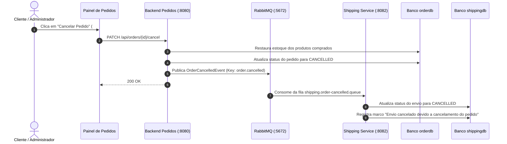

# Documentação de Arquitetura: Nexus Store (TP4)
## Refatoração para Arquitetura Orientada a Eventos (EDA) com RabbitMQ

Este documento detalha a evolução arquitetural realizada no **TP4**, migrando o ecossistema de microsserviços do acoplamento síncrono REST/OpenFeign (TP3) para uma **Arquitetura Orientada a Eventos (Event-Driven Architecture - EDA)** de alta performance, escalabilidade e resiliência, suportada pelo message broker **RabbitMQ** e pelas abstrações do ecossistema **Spring Boot (Spring AMQP)**.

---

## 1. Avaliação de Arquitetura Orientada a Eventos (EDA)

A adoção de uma arquitetura orientada a eventos altera profundamente a forma como os serviços se comunicam, substituindo invocações diretas de procedimentos remotos (RPC / REST síncrono) pela publicação de fatos que já ocorreram no domínio (*Domain Events*).

### 1.1. Prós da Arquitetura Orientada a Eventos

1. **Desacoplamento Espacial e Temporal**:
   - **Espacial**: O produtor do evento (ex: `backend` ao criar um pedido) não precisa conhecer a identidade, localização de rede ou quantidade de consumidores interessados na mensagem.
   - **Temporal**: O produtor e os consumidores não precisam estar online simultaneamente. Se o microsserviço de frete estiver indisponível ou em manutenção, os eventos de pedidos são armazenados de forma durável nas filas do RabbitMQ e processados assim que o serviço retornar, sem perda de dados.
2. **Escalabilidade Elástica e Independente**:
   - Filas de mensagens atuam como buffers naturais (*Load Leveling* / *Queue-based Load Leveling*). Picos súbitos de compras (como na Black Friday) não sobrecarregam os sistemas de backend secundários (logística, faturamento, emissão fiscal); os consumidores processam na sua velocidade máxima sustentável.
   - É possível instanciar múltiplos workers de um mesmo microsserviço concorrendo pela mesma fila (*Competing Consumers Pattern*), escalando o throughput linearmente.
3. **Alta Disponibilidade e Resiliência**:
   - Falhas transitórias de rede ou lentidão em um serviço downstream não bloqueiam a experiência do usuário final no checkout. A resposta HTTP é devolvida em milissegundos enquanto o processamento pesado ocorre de forma assíncrona.
4. **Extensibilidade Sem Impacto (Princípio Aberto/Fechado)**:
   - Novos serviços (ex: Microsserviço de Notificações por E-mail/WhatsApp, Microsserviço de Machine Learning para Fraude, Data Lake de Analytics) podem se plugar ao sistema simplesmente assinando as exchanges existentes, sem que uma única linha de código do `backend` precise ser modificada.
5. **Rastreabilidade e Trilha de Auditoria Granular**:
   - Cada evento é um fato imutável que registra exatamente o que ocorreu, quando ocorreu e quem participou da transação, facilitando auditoria e conformidade.

### 1.2. Contras e Desafios da Arquitetura Orientada a Eventos

1. **Consistência Eventual (*Eventual Consistency*)**:
   - Abandona-se a consistência ACID imediata em favor do modelo BASE (*Basically Available, Soft state, Eventual consistency*). O usuário pode ver o pedido como `AGUARDANDO_LOGISTICA` por alguns instantes até que o evento `ShipmentCreatedEvent` seja processado e o código de rastreamento definitivo seja atribuído.
2. **Complexidade Operacional de Infraestrutura**:
   - Exige gerenciamento, monitoramento, backup e clustering de um message broker de missão crítica (RabbitMQ). Problemas de disco cheio, memória estourada ou rede particionada no broker impactam a entrega das mensagens.
3. **Depuração e Rastreamento Distribuído Complexos**:
   - Rastrear uma transação de ponta a ponta exige o uso rigoroso de identificadores de correlação (*Correlation ID*) injetados nos headers das mensagens e propagados por todos os nós participantes.
4. **Tratamento de Mensagens Duplicadas e Idempotência**:
   - Em redes distribuídas com garantias de entrega *at-least-once* (pelo menos uma vez), mensagens podem ser reentregues após timeouts de confirmação. Todos os consumidores precisam ser projetados como consumidores idempotentes (*Idempotent Consumers*).
5. **Gerenciamento de Erros e Mensagens Venenosas (*Poison Pills*)**:
   - Mensagens malformadas ou com bugs de deserialização podem travar consumidores em loops infinitos de retentativas. Exige a implementação robusta de políticas de retry com backoff e Dead Letter Queues (DLQ).

### 1.3. Cenários Onde a Arquitetura Orientada a Eventos é Mais Vantajosa

- **Plataformas de E-commerce e Marketplaces**: Onde o checkout do cliente precisa ser ultrarrápido e as etapas subsequentes (reserva definitiva de estoque, aprovação de pagamento, emissão de nota fiscal, geração de etiqueta de transporte e notificação por e-mail) podem e devem ocorrer assincronamente.
- **Sistemas com Picos de Carga Imprevisíveis**: Plataformas de ingressos, promoções relâmpago e campanhas promocionais onde o broker atua como amortecedor de vazão.
- **Processamento de Fluxos de Dados e Telemetria**: Ingestão contínua de checkpoints de rastreamento, telemetria de frotas e IoT.
- **Ecossistemas de Microsserviços em Crescimento**: Onde novos módulos de negócio precisam ser agregados periodicamente sem risco de quebrar contratos síncronos legados.

---

## 2. Desenvolvimento de Padrões de Mensagens (Enterprise Integration Patterns)

No TP4, foram implementados cinco padrões de mensagens empresariais essenciais:

| Padrão | Descrição | Implementação no Projeto |
|---|---|---|
| **1. Publish-Subscribe (Pub/Sub) / Event Notification** | O produtor publica eventos de domínio em uma Topic Exchange sem conhecer os destinos; múltiplos interessados recebem cópias independentes via filas dedicadas. | `OrderCreatedEvent`, `OrderDispatchedEvent` e `OrderCancelledEvent` publicados na `nexus.order.exchange`. |
| **2. Event-Carried State Transfer (ECST)** | Os eventos transportam o payload de dados completo necessário para que os consumidores realizem seu trabalho sem precisarem fazer chamadas de volta (*callbacks*) ao serviço de origem. | `OrderCreatedEvent` inclui dados cadastrais, endereço de entrega completo, lista de itens com preços e custo de frete. |
| **3. Sincronização Bidirecional e Coreografia Saga** | O evento gerado por um serviço dispara uma ação no outro serviço, que por sua vez gera um evento de retorno para consolidar o estado distribuído. | Pedido Criado (`backend`) → Envio Provisionado (`shipping-service`) → `ShipmentCreatedEvent` emitido → Pedido Atualizado com Rastreio e Auditoria no `backend`. |
| **4. Dead Letter Queue (DLQ) & Retry Pattern** | Mensagens que falham repetidamente são isoladas em filas de descarte após 3 tentativas com backoff exponencial, garantindo que o pipeline continue operando. | Filas configuradas com `x-dead-letter-exchange: nexus.dlx.exchange` e roteadas para `order.dead-letter.queue` e `shipping.dead-letter.queue`. |
| **5. Idempotent Consumer & Correlation ID Tracing** | Identificação única de cada transação distribuída para prevenção de duplicidades e auditoria ponta a ponta. | Cabeçalho `correlationId` propagado em todas as mensagens AMQP; checagem de existência prévia no banco antes de reinserção. |

---

## 3. Implementação com RabbitMQ

### 3.1. Topologia de Mensageria

A topologia implementada utiliza o modelo de **Topic Exchanges**, permitindo flexibilidade de roteamento por meio de padrões de chaves (*routing keys*):



---

## 4. Diagramas de Sequência e Fluxos de Eventos

### 4.1. Fluxo de Criação de Pedido com Provisionamento Assíncrono de Logística



---

### 4.2. Fluxo de Despacho de Pedido



---

### 4.3. Fluxo de Cancelamento com Compensação Distribuída



---

### 4.4. Fluxo de Tratamento de Falhas e Dead Letter Queue (DLQ)

```mermaid
sequenceDiagram
    autonumber
    participant Broker as RabbitMQ (Fila Principal)
    participant Consumer as Consumidor Spring AMQP
    participant Retry as Spring Retry Interceptor
    participant DLX as nexus.dlx.exchange
    participant DLQ as dead-letter.queue

    Broker->>Consumer: Entrega mensagem com payload corrompido / erro inesperado
    Consumer->>Consumer: Falha no processamento (lança Exception)
    
    Consumer->>Retry: Tentativa 1 falhou. Aguarda 1s (Backoff).
    Retry->>Consumer: Tentativa 2 falhou. Aguarda 2s (Backoff).
    Retry->>Consumer: Tentativa 3 falhou.
    
    Retry->>Broker: Rejeita mensagem (basic.reject com requeue=false)
    Broker->>DLX: Encaminha para Dead Letter Exchange configurada
    DLX->>DLQ: Enfileira mensagem na DLQ para análise posterior
    Note over DLQ: Mensagem isolada; consumidor segue processando mensagens válidas!
```

---

## 5. Simplificação com Spring Boot e Spring AMQP

O Spring Boot abstrai grande parte do boilerplate de integração com o RabbitMQ através do starter `spring-boot-starter-amqp`:

### 5.1. Declaração Declarativa da Infraestrutura
Em vez de scripts manuais ou chamadas imperativas, toda a topologia de exchanges, filas e bindings é declarada via beans gerenciados pelo Spring:
```java
@Bean
public TopicExchange orderExchange() {
    return ExchangeBuilder.topicExchange("nexus.order.exchange").durable(true).build();
}

@Bean
public Queue orderShipmentCreatedQueue() {
    return QueueBuilder.durable("order.shipment-created.queue")
            .deadLetterExchange("nexus.dlx.exchange")
            .deadLetterRoutingKey("order.dlq")
            .build();
}

@Bean
public Binding bindingOrderShipmentCreated(Queue orderShipmentCreatedQueue, TopicExchange shippingExchange) {
    return BindingBuilder.bind(orderShipmentCreatedQueue).to(shippingExchange).with("shipping.created");
}
```

### 5.2. Conversão Automática de Mensagens JSON
Com a configuração do `Jackson2JsonMessageConverter` e `TypePrecedence.INFERRED`, os payloads Java são serializados automaticamente em JSON e deserializados diretamente na classe tipada recebida no método ouvinte, superando discrepâncias de pacotes entre microsserviços distintos:
```java
@Bean
public MessageConverter jacksonMessageConverter() {
    Jackson2JsonMessageConverter converter = new Jackson2JsonMessageConverter();
    DefaultClassMapper classMapper = new DefaultClassMapper();
    classMapper.setTrustedPackages("*");
    converter.setClassMapper(classMapper);
    converter.setTypePrecedence(Jackson2JavaTypeMapper.TypePrecedence.INFERRED);
    return converter;
}
```

### 5.3. Consumo Desacoplado com `@RabbitListener`
A anotação `@RabbitListener` elimina a necessidade de threads manuais de consumo, gerenciamento de canais AMQP ou controle de confirmação (*ack/nack*):
```java
@RabbitListener(queues = "order.shipment-created.queue")
@Transactional
public void handleShipmentCreated(ShipmentCreatedEvent event) {
    Order order = orderRepository.findById(event.getOrderId()).orElse(null);
    if (order != null) {
        order.setTrackingNumber(event.getTrackingNumber());
        orderRepository.save(order);
    }
}
```

### 5.4. Emissão Fluente com `RabbitTemplate`
O envio de mensagens é feito de forma tipada, permitindo injetar Correlation IDs diretamente nos headers do protocolo AMQP:
```java
rabbitTemplate.convertAndSend(
    RabbitMqConfig.EXCHANGE_ORDER,
    RabbitMqConfig.ROUTING_KEY_ORDER_CREATED,
    event,
    m -> {
        m.getMessageProperties().setCorrelationId(event.getCorrelationId());
        m.getMessageProperties().setMessageId(event.getEventId());
        return m;
    }
);
```

---

## 6. Comparativo Arquitetural: TP3 (Síncrono/Feign) vs TP4 (Orientado a Eventos/RabbitMQ)

| Aspecto | TP3 (Microsserviços REST / OpenFeign) | TP4 (Arquitetura Orientada a Eventos / RabbitMQ) |
|---|---|---|
| **Padrão de Comunicação** | Síncrono (HTTP Request-Response). | Assíncrono (Message-Driven / Event-Driven). |
| **Acoplamento** | Alto acoplamento temporal (ambos os serviços precisam estar online para efetivar criação do envio). | Baixo acoplamento total (espacial e temporal). |
| **Latência no Checkout** | Latência cumulativa: soma do tempo do banco local + tempo da chamada HTTP externa ao microsserviço de frete. | Latência mínima: o pedido é gravado no banco local e o evento é publicado no broker em milissegundos. |
| **Tratamento de Indisponibilidade** | Dependência de Circuit Breaker com fallback e geração de rastreios sintéticos offline. | Resiliência nativa: o broker retém as mensagens de forma durável nas filas até que o consumidor volte a operar. |
| **Absorção de Picos de Carga** | Sobrecarga em cascata nos microsserviços secundários. | Amortecimento natural (*Load Leveling*); filas absorvem rajadas sem degradar os serviços. |
| **Extensibilidade** | Para adicionar uma notificação por e-mail ou auditoria externa, era necessário alterar o `OrderService`. | Totalmente extensível: novos consumidores assinam a exchange sem alterar o código do produtor. |
| **Gestão de Falhas Críticas** | Rejeição imediata ou tentativa em loop síncrono. | Mecanismo de Retry com Backoff Exponencial e descarte isolado em Dead Letter Queue (DLQ). |

---

## 7. Instruções de Execução e Demonstração

### 7.1. Execução via Docker Compose (Solução Completa)
Para subir o ecossistema completo com RabbitMQ, ambos os microsserviços e o frontend em containers Docker:
```bash
# Na raiz da pasta TP4/
docker compose up --build
```
Serviços disponíveis:
- **Frontend SPA**: `http://localhost:5173`
- **Backend Pedidos**: `http://localhost:8080`
- **Microsserviço de Frete**: `http://localhost:8082`
- **Painel de Gestão RabbitMQ**: `http://localhost:15672` (login: `guest` / senha: `guest`)

---

### 7.2. Execução Local para Desenvolvimento

#### Passo 1: Iniciar o RabbitMQ
```bash
docker run -d --name rabbitmq -p 5672:5672 -p 15672:15672 rabbitmq:3-management
```

#### Passo 2: Iniciar o Microsserviço de Frete (`shipping-service`)
```bash
cd TP4/shipping-service
mvn spring-boot:run
```

#### Passo 3: Iniciar o Backend Principal (`backend`)
```bash
cd TP4/backend
mvn spring-boot:run
```

#### Passo 4: Iniciar o Frontend React
```bash
cd TP4/frontend
npm run dev
```

---

### 7.3. Execução dos Testes Automatizados
Todas as suítes de testes foram construídas para validar a arquitetura orientada a eventos, com simulação e mock do RabbitMQ garantindo que o comando `mvn test` passe com 100% de sucesso mesmo sem o broker externo ativo:

```bash
# Executar testes do microsserviço de logística
cd TP4/shipping-service
mvn test

# Executar testes do backend principal
cd TP4/backend
mvn test
```

**Resultado dos Testes**:
- `shipping-service`: **12 testes executados, 0 falhas, 0 erros** (`BUILD SUCCESS`).
- `backend`: **20 testes executados, 0 falhas, 0 erros** (`BUILD SUCCESS`).

---

### 7.4. Explorando a Nova Aba "Eventos (RabbitMQ)" no Frontend
Ao acessar a aplicação em `http://localhost:5173`:
1. Clique na aba **"Eventos (RabbitMQ)"** no cabeçalho superior.
2. Observe o **Monitor de Mensagens**: contadores em tempo real de mensagens publicadas, consumidas e isoladas em DLQ.
3. Visualize os blocos de **Topologia de Exchanges e Filas**.
4. Realize um pedido no **Catálogo**: volte à aba de eventos e veja os eventos `ORDER_CREATED` e `SHIPMENT_CREATED` com seus Correlation IDs e payloads JSON formatados.
5. Use o **Laboratório de Resiliência (DLQ)** para disparar simulações de mensagens venenosas e inspecione seu encaminhamento imediato para a Dead Letter Queue.
