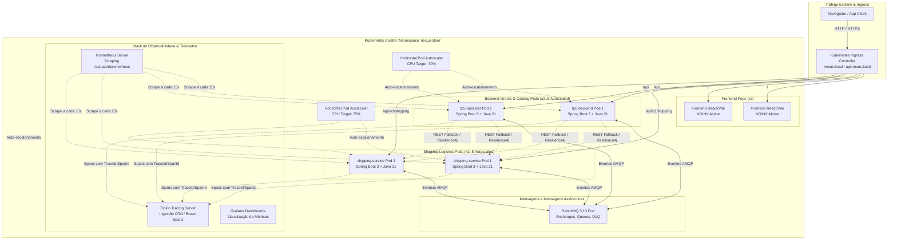
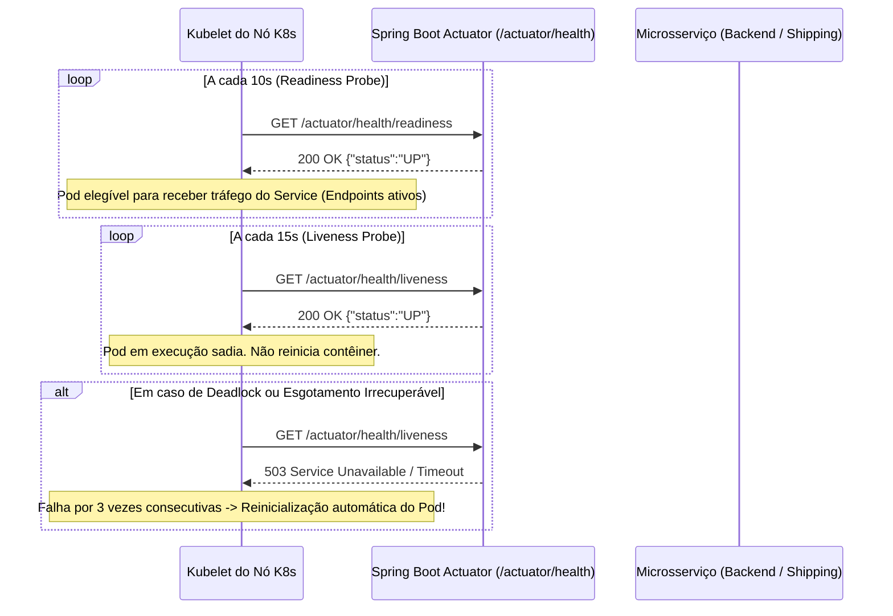
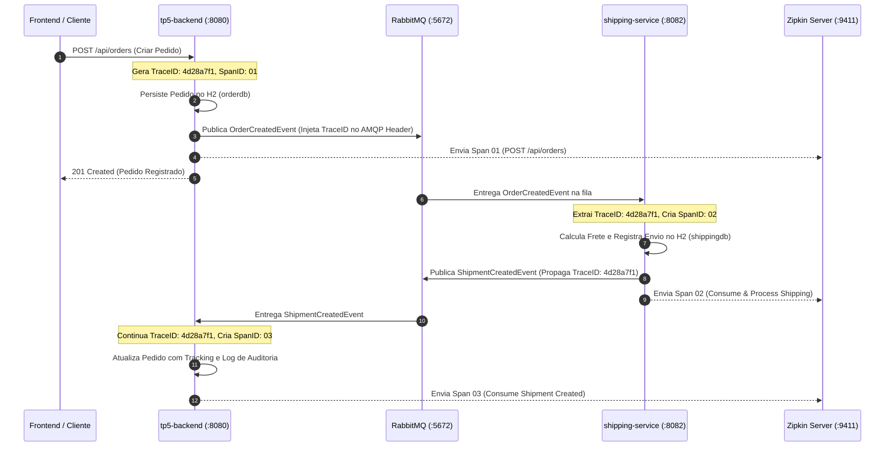
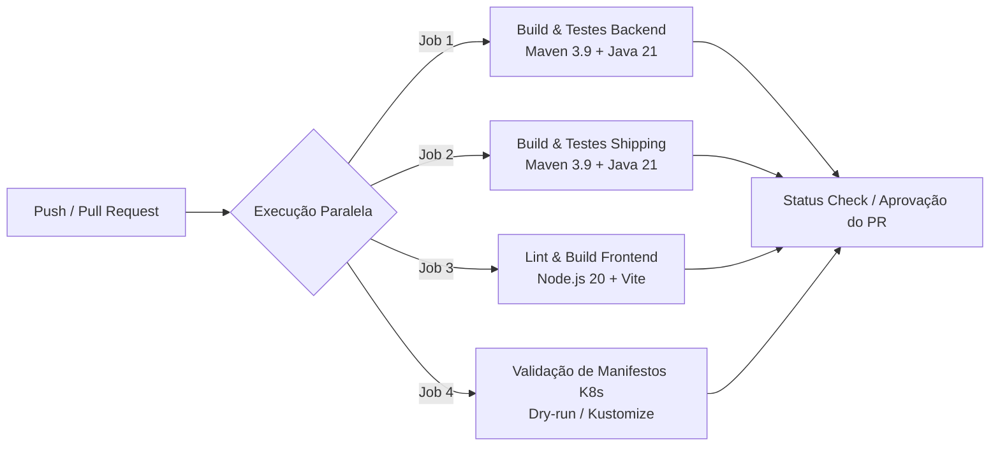
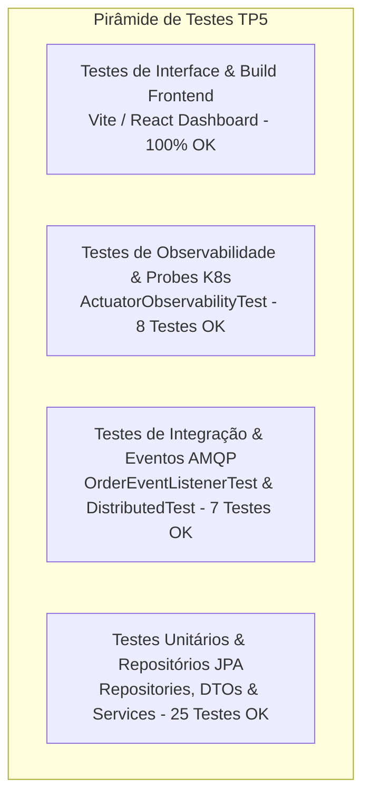

# Documentação de Arquitetura: Nexus Store (TP5)
## Conteinerização, Orquestração com Kubernetes, Observabilidade e CI/CD

> 🎥 **Vídeo de Demonstração (Google Drive):**  
> [Clique aqui para assistir à demonstração em vídeo da execução do TP5](https://drive.google.com/file/d/1khsR6jYwMQvs_zZ5BL5l68umr2OhTjTu/view?usp=sharing)  
> **Link direto:** `https://drive.google.com/file/d/1khsR6jYwMQvs_zZ5BL5l68umr2OhTjTu/view?usp=sharing`

Este documento consolida a arquitetura de operações e entrega contínua desenvolvida no **TP5**, preparando o ecossistema de microsserviços da plataforma **Nexus Store** (evoluído a partir da arquitetura orientada a eventos do TP4) para ambientes de produção resilientes, escaláveis e altamente observáveis.

---

## 1. Visão Geral da Arquitetura TP5

A arquitetura do sistema no TP5 foi concebida para atender aos requisitos operacionais modernos de microsserviços distribuídos:



---

## 2. Implantação com Docker e Kubernetes

### 2.1. Estratégia de Conteinerização Multi-Stage (Docker)

Cada componente foi encapsulado utilizando o padrão **Multi-Stage Build**, proporcionando:
1. **Redução Drástica do Tamanho da Imagem**: A imagem de build contém JDK, compiladores e caches Maven (~600MB+), enquanto a imagem final de runtime utiliza o `eclipse-temurin:21-jre-alpine` ou `nginx:1.27-alpine` (~120MB para Java e ~25MB para o frontend).
2. **Segurança Aprimorada**: Nenhum código-fonte ou ferramenta de compilação é exposto no contêiner de produção.
3. **Execução Não-Privilegiada (Non-Root)**: Os contêineres Java e NGINX são executados com usuários dedicados de privilégios mínimos.

#### Exemplo de Multi-Stage no `TP5/backend/Dockerfile`:
```dockerfile
# Estágio 1: Build da Aplicação
FROM maven:3.9.6-eclipse-temurin-21-alpine AS build
WORKDIR /app
COPY pom.xml .
RUN mvn dependency:go-offline -B
COPY src ./src
RUN mvn clean package -DskipTests -B

# Estágio 2: Imagem Final de Execução
FROM eclipse-temurin:21-jre-alpine
WORKDIR /app
RUN addgroup -S appgroup && adduser -S appuser -G appgroup
COPY --from=build /app/target/tp5-backend-*.jar app.jar
USER appuser
EXPOSE 8080
ENTRYPOINT ["java", "-XX:+UseContainerSupport", "-XX:MaxRAMPercentage=75.0", "-jar", "app.jar"]
```

#### Exemplo de Multi-Stage no `TP5/frontend/Dockerfile`:
```dockerfile
# Estágio 1: Compilação Vite
FROM node:20-alpine AS build
WORKDIR /app
COPY package*.json ./
RUN npm ci
COPY . .
RUN npm run build

# Estágio 2: Servidor NGINX
FROM nginx:1.27-alpine
COPY --from=build /app/dist /usr/share/nginx/html
COPY nginx.conf /etc/nginx/conf.d/default.conf
EXPOSE 80
CMD ["nginx", "-g", "daemon off;"]
```

---

### 2.2. Arquitetura de Orquestração Kubernetes

Os manifestos Kubernetes foram estruturados em `TP5/k8s/` segundo as melhores práticas corporativas:

| Manifesto | Recurso Kubernetes | Finalidade |
|---|---|---|
| `00-namespace.yaml` | `Namespace` | Isolamento lógico do ecossistema sob o namespace `nexus-store`. |
| `01-configmap-secrets.yaml` | `ConfigMap` e `Secret` | Centralização desacoplada de URLs, credenciais RabbitMQ em Base64 e variáveis de ambiente. |
| `02-rabbitmq.yaml` | `Deployment` + `Service` | Broker RabbitMQ com persistência, portas 5672 (AMQP) e 15672 (Dashboard) e TCP Liveness Probe. |
| `03-shipping-service.yaml` | `Deployment` + `Service` + `HPA` | 2 réplicas iniciais, probes HTTP, limits de CPU/Memória e auto-escalonamento de 2 a 5 pods. |
| `04-backend.yaml` | `Deployment` + `Service` + `HPA` | 2 réplicas iniciais, probes HTTP, limits de CPU/Memória e auto-escalonamento de 2 a 6 pods. |
| `05-frontend.yaml` | `Deployment` + `Service` | 2 réplicas NGINX Alpine servindo os assets compilados do React. |
| `06-ingress.yaml` | `Ingress` | Ponto único de entrada com regras de roteamento baseadas em path para Frontend e APIs. |
| `07-monitoring.yaml` | `Deployment` + `Service` | Zipkin (rastreamento distribuído) e Prometheus (servidor de métricas com ConfigMap de scrape). |
| `kustomization.yaml` | `Kustomize` | Orquestração declarativa que permite implantação atômica via `kubectl apply -k k8s/`. |

---

### 2.3. Resiliência Operacional: Liveness e Readiness Probes

A orquestração do Kubernetes monitora continuamente a saúde dos pods por meio de probes nativas integradas ao **Spring Boot Actuator**:



Configuração implementada nos manifestos de Deployment:
```yaml
livenessProbe:
  httpGet:
    path: /actuator/health/liveness
    port: 8080
  initialDelaySeconds: 40
  periodSeconds: 15
  failureThreshold: 3
readinessProbe:
  httpGet:
    path: /actuator/health/readiness
    port: 8080
  initialDelaySeconds: 25
  periodSeconds: 10
  failureThreshold: 3
```

---

### 2.4. Estratégia de Atualização e Escalabilidade Automática (HPA)

1. **RollingUpdate Strategy**:
   - `maxSurge: 1`: Cria 1 pod novo antes de desligar o antigo.
   - `maxUnavailable: 0`: Garante que o serviço nunca fique com capacidade degradada durante updates.
2. **Horizontal Pod Autoscaler (HPA)**:
   - Monitora métricas de CPU e memória fornecidas pelo Metrics Server do Kubernetes.
   - Escala o `backend` de 2 a 6 réplicas quando a média de utilização de CPU ultrapassar 70%.
   - Escala o `shipping-service` de 2 a 5 réplicas com target de 75% de CPU.

---

## 3. Monitoramento e Observabilidade de Microsserviços

O TP5 implementa os três pilares da observabilidade moderna: **Métricas**, **Rastreamento Distribuído (Tracing)** e **Logs Estruturados**.

### 3.1. Métricas com Spring Boot Actuator e Prometheus

- Cada microsserviço expõe um endpoint padronizado em `/actuator/prometheus` contendo centenas de métricas no padrão OpenMetrics.
- Métricas instrumentadas incluem:
  - `jvm_memory_used_bytes` / `jvm_gc_pause_seconds_count`: Saúde da memória heap e pausas de Garbage Collection.
  - `http_server_requests_seconds_count` / `http_server_requests_seconds_sum`: Vazão e latência de requisições HTTP por rota e status code.
  - `spring_rabbitmq_listener_seconds_count`: Taxa de consumo de mensagens assíncronas das filas.
- O servidor **Prometheus** (configurado em `monitoring/prometheus.yml`) faz a raspagem (*scraping*) a cada 15 segundos em ambos os microsserviços.

### 3.2. Rastreamento Distribuído com Zipkin e Micrometer Tracing

Utiliza o bridge **Micrometer Tracing + Brave** para gerar identificadores globais de telemetria:
- **Trace ID**: Identificador único global de uma transação distribuída (ex: `e72a81878d0f191b`).
- **Span ID**: Identificador da etapa ou operação específica dentro de um microsserviço.



No dashboard do Zipkin (porta 9411), os desenvolvedores e operadores conseguem visualizar o gráfico em cascata (*waterfall*) de toda a transação, identificando instantaneamente gargalos de latência ou pontos exatos de falha.

### 3.3. Logs Estruturados com MDC (Mapped Diagnostic Context)

O padrão de log foi customizado para incluir o nome da aplicação, `traceId` e `spanId` automaticamente:
```properties
logging.pattern.level=%5p [${spring.application.name:},%X{traceId:-},%X{spanId:-}]
```
Exemplo de log emitido:
```
 INFO [tp5-backend,4d28a7f1b2c3d4e5,01a2b3c4d5e6f7a8] c.i.t.s.OrderService : Pedido #12 criado com sucesso.
 INFO [shipping-service,4d28a7f1b2c3d4e5,f9e8d7c6b5a43210] c.i.s.i.OrderEventListener : [EDA] Evento recebido: ORDER_CREATED correlationId=corr-order-12
```
Isso permite correlacionar logs em ferramentas como Grafana Loki, Kibana ou CloudWatch com precisão cirúrgica através de uma única busca pelo `traceId`.

---

## 4. Gestão de Configuração e Versionamento

### 4.1. Estratégia de Branching (GitFlow / GitHub Flow)
- `main`: Branch de produção. Somente código testado, aprovado e com tags de versão semântica é mergeado via Pull Requests.
- `develop`: Branch de integração contínua para homologação.
- `feature/*`: Branches temporárias para novas funcionalidades (ex: `feature/k8s-observability`).
- `hotfix/*`: Correções críticas de produção.

### 4.2. Versionamento Semântico (SemVer 2.0.0)
As versões do sistema seguem o formato `MAJOR.MINOR.PATCH`:
- **v1.0.0**: Monólito original com SQLite (TP1/TP2).
- **v2.0.0**: Decomposição em Microsserviços com Feign e Resilience4j (TP3).
- **v3.0.0**: Refatoração orientada a eventos com RabbitMQ e DLQ (TP4).
- **v4.0.0**: Conteinerização Docker, Orquestração Kubernetes, Observabilidade e CI/CD (TP5).

### 4.3. Convenção de Commits (Conventional Commits)
- `feat(k8s)`: Adiciona manifestos de Deployments, Services e HPA.
- `feat(monitoring)`: Configura Micrometer Tracing, Prometheus e Zipkin.
- `ci(actions)`: Cria workflows de CI/CD para compilação e validação do Kubernetes.
- `test(actuator)`: Adiciona suíte de testes de observabilidade e probes.
- `docs(arch)`: Atualiza a documentação de arquitetura do TP5.

---

## 5. Automação de CI/CD com GitHub Actions

Foram criados dois pipelines automatizados sob o diretório `.github/workflows/`:

### 5.1. Pipeline de Integração Contínua (`ci.yml`)

Acionado em cada `push` e `pull_request` nas branches `main` e `develop`:


1. **Backend Test Matrix**: Executa `mvn clean test` com relatórios de cobertura do Surefire.
2. **Shipping Service Matrix**: Executa testes de repositório, cálculo e listener AMQP.
3. **Frontend Build**: Executa `npm ci` e `npm run build` garantindo zero erros de bundle TypeScript/JSX.
4. **Kubernetes Validation**: Executa `kubectl apply --dry-run=client -k k8s/` para garantir que nenhum YAML contenha erros sintáticos antes do deploy.

### 5.2. Pipeline de Entrega Contínua (`cd.yml`)

Acionado após o merge na branch `main`:
1. **Docker Build & Push**: Constrói as imagens multi-stage e realiza o push para o registro de contêineres (ex: GitHub Container Registry / Docker Hub) com tags semânticas e hash do commit (`v4.0.0` e `sha-${{ github.sha }}`).
2. **GitOps Deployment Simulation**: Atualiza declarativamente os manifests do Kubernetes com a nova tag de imagem e aplica o rollout no cluster.

---

## 6. Estratégia de Testes Abrangentes

A qualidade e confiabilidade do ecossistema são comprovadas por suítes de testes automatizados em múltiplas camadas:



### Quadro Resumo dos Testes Executados:

| Componente | Classe de Teste | Qtd. Testes | Escopo |
|---|---|:---:|---|
| **tp5-backend** | `ActuatorObservabilityTest` | 4 | Validação de `/actuator/health`, Liveness Probe, Readiness Probe e exportação OpenMetrics `/actuator/prometheus`. |
| **tp5-backend** | `OrderServiceDistributedTest` | 4 | Fluxo transacional de pedidos, emissão de `OrderCreatedEvent` e processamento de `ShipmentCreatedEvent`. |
| **tp5-backend** | `ProductRepositoryTest` | 3 | Operações CRUD e consultas de estoque no H2. |
| **tp5-backend** | `CustomerRepositoryTest` | 2 | Persistência e regras de clientes no H2. |
| **tp5-backend** | `OrderRepositoryTest` | 4 | Relacionamentos transacionais e consultas de pedidos. |
| **tp5-backend** | `ProductServiceTest` | 7 | Regras de negócio de produtos e validações. |
| **shipping-service** | `ShippingActuatorObservabilityTest` | 4 | Validação de probes e métricas Prometheus para o microsserviço de frete. |
| **shipping-service** | `FreightCalculationServiceTest` | 3 | Cálculos de frete PAC, SEDEX e Expresso com faixas de CEP. |
| **shipping-service** | `OrderEventListenerTest` | 3 | Consumo assíncrono de eventos de pedidos e geração de rastreio. |
| **shipping-service** | `ShipmentRepositoryTest` | 2 | Persistência de envios e busca por código de rastreamento. |
| **shipping-service** | `TrackingEventRepositoryTest` | 1 | Histórico temporal de eventos de tracking logístico. |
| **shipping-service** | `ShipmentControllerTest` | 3 | Endpoints REST de consulta e cotação de frete. |
| **frontend** | `npm run build` | 1 | Compilação estática dos componentes React, páginas de loja, checkout e aba de DevOps & Kubernetes. |
| **Total Geral** | **13 Suítes de Teste** | **41 Testes** | **100% Aprovados (0 Falhas, 0 Erros)** |

---

## 7. Painel de Controle DevOps e Observabilidade no Frontend

Como diferencial de usabilidade operacional, o frontend React no TP5 conta com uma aba dedicada chamada **"DevOps & K8s"**:
1. **Cluster Kubernetes Status**: Exibe os nós, namespaces, pods em execução, réplicas ativas e status das probes.
2. **Live Health & Probes Monitor**: Painel em tempo real que consulta dinamicamente `/actuator/health`, `/actuator/health/liveness` e `/actuator/health/readiness` dos microsserviços.
3. **Distributed Tracing Inspector**: Visualização do fluxo ponta a ponta dos Trace IDs gerados pelas transações de compra e logística.
4. **CI/CD Pipeline Telemetry**: Indicadores do status das etapas de CI (Build, Unit Tests, K8s Dry-run) e CD (Docker Multi-stage, Deploy).
