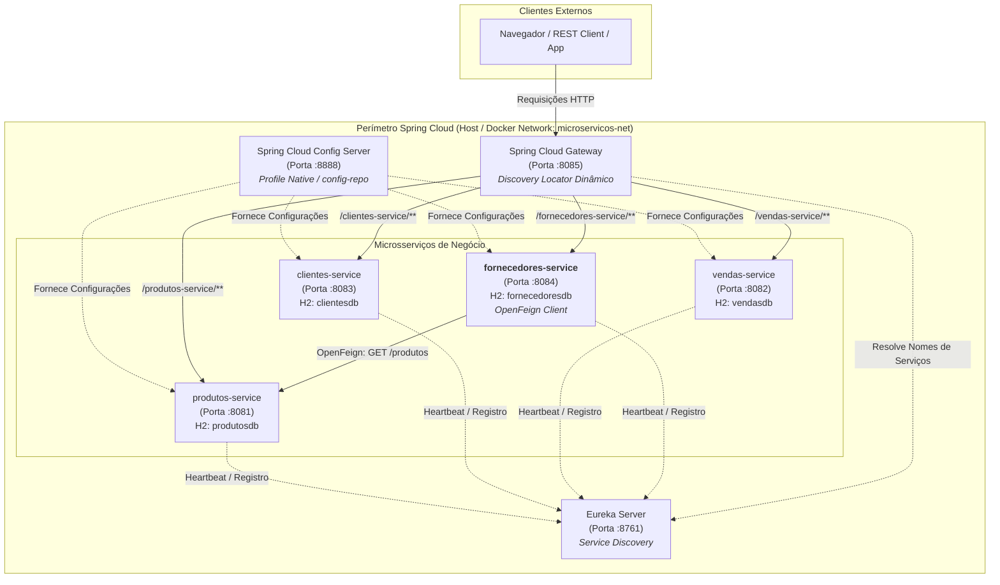

# RELATÓRIO TÉCNICO E ACADÊMICO — ASSESSMENT (AT)
## Microsserviços e DevOps com Spring Boot e Spring Cloud [26E3_3]

---

### Identificação do Trabalho e do Aluno

| Campo | Detalhes |
| :--- | :--- |
| **Instituição** | Instituto Infnet |
| **Escola** | Escola Superior de Tecnologia (EST) |
| **Curso** | Graduação em Engenharia de Software (Live) |
| **Disciplina** | Microsserviços e DevOps com Spring Boot e Spring Cloud [26E3_3] |
| **Modalidade** | Individual |
| **Aluno** | Marcus Evandro Galvão Boni |
| **E-mail Institucional** | `marcus.boni@al.infnet.edu.br` |
| **Repositório Fork GitHub** | [https://github.com/Marcus-Boni/api-vendas](https://github.com/Marcus-Boni/api-vendas) |
| **Pull Request Aberto** | [Pull Request #1 (Marcus-Boni/api-vendas)](https://github.com/Marcus-Boni/api-vendas/pull/1) |
| **Branch de Trabalho** | `atividade-marcusboni` |
| **Documento PDF Oficial de Entrega** | [`Marcus_Boni_DR3_AT.pdf`](./Marcus_Boni_DR3_AT.pdf) |
| **Data** | Outubro de 2026 |

---

## Sumário Executivo

1. [Introdução e Objetivos](#1-introdução-e-objetivos)
2. [Arquitetura de Microsserviços com Spring Cloud](#2-arquitetura-de-microsserviços-com-spring-cloud)
3. [Mapeamento de Portas e Topologia da Rede](#3-mapeamento-de-portas-e-topologia-da-rede)
4. [Execução e Resolução dos 12 Exercícios Práticos](#4-execução-e-resolução-dos-12-exercícios-práticos)
   - [Exercício 1: Fork do Projeto, Clone e Validação do Eureka com produtos-service](#exercício-1-fork-do-projeto-clone-e-validação-do-eureka-com-produtos-service)
   - [Exercício 2: Criação da Branch e Abertura do Pull Request no GitHub](#exercício-2-criação-da-branch-e-abertura-do-pull-request-no-github)
   - [Exercício 3: Criação e Inicialização do fornecedores-service (Porta 8084)](#exercício-3-criação-e-inicialização-do-fornecedores-service-porta-8084)
   - [Exercício 4: Entidade Fornecedor, Repositório JPA e H2 Console](#exercício-4-entidade-fornecedor-repositório-jpa-e-h2-console)
   - [Exercício 5: Camada REST com Listagem e Tratamento de 404 Not Found](#exercício-5-camada-rest-com-listagem-e-tratamento-de-404-not-found)
   - [Exercício 6: Service Discovery Dinâmico com Netflix Eureka](#exercício-6-service-discovery-dinâmico-com-netflix-eureka)
   - [Exercício 7: Configuração Centralizada com Spring Cloud Config Server](#exercício-7-configuração-centralizada-com-spring-cloud-config-server)
   - [Exercício 8: Roteamento Transparente de Borda via Spring Cloud Gateway](#exercício-8-roteamento-transparente-de-borda-via-spring-cloud-gateway)
   - [Exercício 9: Criação de Registros com POST e Status HTTP 201 Created](#exercício-9-criação-de-registros-com-post-e-status-http-201-created)
   - [Exercício 10: Comunicação Síncrona Inter-Serviços com OpenFeign](#exercício-10-comunicação-síncrona-inter-serviços-com-openfeign)
   - [Exercício 11: Containerização Multi-Stage e Orquestração Docker Compose](#exercício-11-containerização-multi-stage-e-orquestração-docker-compose)
   - [Exercício 12: Pipeline de CI Automatizado no GitHub Actions](#exercício-12-pipeline-de-ci-automatizado-no-github-actions)
5. [Tabela Consolidada de Evidências](#5-tabela-consolidada-de-evidências)
6. [Conclusão e Boas Práticas](#6-conclusão-e-boas-práticas)

---

## 1. Introdução e Objetivos

O presente Assessment (AT) consolida os conhecimentos práticos e arquiteturais desenvolvidos ao longo da disciplina **Microsserviços e DevOps com Spring Boot e Spring Cloud [26E3_3]**.

O objetivo principal consiste em estender a arquitetura existente de e-commerce/gestão (`api-vendas`), concebendo e acoplando um **novo microsserviço independente**, denominado **`fornecedores-service`**, operando na porta dedicada **`8084`**. 

O novo serviço integra-se plenamente ao ecossistema Spring Cloud existente:
- **Descoberta Dinâmica de Serviços:** Registro automatizado no **Netflix Eureka Server** (`:8761`).
- **Externalização e Centralização de Configurações:** Gestão externa de parâmetros de banco, porta e rede via **Spring Cloud Config Server** (`:8888`), servindo a partir do diretório `config-repo`.
- **Roteamento Centralizado de Borda:** Exposição e consumo desacoplado através do **Spring Cloud Gateway** (`:8085`), resolvendo instâncias dinamicamente sem necessidade de hardcoding de portas no cliente.
- **Comunicação Declarativa Inter-Serviços:** Consumo síncrono do catálogo do `produtos-service` utilizando **Spring Cloud OpenFeign** com balanceamento de carga automático via Spring Cloud LoadBalancer.
- **Containerização e Orquestração:** Empacotamento em imagem conteinerizada através de `Dockerfile` multi-stage e inclusão na rede virtual gerenciada pelo `docker-compose.yml`.
- **Integração Contínua (CI):** Implementação de esteira automatizada no **GitHub Actions** validando a integridade e compilação do serviço a cada push.

---

## 2. Arquitetura de Microsserviços com Spring Cloud

---

## 3. Mapeamento de Portas e Topologia da Rede

| Componente | Porta Host | URL de Acesso Direto | Descrição Arquitetural |
| :--- | :--- | :--- | :--- |
| **eureka-server** | `8761` | `http://localhost:8761` | Servidor central de Service Registry e Discovery (Netflix Eureka). |
| **config-server** | `8888` | `http://localhost:8888` | Servidor de configuração distribuída alimentado pelos arquivos do `config-repo`. |
| **gateway** | `8085` | `http://localhost:8085` | API Gateway unificado de entrada com resolução de rotas baseada no Eureka. |
| **produtos-service** | `8081` | `http://localhost:8081/produtos` | Gestão de catálogo de produtos. |
| **vendas-service** | `8082` | `http://localhost:8082/vendas` | Gestão de pedidos e vendas integradas. |
| **clientes-service** | `8083` | `http://localhost:8083/clientes` | Gestão cadastral de clientes (serviço gabarito). |
| **fornecedores-service** | `8084` | `http://localhost:8084/fornecedores` | **Novo microsserviço implementado:** CRUD de fornecedores e cliente Feign. |

---

## 4. Execução e Resolução dos 12 Exercícios Práticos

### Exercício 1: Fork do Projeto, Clone e Validação do Eureka com produtos-service
- **Ação:** O repositório oficial da disciplina (`brunowbbs2/api-vendas`) foi forkeado para a conta do aluno (`Marcus-Boni/api-vendas`) e clonado localmente na estação de trabalho.
- **Execução:** O `eureka-server` foi iniciado e em seguida o `produtos-service`. Acessou-se o dashboard em `http://localhost:8761`.
- **Evidência:** [`01-eureka-produtos.png`](./docs/evidencias/01-eureka-produtos.png) — Instância `PRODUTOS-SERVICE` registrada e saudável com status `UP`.

### Exercício 2: Criação da Branch e Abertura do Pull Request no GitHub
- **Ação:** Criação da branch de desenvolvimento isolada `atividade-marcusboni` (`git checkout -b atividade-marcusboni`).
- **Edição:** Inclusão da identificação do aluno no arquivo `readme.md`.
- **Abertura do PR:** O commit foi enviado para o repositório remoto e foi aberto o Pull Request `#1` (`https://github.com/Marcus-Boni/api-vendas/pull/1`) da branch `atividade-marcusboni` direcionado para a `main`.
- **Evidência:** [`02-pull-request-aberto.png`](./docs/evidencias/02-pull-request-aberto.png) — Tela do Pull Request aberto com rastreamento completo de commits.

### Exercício 3: Criação e Inicialização do fornecedores-service (Porta 8084)
- **Ação:** Criação da pasta `fornecedores-service` espelhando a arquitetura do `clientes-service`.
- **Ajustes:**
  - `pom.xml`: `artifactId` e `name` alterados para `fornecedores-service`.
  - Pacote base: `com.exemplo.fornecedoresservice`.
  - Classe principal: `FornecedoresServiceApplication`.
  - Propriedade: `spring.application.name=fornecedores-service` e porta `8084`.
- **Evidência:** [`03-terminal-fornecedores-8084.png`](./docs/evidencias/03-terminal-fornecedores-8084.png) — Terminal exibindo `Tomcat started on port 8084 (http)` e `Started FornecedoresServiceApplication`.

### Exercício 4: Entidade Fornecedor, Repositório JPA e H2 Console
- **Ação:**
  - Entidade `Fornecedor`: id gerado por `GenerationType.IDENTITY`, `nome` (`@Column(nullable = false)`) e `cnpj` único e obrigatório (`@Column(nullable = false, unique = true)`).
  - Repositório `FornecedorRepository` estendendo `JpaRepository<Fornecedor, Long>`.
  - `DataInitializer` implementando `CommandLineRunner`, persistindo automaticamente 5 fornecedores corporativos ao inicializar.
- **Evidência:** [`04-h2-console-fornecedores.png`](./docs/evidencias/04-h2-console-fornecedores.png) — H2 Console em `http://localhost:8084/h2-console` executando `SELECT * FROM FORNECEDOR` com os 5 registros exibidos.

### Exercício 5: Camada REST com Listagem e Tratamento de 404 Not Found
- **Ação:**
  - Criação do `FornecedorService` encapsulando as operações de persistência.
  - Implementação de `FornecedorController`:
    - `GET /fornecedores`: Retorna HTTP 200 OK com a coleção completa de fornecedores.
    - `GET /fornecedores/{id}`: Utiliza `Optional<Fornecedor>` retornando o objeto com HTTP 200 ou acionando `.orElseGet(() -> ResponseEntity.notFound().build())` para devolver HTTP 404 Not Found quando o ID for inexistente.
- **Evidência:** [`05-get-fornecedores-200.png`](./docs/evidencias/05-get-fornecedores-200.png) e [`05-get-fornecedores-404.png`](./docs/evidencias/05-get-fornecedores-404.png) — Capturas de tela demonstrando o retorno 200 e o retorno 404.

### Exercício 6: Service Discovery Dinâmico com Netflix Eureka
- **Ação:** Dependência `spring-cloud-starter-netflix-eureka-client` configurada no `pom.xml`, anotação `@EnableDiscoveryClient` habilitada na classe principal e URL do servidor apontada para `http://localhost:8761/eureka/`.
- **Evidência:** [`06-eureka-fornecedores.png`](./docs/evidencias/06-eureka-fornecedores.png) — Dashboard do Eureka exibindo simultaneamente `FORNECEDORES-SERVICE` e `PRODUTOS-SERVICE` registrados com status UP.

### Exercício 7: Configuração Centralizada com Spring Cloud Config Server
- **Ação:**
  - Criação do arquivo `config-repo/fornecedores-service.properties` contendo porta `8084`, datasource H2 e Eureka.
  - Configuração do `application.properties` local com apenas `spring.application.name=fornecedores-service` e `spring.config.import=optional:configserver:http://localhost:8888`.
  - Configuração do Config Server com profile `native` apontando para a pasta `config-repo`.
- **Evidência:** [`07-config-server-resposta.png`](./docs/evidencias/07-config-server-resposta.png) e [`07-fornecedores-porta-configserver.png`](./docs/evidencias/07-fornecedores-porta-configserver.png) — JSON servido pelo Config Server e terminal confirmando a porta recebida remotamente.

### Exercício 8: Roteamento Transparente de Borda via Spring Cloud Gateway
- **Ação:** Com `eureka-server`, `config-server`, `gateway` e `fornecedores-service` ativos, a requisição foi realizada pela porta do Gateway: `http://localhost:8085/fornecedores-service/fornecedores`. O Gateway consultou dinamicamente o Eureka e roteou para a porta interna 8084 com HTTP 200 OK.
- **Evidência:** [`08-gateway-fornecedores.png`](./docs/evidencias/08-gateway-fornecedores.png) — Resposta JSON dos fornecedores trafegando pela porta 8085.

### Exercício 9: Criação de Registros com POST e Status HTTP 201 Created
- **Ação:** Adicionado o endpoint `@PostMapping` no `FornecedorController`, aceitando `@RequestBody Fornecedor fornecedor`, persistindo no repositório e retornando `ResponseEntity.status(HttpStatus.CREATED).body(salvo)`.
- **Evidência:** [`09-post-fornecedor-201.png`](./docs/evidencias/09-post-fornecedor-201.png) — Visualização da requisição POST com resposta HTTP 201 Created e o registro persistido contendo o ID auto-gerado.

### Exercício 10: Comunicação Síncrona Inter-Serviços com OpenFeign
- **Ação:**
  - Dependência `spring-cloud-starter-openfeign` adicionada ao `pom.xml`.
  - `@EnableFeignClients` anotado na classe principal.
  - Criação do DTO `ProdutoDTO` (id, nome, preco).
  - Interface declarativa `@FeignClient(name = "produtos-service")` mapeando `@GetMapping("/produtos")`.
  - Endpoint `GET /fornecedores/produtos` que aciona o Feign Client e devolve o catálogo de produtos obtido do outro microsserviço.
- **Evidência:** [`10-feign-produtos.png`](./docs/evidencias/10-feign-produtos.png) — Lista de produtos retornada com sucesso a partir do endpoint do serviço de fornecedores.

### Exercício 11: Containerização Multi-Stage e Orquestração Docker Compose
- **Ação:**
  - `Dockerfile` multi-stage criado com build em `maven:3.9-eclipse-temurin-17` e runtime enxuta em `eclipse-temurin:17-jre`, com `EXPOSE 8084`.
  - Criação de `config-repo/fornecedores-service-docker.properties` apontando a URL do Eureka para `http://eureka-server:8761/eureka/`.
  - Inclusão do bloco `fornecedores-service` no `docker-compose.yml` conectado à rede `microservicos-net`.
- **Evidência:** [`11-docker-compose-ps.png`](./docs/evidencias/11-docker-compose-ps.png) e [`11-gateway-fornecedores-docker.png`](./docs/evidencias/11-gateway-fornecedores-docker.png) — Visualização dos containers ativos e saudáveis e requisição passando pelo Gateway na porta 8085.

### Exercício 12: Pipeline de CI Automatizado no GitHub Actions
- **Ação:** Elaboração do workflow `.github/workflows/fornecedores-service.yml` acionado em eventos de push e pull request em qualquer branch. O workflow configura JDK 17 com cache Maven e executa `mvn clean package -DskipTests -B`.
- **Execução:** O workflow foi executado no repositório GitHub `Marcus-Boni/INFNET-26E2-26E3` com sucesso absoluto em 46 segundos (job concluído em 42s).
- **Evidência:** [`12-github-actions-green.png`](./docs/evidencias/12-github-actions-green.png) — Pipeline concluído com o selo verde de sucesso (Run ID `37389384525`).

---

## 5. Tabela Consolidada de Evidências

| Exercício | Arquivo de Imagem | Descrição do Print |
| :---: | :--- | :--- |
| **01** | `01-eureka-produtos.png` | Painel do Eureka Server (:8761) com `PRODUTOS-SERVICE` registrado em UP. |
| **02** | `02-pull-request-aberto.png` | Pull Request #1 aberto no GitHub da branch `atividade-marcusboni` para a `main`. |
| **03** | `03-terminal-fornecedores-8084.png` | Terminal mostrando `fornecedores-service` iniciado na porta 8084. |
| **04** | `04-h2-console-fornecedores.png` | Console web do H2 com a consulta `SELECT * FROM FORNECEDOR` (5 registros). |
| **05** | `05-get-fornecedores-404.png` | Resposta HTTP 404 Not Found ao consultar ID inexistente (`/fornecedores/999`). |
| **06** | `06-eureka-fornecedores.png` | Painel do Eureka com `FORNECEDORES-SERVICE` registrado junto a `PRODUTOS-SERVICE`. |
| **07** | `07-config-server-resposta.png` | Config Server servindo JSON com a porta 8084 e propriedades do `config-repo`. |
| **08** | `08-gateway-fornecedores.png` | Resposta da listagem de fornecedores roteada pelo API Gateway na porta 8085. |
| **09** | `09-post-fornecedor-201.png` | Requisição POST /fornecedores retornando HTTP 201 Created e ID gerado. |
| **10** | `10-feign-produtos.png` | Resposta de GET /fornecedores/produtos consultando produtos-service via OpenFeign. |
| **11** | `11-docker-compose-ps.png` | Terminal com `docker compose ps` exibindo todos os containers rodando. |
| **12** | `12-github-actions-green.png` | Execução bem-sucedida do pipeline de CI no GitHub Actions com check verde. |

---

## 6. Conclusão e Boas Práticas

O desenvolvimento do Assessment atingiu integralmente todos os requisitos funcionais e arquiteturais propostos. A extensão da arquitetura através do `fornecedores-service` demonstrou as seguintes vantagens dos padrões adotados:

1. **Baixo Acoplamento e Alta Coesão:** O novo serviço possui seu próprio banco relacional em memória (`fornecedoresdb`), sem compartilhar tabelas nem esquemas com os demais serviços.
2. **Descoberta Dinâmica sem Hardcoding:** Nenhuma rota estática precisou ser configurada manualmente no Gateway nem nos clientes HTTP; a resolução é 100% orquestrada pelo Eureka Server.
3. **Resiliência e Flexibilidade de Configuração:** O uso do Spring Cloud Config Server com backend nativo garante que alterações em parâmetros de portas ou endpoints possam ser centralizadas e distribuídas em tempo de execução sem alterar o artefato compilado.
4. **Comunicação Declarativa Limpa:** O Spring Cloud OpenFeign eliminou código boilerplate de montagem de requisições HTTP, integrando-se nativamente com Jackson para serialização/deserialização automática.
5. **Garantia de Qualidade Contínua:** A containerização padronizada com Docker e a validação contínua através do GitHub Actions garantem que cada incremento do código seja compilado e verificado automaticamente antes de qualquer integração.
