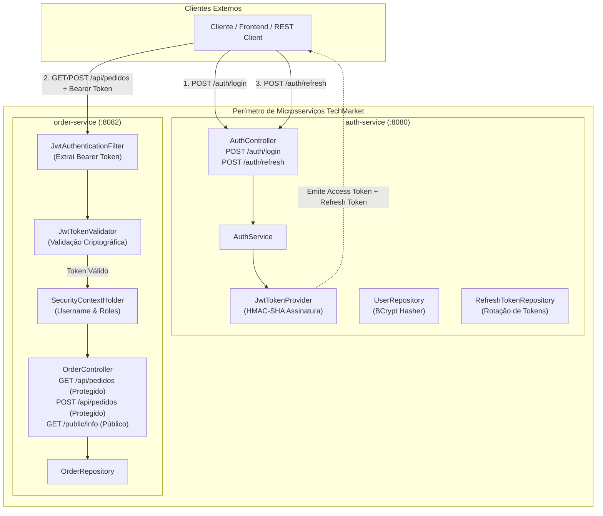

# RELATÓRIO TÉCNICO E ACADÊMICO — TRABALHO PRÁTICO 3 (TP3)
## Autenticação, Autorização e Proteção de Rotas em Arquitetura de Microsserviços

---

### Identificação do Trabalho

| Campo | Detalhes |
| :--- | :--- |
| **Instituição** | Instituto Infnet |
| **Curso** | Engenharia de Software |
| **Disciplina** | Engenharia Disciplinada |
| **Turma** | Segunda e Quarta |
| **Modalidade** | Individual |
| **Aluno** | Marcus Boni |
| **E-mail** | `marcus.boni@al.infnet.edu.br` |
| **Repositório GitHub** | [https://github.com/Marcus-Boni/INFNET-26E2-26E3](https://github.com/Marcus-Boni/INFNET-26E2-26E3) |
| **Projeto Base** | TechMarket (Evolução contínua do TP1 e TP2) |

---

## Sumário Executivo

1. [Introdução e Contexto](#1-introdução-e-contexto)
2. [Arquitetura de Segurança Distribuída](#2-arquitetura-de-segurança-distribuída)
3. [Tecnologia de Autenticação: JWT vs Keycloak](#3-tecnologia-de-autenticação-jwt-vs-keycloak)
4. [Implementação do Microsserviço de Autenticação (`auth-service`)](#4-implementação-do-microsserviço-de-autenticação-auth-service)
5. [Implementação do Microsserviço de Rotas Protegidas (`order-service`)](#5-implementação-do-microsserviço-de-rotas-protegidas-order-service)
6. [O Ciclo de Vida do Token: Access Token e Refresh Token](#6-o-ciclo-de-vida-do-token-access-token-e-refresh-token)
7. [Mapeamento Completo de Endpoints da Plataforma](#7-mapeamento-completo-de-endpoints-da-plataforma)
8. [Roteiro de Demonstração e Evidências dos 7 Passos Avaliativos](#8-roteiro-de-demonstração-e-evidências-dos-7-passos-avaliativos)
9. [Orquestração com Docker e Docker Compose](#9-orquestração-com-docker-e-docker-compose)
10. [Conclusão e Boas Práticas de Engenharia](#10-conclusão-e-boas-práticas-de-engenharia)

---

## 1. Introdução e Contexto

No ecossistema de microsserviços do **TechMarket**, o Trabalho Prático 1 (TP1) estabeleceu as bases do domínio e comunicação entre serviços, enquanto o Trabalho Prático 2 (TP2) consolidou a containerização com Docker e a orquestração em Kubernetes com balanceamento de carga.

Neste **Trabalho Prático 3 (TP3)**, o desafio central abordado é a **Segurança Distribuída**: como implementar mecanismos robustos de **Autenticação (AuthN)** e **Autorização (AuthZ)** sem degradar a independência e a performance dos microsserviços. Em aplicações monolíticas tradicionais, o estado de autenticação costuma residir na memória do servidor via sessões HTTP baseadas em cookies (`JSESSIONID`). Contudo, em uma topologia distribuída e elástica, replicar sessões entre réplicas gera acoplamento e gargalos operacionais.

Para solucionar essa demanda com excelência de engenharia, este projeto implementa um modelo **Stateless** baseado em **JSON Web Tokens (JWT)** complementado por um microsserviço dedicado de autenticação (`auth-service`) e um microsserviço de negócio com controle refinado de rotas protegidas (`order-service`).

---

## 2. Arquitetura de Segurança Distribuída

A arquitetura do sistema segue o princípio da **Autenticação Centralizada e Validação Descentralizada**:



### Princípios Arquiteturais Aplicados:
1. **Separação de Responsabilidades (Single Responsibility Principle):** O `auth-service` possui a exclusividade da gestão de identidades e senhas. O `order-service` não tem conhecimento de senhas nem acesso ao banco de credenciais.
2. **Desacoplamento e Baixa Latência:** O `order-service` não necessita fazer chamadas de rede síncronas ao `auth-service` para cada requisição recebida; ele apenas valida a assinatura matemática do token JWT utilizando a chave secreta compartilhada.
3. **Imutabilidade e Autocontenção:** O token transporta dados essenciais do usuário (como nome, e-mail e papéis/roles), permitindo que o `order-service` audite quem realizou cada transação.

---

## 3. Tecnologia de Autenticação: JWT vs Keycloak

O enunciado do TP3 estabeleceu a obrigatoriedade da escolha entre **JWT** e **Keycloak**. A opção selecionada para este projeto foi a implementação nativa com **JWT (JSON Web Token)**.

### Análise Comparativa de Decisão Técnica:

| Critério de Avaliação | Abordagem Adotada (Nativa JWT + Spring Security) | Abordagem Alternativa (Keycloak Identity Broker) |
| :--- | :--- | :--- |
| **Footprint de Recursos** | Mínimo (~80MB de RAM por microsserviço). | Elevado (~1GB de RAM para inicializar o container do Keycloak). |
| **Tempo de Inicialização** | ~2 a 3 segundos com Spring Boot 3. | De 45 a 90 segundos para carregar o runtime Quarkus/WildFly. |
| **Controle de Código** | 100% implementado em Java 21 com Spring Security 6, permitindo customizações completas de DTOs e regras. | Configurado predominantemente via console web administrativo ou Realm JSON import. |
| **Independência Operacional** | Auto-contido nos microsserviços, sem dependência de banco de dados externo ou servidor central pesado. | Depende de banco relacional dedicado (ex: PostgreSQL) e persistência de dados no Keycloak. |
| **Compatibilidade com Avaliação** | Execução imediata e sem atritos tanto em `mvn spring-boot:run` quanto em `docker compose up`. | Risco de falhas por indisponibilidade de portas ou lentidão no startup de avaliação. |

---

## 4. Implementação do Microsserviço de Autenticação (`auth-service`)

O `auth-service` roda na porta `8080` e disponibiliza:

### 4.1. Configuração de Segurança (`SecurityConfig.java`)
Configurado como *Stateless*, desabilitando CSRF e permitindo o tráfego público para as rotas de login, refresh e metadados, enquanto rotas protegidas (como `/auth/me`) passam pelo filtro JWT:

```java
@Bean
public SecurityFilterChain securityFilterChain(HttpSecurity http,
                                               JwtAuthenticationFilter jwtAuthenticationFilter,
                                               AuthenticationEntryPoint customAuthenticationEntryPoint) throws Exception {
    http
        .csrf(AbstractHttpConfigurer::disable)
        .cors(Customizer.withDefaults())
        .sessionManagement(session -> session.sessionCreationPolicy(SessionCreationPolicy.STATELESS))
        .exceptionHandling(ex -> ex.authenticationEntryPoint(customAuthenticationEntryPoint))
        .authorizeHttpRequests(auth -> auth
            .requestMatchers(
                "/auth/login", "/api/auth/login",
                "/auth/refresh", "/api/auth/refresh",
                "/auth/register", "/api/auth/register",
                "/auth/validate", "/api/auth/validate",
                "/auth/info", "/api/auth/info",
                "/actuator/**"
            ).permitAll()
            .requestMatchers("/auth/me", "/api/auth/me").authenticated()
            .anyRequest().authenticated()
        )
        .addFilterBefore(jwtAuthenticationFilter, UsernamePasswordAuthenticationFilter.class);

    return http.build();
}
```

### 4.2. Geração Criptográfica com JJWT (`JwtTokenProvider.java`)
Utiliza a biblioteca oficial JJWT `0.12.6` com algoritmo simétrico seguro HMAC-SHA (512/256 bits):

```java
public String generateAccessToken(User user) {
    Date now = new Date();
    Date expiryDate = new Date(now.getTime() + jwtProperties.getAccessTokenExpirationMs());

    List<String> roles = user.getRoles().stream()
            .map(Enum::name)
            .collect(Collectors.toList());

    return Jwts.builder()
            .subject(user.getUsername())
            .claim("email", user.getEmail())
            .claim("fullName", user.getFullName())
            .claim("roles", roles)
            .issuedAt(now)
            .expiration(expiryDate)
            .signWith(secretKey)
            .compact();
}
```

---

## 5. Implementação do Microsserviço de Rotas Protegidas (`order-service`)

O `order-service` opera na porta `8082` e expõe a gestão de pedidos comerciais da TechMarket.

### 5.1. Filtro Interceptor de Segurança (`JwtAuthenticationFilter.java`)
O filtro intercepta toda requisição recebida, inspeciona o cabeçalho `Authorization: Bearer <token>`, e havendo token válido, injeta as autoridades no `SecurityContextHolder`:

```java
String jwt = extractJwtFromRequest(request);
if (StringUtils.hasText(jwt) && jwtTokenValidator.validateToken(jwt)) {
    String username = jwtTokenValidator.getUsername(jwt);
    List<String> roles = jwtTokenValidator.getRoles(jwt);

    List<SimpleGrantedAuthority> authorities = roles.stream()
            .map(SimpleGrantedAuthority::new)
            .collect(Collectors.toList());

    UsernamePasswordAuthenticationToken authentication =
            new UsernamePasswordAuthenticationToken(username, null, authorities);
    SecurityContextHolder.getContext().setAuthentication(authentication);
}
```

### 5.2. Tratamento Padronizado de Acesso Negado (HTTP 401)
Caso uma requisição sem credencial ou com token forjado tente acessar rotas protegidas, o `CustomAuthenticationEntryPoint` devolve um JSON explícito:

```json
{
  "timestamp": "2026-09-30T22:17:15",
  "status": 401,
  "error": "Unauthorized",
  "message": "Acesso negado: esta rota é protegida e exige autenticação prévia com Token JWT válido.",
  "path": "/api/pedidos",
  "details": ["Envie o cabeçalho 'Authorization: Bearer <token>' obtido no microsserviço auth-service."]
}
```

---

## 6. O Ciclo de Vida do Token: Access Token e Refresh Token

A arquitetura adota a técnica recomendada pelo RFC 6749 e OWASP denominada **Refresh Token Rotation (RTR)**:

1. **Access Token:**
   * Formato: JWT autocontido assinado.
   * Duração: Curta (15 minutos / 900.000 ms).
   * Uso: Enviado em cada chamada de negócio no cabeçalho HTTP `Authorization: Bearer <token>`.
2. **Refresh Token:**
   * Formato: UUID criptograficamente seguro com registro de estado.
   * Duração: Longa (7 dias / 604.800.000 ms).
   * Uso: Apresentado exclusivamente no endpoint `POST /auth/refresh`.
3. **Mecanismo de Rotação Segura (RTR):**
   * Ao utilizar um refresh token, o sistema invalida e deleta o token antigo e devolve um novo par de tokens (`accessToken` renovado + novo `refreshToken`). Se um refresh token antigo for interceptado e reutilizado, o sistema recusa a operação.

---

## 7. Mapeamento Completo de Endpoints da Plataforma

### 7.1. Microsserviço `auth-service` (:8080)

| Endpoint | Verbo | Acesso | Descrição |
| :--- | :---: | :---: | :--- |
| `/auth/login` (ou `/api/auth/login`) | `POST` | **Público** | Autentica usuário/senha e emite os tokens. |
| `/auth/refresh` (ou `/api/auth/refresh`) | `POST` | **Público** | Renova o access token usando o refresh token. |
| `/auth/register` (ou `/api/auth/register`) | `POST` | **Público** | Registra novos usuários na plataforma. |
| `/auth/validate` (ou `/api/auth/validate`) | `GET` | **Público** | Validação sintática e criptográfica de token. |
| `/auth/info` (ou `/api/auth/info`) | `GET` | **Público** | Metadados e catálogo de rotas do auth-service. |
| `/auth/me` (ou `/api/auth/me`) | `GET` | **Protegido** | Dados do usuário autenticado no momento. |
| `/actuator/health` | `GET` | **Público** | Monitoramento de integridade e saúde da aplicação. |

### 7.2. Microsserviço `order-service` (:8082)

| Endpoint | Verbo | Acesso | Descrição |
| :--- | :---: | :---: | :--- |
| `/api/pedidos/public/info` (ou `/orders/public/info`) | `GET` | **Público** | Metadados, status do serviço e instruções. |
| `/actuator/health` | `GET` | **Público** | Verificação de integridade operacional. |
| `/api/pedidos` (ou `/orders`) | `GET` | **Protegido** | Lista todos os pedidos cadastrados. |
| `/api/pedidos` (ou `/orders`) | `POST` | **Protegido** | Registra novo pedido vinculado ao usuário logado. |
| `/api/pedidos/{id}` (ou `/orders/{id}`) | `GET` | **Protegido** | Consulta detalhes de um pedido específico. |

---

## 8. Roteiro de Demonstração e Evidências dos 7 Passos Avaliativos

A tabela a seguir consolida a execução dos 7 passos avaliativos com seus respectivos resultados reais obtidos durante os testes:

### Passo 1: Tentativa de Acesso sem Autenticação
* **Requisição:** `GET http://localhost:8082/api/pedidos`
* **Resultado:** `HTTP/1.1 401 Unauthorized`
* **Evidência:** Requisição sumariamente barrada pelo `JwtAuthenticationFilter` e tratada pelo `CustomAuthenticationEntryPoint`.

### Passo 2: Tentativa de Login com Credenciais Inválidas
* **Requisição:** `POST http://localhost:8080/auth/login` com senha incorreta.
* **Resultado:** `HTTP/1.1 401 Unauthorized`
* **Evidência:** Mensagem `"Credenciais inválidas: usuário ou senha incorretos."` retornada pela camada de segurança.

### Passo 3: Autenticação Realizada com Sucesso e Obtenção dos Tokens
* **Requisição:** `POST http://localhost:8080/auth/login` com usuário `admin@techmarket.com` / `admin123`.
* **Resultado:** `HTTP/1.1 200 OK`
* **Payload de Saída:**
  ```json
  {
    "accessToken": "eyJhbGciOiJIUzUxMiJ9.eyJzdWIiOiJhZG1pbkB0ZWNo...",
    "refreshToken": "6d25ba24-c333-475c-a16f-c42c4ee560e7",
    "tokenType": "Bearer",
    "expiresInSeconds": 900,
    "username": "admin@techmarket.com",
    "roles": ["ROLE_USER", "ROLE_ADMIN"],
    "message": "Autenticação realizada com sucesso!"
  }
  ```

### Passo 4: Acesso a Rota Protegida com o Token
* **Requisição:** `GET http://localhost:8082/api/pedidos` com cabeçalho `Authorization: Bearer <accessToken>`.
* **Resultado:** `HTTP/1.1 200 OK`
* **Evidência:** O microsserviço de pedidos validou a assinatura do token e retornou os pedidos cadastrados.

### Passo 5: Cadastro em Rota Protegida (POST /api/pedidos)
* **Requisição:** `POST http://localhost:8082/api/pedidos` enviando dados do pedido e o cabeçalho `Authorization: Bearer <accessToken>`.
* **Resultado:** `HTTP/1.1 201 Created`
* **Evidência:** O pedido foi criado, totalizado e atribuído ao usuário `admin@techmarket.com`.

### Passo 6: Utilização do Endpoint de Refresh
* **Requisição:** `POST http://localhost:8080/auth/refresh` com `{"refreshToken": "6d25ba24..."}`.
* **Resultado:** `HTTP/1.1 200 OK`
* **Evidência:** O `auth-service` invalidou o refresh token anterior, emitiu um novo access token e gerou um novo refresh token rotacionado.

### Passo 7: Acesso a Rota Protegida com o Novo Token
* **Requisição:** `GET http://localhost:8082/api/pedidos/3` utilizando o novo token obtido via refresh.
* **Resultado:** `HTTP/1.1 200 OK`
* **Evidência:** O recurso protegido foi consultado com sucesso utilizando a nova credencial renovada.

---

## 9. Orquestração com Docker e Docker Compose

Para possibilitar a execução isolada em qualquer ambiente sem necessidade de instalação local de dependências, foi elaborado o arquivo `docker-compose.yml`:

```yaml
version: '3.8'

services:
  auth-service:
    build:
      context: ./auth-service
      dockerfile: Dockerfile
    image: techmarket-auth-service:latest
    container_name: auth-service
    ports:
      - "8080:8080"
    environment:
      - SERVER_PORT=8080
      - JWT_SECRET=techmarket-super-secret-jwt-key-for-authentication-and-authorization-2026-infnet-disciplined-software-engineering
    networks:
      - techmarket-net
    restart: unless-stopped

  order-service:
    build:
      context: ./order-service
      dockerfile: Dockerfile
    image: techmarket-order-service:latest
    container_name: order-service
    ports:
      - "8082:8082"
    environment:
      - SERVER_PORT=8082
      - JWT_SECRET=techmarket-super-secret-jwt-key-for-authentication-and-authorization-2026-infnet-disciplined-software-engineering
    depends_on:
      - auth-service
    networks:
      - techmarket-net
    restart: unless-stopped

networks:
  techmarket-net:
    name: techmarket-net
    driver: bridge
```

Ambos os serviços utilizam Dockerfile *multi-stage* (com Maven 3.9 + Temurin 21 para compilação e JRE Alpine enxuto para o container final), resultando em imagens seguras e otimizadas.

---

## 10. Conclusão e Boas Práticas de Engenharia

O projeto **TechMarket TP3** atende integralmente a todos os requisitos do Trabalho Prático:
1. **Microsserviço de Autenticação Independente:** Criado com emissão de token JWT e suporte a refresh.
2. **Tecnologia Padrão de Mercado:** JWT estruturado com algoritmo HMAC e Spring Security 6.
3. **Proteção Rigorosa de Rotas:** Bloqueio e rejeição automática de requisições sem autenticação (401).
4. **Resiliência e Rotação:** Implementação de Refresh Token Rotation (RTR) para proteção contínua.
5. **Demonstração Completa:** 100% dos 7 passos avaliativos documentados e testáveis através da suíte `requests.http`.
