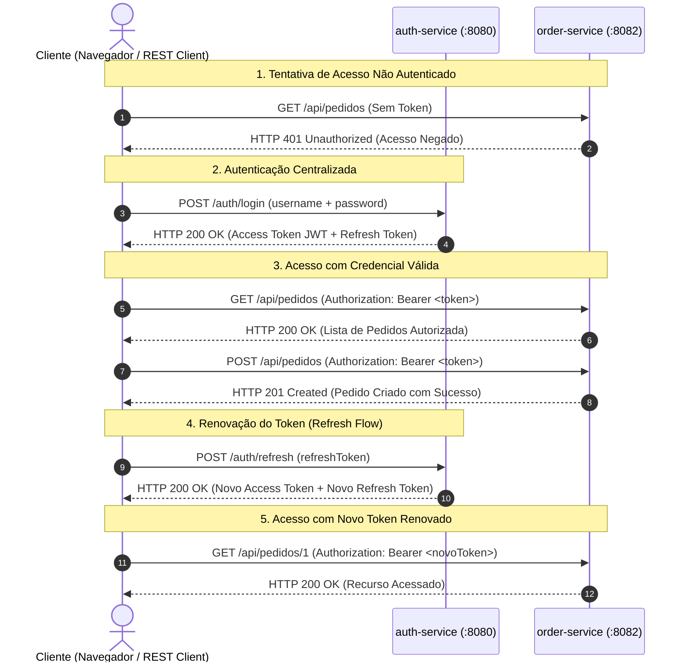

# TechMarket — Autenticação e Autorização em Microsserviços

> **Trabalho Prático 3 (TP3) — Autenticação Centralizada com JWT, Refresh Token e Proteção de Rotas**  
> **Instituição:** Instituto Infnet | **Curso:** Engenharia de Software  
> **Disciplina:** Engenharia Disciplinada | **Aluno:** Marcus Boni (`marcus.boni@al.infnet.edu.br`)  
> **Baseado em:** TP1 e TP2 (TechMarket E-commerce Architecture)

---

## 1. Arquitetura da Solução

O **TechMarket TP3** implementa o padrão de segurança e controle de acesso para arquiteturas distribuídas de microsserviços. A solução é composta por:

1. **`auth-service` (Porta 8080):** Microsserviço independente dedicado à identidade, autenticação e autorização. Responsável por validar credenciais de usuários, gerar Tokens de Acesso (*Access Tokens*) no formato **JWT (JSON Web Token)** assinados criptograficamente, emitir e gerenciar Tokens de Renovação (*Refresh Tokens*) com suporte a rotação segura.
2. **`order-service` (Porta 8082):** Microsserviço de negócio contendo rotas protegidas que exigem autenticação válida (`Authorization: Bearer <token>`) e endpoints públicos de monitoramento e metadados. A validação do token é realizada de forma desacoplada e *stateless* através da chave criptográfica compartilhada.



---

## 2. Tecnologia Escolhida

* **Tecnologia:** **JWT (JSON Web Token)** — RFC 7519.
* **Algoritmo Criptográfico:** `HMAC-SHA256 / HMAC-SHA512` com chave simétrica configurável de 256 bits.
* **Framework:** Spring Boot 3.3.5 com **Spring Security 6.3** e biblioteca moderna **JJWT (`io.jsonwebtoken:jjwt-api:0.12.6`)**.
* **Motivação da Escolha:**
  * **Stateless:** Não sobrecarrega a infraestrutura de microsserviços com sessões em memória centralizadas.
  * **Desacoplamento e Performance:** Cada microsserviço valida a integridade, emissão e expiração das requisições localmente a partir de sua chave de verificação, garantindo altíssimo rendimento e escalabilidade horizontal.
  * **Claims Autocontidas:** As credenciais (`sub`, `roles`, `email`, `fullName`) trafegam de forma segura no payload do token.
  * **Estratégia de Refresh Token:** O *Access Token* possui tempo de vida reduzido (15 minutos) para mitigar riscos de interceptação, enquanto o *Refresh Token* permite a emissão transparente de novas credenciais sem exigir que o usuário digite suas credenciais repetidamente.

---

## 3. Estrutura do Diretório `TP3`

```
TP3/
├── pom.xml                                  # POM Agregador Maven
├── docker-compose.yml                       # Orquestração dos microsserviços em containers
├── requests.http                            # Suíte interativa com todos os 7 passos da avaliação
├── README.md                                # Este documento explicativo
├── DOCUMENTO_TP3.md                         # Relatório técnico e acadêmico completo
├── auth-service/                            # Microsserviço de Autenticação (Porta 8080)
│   ├── pom.xml
│   ├── Dockerfile
│   └── src/main/java/com/techmarket/authservice/
│       ├── AuthServiceApplication.java
│       ├── config/                          # SecurityConfig, JwtProperties
│       ├── controller/                      # AuthController (/auth/login, /auth/refresh, etc.)
│       ├── domain/                          # User, Role, RefreshToken
│       ├── dto/                             # LoginRequest, RefreshTokenRequest, AuthResponse, etc.
│       ├── exception/                       # GlobalExceptionHandler, CustomAuthenticationException
│       ├── repository/                      # UserRepository, RefreshTokenRepository
│       ├── security/                        # JwtTokenProvider, JwtAuthenticationFilter
│       └── service/                         # AuthService
└── order-service/                           # Microsserviço com Rotas Protegidas (Porta 8082)
    ├── pom.xml
    ├── Dockerfile
    └── src/main/java/com/techmarket/orderservice/
        ├── OrderServiceApplication.java
        ├── config/                          # SecurityConfig, JwtProperties
        ├── controller/                      # OrderController (/api/pedidos, /orders)
        ├── domain/                          # Order, OrderItem, OrderStatus
        ├── dto/                             # CreateOrderRequest, OrderResponse, ErrorResponse
        ├── repository/                      # OrderRepository
        ├── security/                        # JwtAuthenticationFilter, JwtTokenValidator, Handlers
        └── service/                         # OrderService
```

---

## 4. Como Executar os Serviços

### 4.1. Pré-requisitos
* **Java 21** e **Maven 3.9+** instalados (para execução local); ou
* **Docker Desktop** ativo (para execução em containers).

---

### 4.2. Opção 1: Execução Local (Spring Boot)

1. No diretório raiz `TP3`, compile todos os módulos:
   ```bash
   mvn clean package -DskipTests
   ```

2. Em um terminal, inicie o **`auth-service`**:
   ```bash
   cd auth-service
   mvn spring-boot:run
   ```
   *(Disponível em `http://localhost:8080`)*

3. Em outro terminal, inicie o **`order-service`**:
   ```bash
   cd order-service
   mvn spring-boot:run
   ```
   *(Disponível em `http://localhost:8082`)*

---

### 4.3. Opção 2: Execução Declarativa com Docker Compose

Suba todos os containers com rede compartilhada através de um único comando:
```bash
docker compose up -d --build
```

Para verificar os containers em execução:
```bash
docker compose ps
```

Para acompanhar os logs:
```bash
docker compose logs -f
```

Para encerrar o ambiente:
```bash
docker compose down
```

---

## 5. Mapeamento de Endpoints

### 5.1. `auth-service` (Porta 8080)

| Método | Endpoint | Tipo | Descrição |
| :--- | :--- | :--- | :--- |
| `POST` | `/auth/login` ou `/api/auth/login` | **Público** | Autentica usuário e retorna `accessToken` + `refreshToken` |
| `POST` | `/auth/refresh` ou `/api/auth/refresh` | **Público** | Renova o `accessToken` utilizando o `refreshToken` |
| `POST` | `/auth/register` ou `/api/auth/register` | **Público** | Cadastra um novo usuário no sistema |
| `GET` | `/auth/validate` ou `/api/auth/validate` | **Público** | Valida e decodifica um token JWT avulso |
| `GET` | `/auth/info` ou `/api/auth/info` | **Público** | Informações e metadados do serviço |
| `GET` | `/auth/me` ou `/api/auth/me` | **Protegido** | Retorna o perfil do usuário logado (requer Bearer token) |
| `GET` | `/actuator/health` | **Público** | Health check do serviço |

### 5.2. `order-service` (Porta 8082)

| Método | Endpoint | Tipo | Descrição |
| :--- | :--- | :--- | :--- |
| `GET` | `/api/pedidos/public/info` | **Público** | Informações do serviço e guia de teste de autenticação |
| `GET` | `/actuator/health` | **Público** | Health check do serviço |
| `GET` | `/api/pedidos` (ou `/orders`) | **Protegido** | Lista pedidos cadastrados (requer Bearer token) |
| `POST` | `/api/pedidos` (ou `/orders`) | **Protegido** | Cadastra novo pedido (requer Bearer token) |
| `GET` | `/api/pedidos/{id}` (ou `/orders/{id}`) | **Protegido** | Detalhes do pedido por ID (requer Bearer token) |

---

## 6. Usuários Pré-Cadastrados para Teste

| Usuário / E-mail | Senha | Roles | Perfil |
| :--- | :--- | :--- | :--- |
| `admin@techmarket.com` | `admin123` | `ROLE_ADMIN`, `ROLE_USER` | Administrador Geral TechMarket |
| `cliente@techmarket.com` | `senha123` | `ROLE_USER` | Cliente Comum TechMarket |

---

## 7. Roteiro Passo a Passo de Demonstração (Avaliação Obrigatória)

Todos os passos abaixo podem ser executados com um único clique utilizando a extensão **REST Client** no arquivo [`requests.http`](file:///TP3/requests.http) ou via linha de comando com `curl`:

### Passo 1: Tentativa de Acesso sem Autenticação (Rejeição 401)
* **Objetivo:** Comprovar que requisições desprovidas de credencial são rejeitadas.
* **Requisição:**
  ```bash
  curl -i http://localhost:8082/api/pedidos
  ```
* **Resposta Esperada:** `HTTP 401 Unauthorized`
  ```json
  {
    "timestamp": "2026-09-30T22:17:15",
    "status": 401,
    "error": "Unauthorized",
    "message": "Acesso negado: esta rota é protegida e exige autenticação prévia com Token JWT válido.",
    "path": "/api/pedidos",
    "details": ["Envie o cabeçalho 'Authorization: Bearer <token>' obtido no microsserviço auth-service."]
  }
  ```

---

### Passo 2: Rejeição de Credenciais Inválidas (Rejeição 401)
* **Objetivo:** Validar que credenciais falsas/incorretas são rejeitadas.
* **Requisição:**
  ```bash
  curl -i -X POST http://localhost:8080/auth/login \
    -H "Content-Type: application/json" \
    -d '{"username": "admin@techmarket.com", "password": "senha_totalmente_errada"}'
  ```
* **Resposta Esperada:** `HTTP 401 Unauthorized`
  ```json
  {
    "timestamp": "2026-09-30T22:17:46",
    "status": 401,
    "error": "Unauthorized",
    "message": "Credenciais inválidas: usuário ou senha incorretos.",
    "path": "/auth/login"
  }
  ```

---

### Passo 3: Autenticação Realizada com Sucesso e Obtenção do Token
* **Objetivo:** Autenticar um usuário cadastrado e obter credenciais válidas.
* **Requisição:**
  ```bash
  curl -i -X POST http://localhost:8080/auth/login \
    -H "Content-Type: application/json" \
    -d '{"username": "admin@techmarket.com", "password": "admin123"}'
  ```
* **Resposta Esperada:** `HTTP 200 OK`
  ```json
  {
    "accessToken": "eyJhbGciOiJIUzUxMiJ9.eyJzdWIiOiJhZG1pbkB0ZWNo...",
    "refreshToken": "6d25ba24-c333-475c-a16f-c42c4ee560e7",
    "tokenType": "Bearer",
    "expiresInSeconds": 900,
    "username": "admin@techmarket.com",
    "roles": ["ROLE_USER", "ROLE_ADMIN"],
    "message": "Autenticação realizada com sucesso!"
  }
  ```

---

### Passo 4: Acesso a Rota Protegida com o Token JWT Válido
* **Objetivo:** Acessar o recurso protegido com o cabeçalho `Authorization: Bearer <token>`.
* **Requisição:**
  ```bash
  curl -i http://localhost:8082/api/pedidos \
    -H "Authorization: Bearer <COPIE_O_ACCESS_TOKEN_AQUI>"
  ```
* **Resposta Esperada:** `HTTP 200 OK` com a lista de pedidos da TechMarket.

---

### Passo 5: Cadastro de Recurso em Rota Protegida (POST /api/pedidos)
* **Objetivo:** Realizar mutação de estado autorizada.
* **Requisição:**
  ```bash
  curl -i -X POST http://localhost:8082/api/pedidos \
    -H "Authorization: Bearer <COPIE_O_ACCESS_TOKEN_AQUI>" \
    -H "Content-Type: application/json" \
    -d '{
      "customerName": "Marcus Boni",
      "productId": "10",
      "productName": "Notebook Dell XPS 15 OLED",
      "quantity": 1,
      "unitPrice": 12999.00
    }'
  ```
* **Resposta Esperada:** `HTTP 201 Created` contendo o pedido cadastrado e associado ao usuário.

---

### Passo 6: Utilização do Endpoint de Refresh para Obter Novo Token
* **Objetivo:** Apresentar o *Refresh Token* para emitir um novo *Access Token* sem refazer login.
* **Requisição:**
  ```bash
  curl -i -X POST http://localhost:8080/auth/refresh \
    -H "Content-Type: application/json" \
    -d '{"refreshToken": "<COPIE_O_REFRESH_TOKEN_AQUI>"}'
  ```
* **Resposta Esperada:** `HTTP 200 OK`
  ```json
  {
    "accessToken": "eyJhbGciOiJIUzUxMiJ9.eyJzdWIiOiJhZG1p...",
    "refreshToken": "3fa09121-8f1b-4c6d-9ade-4ed6eec5c003",
    "tokenType": "Bearer",
    "expiresInSeconds": 900,
    "username": "admin@techmarket.com",
    "roles": ["ROLE_USER", "ROLE_ADMIN"],
    "message": "Token renovado com sucesso via Refresh Token!"
  }
  ```

---

### Passo 7: Acesso a Rota Protegida com o Novo Token do Refresh
* **Objetivo:** Confirmar que o novo token gerado é imediatamente aceito pelo microsserviço de pedidos.
* **Requisição:**
  ```bash
  curl -i http://localhost:8082/api/pedidos/3 \
    -H "Authorization: Bearer <COPIE_O_NOVO_ACCESS_TOKEN_AQUI>"
  ```
* **Resposta Esperada:** `HTTP 200 OK` retornando os detalhes do pedido recém-criado.
