# Freela Marketplace — Arquitetura Orientada a Eventos com Apache Kafka

> **Assessment: Domain-Driven Design (DDD) e Arquitetura de Softwares Escaláveis com Java [26E3_4]**  
> **Instituição:** Instituto Infnet  
> **Aluno:** Marcus Boni  

---

## 1. Visão Geral da Arquitetura

O **Freela Marketplace** é uma plataforma distribuída construída com **Java 21**, **Spring Boot 4 / Spring Cloud 2025**, **Apache Kafka em modo KRaft** e **PostgreSQL**. A plataforma permite a conexão entre clientes e profissionais freelancers, gerenciando o ciclo de vida de contratos e propagando eventos de negócio de forma assíncrona, resiliente, ordenada e observável.

```mermaid
flowchart TD
    Client([Cliente / Postman / cURL]) -->|HTTP REST + X-Correlation-Id| Gateway[API Gateway :8080]
    Gateway -->|Discovery & Load Balancing| Eureka[Eureka Server :8761]
    Gateway -->|Forward c/ Tracing| ContratoSvc[contrato-service :8081]
    
    subgraph ContratoServiceBoundary ["contrato-service (Transactional Outbox)"]
        ContratoAPI[ContratoController] --> ContratoApp[ContratoApplicationService]
        ContratoApp -->|1. Persiste Aggregate + Evento no Outbox| ContratoDB[(PostgreSQL: contrato_db)]
        OutboxPoller[OutboxPublisher] -->|2. Polling PENDING ordenado por createdAt| ContratoDB
        OutboxPoller -->|3. Publica c/ Key=contratoId| KafkaTopic[(Kafka: contratos.v1.events)]
        OutboxPoller -->|4. Atualiza status para PUBLISHED| ContratoDB
    end

    subgraph KafkaBroker ["Apache Kafka (KRaft - 3 Partições)"]
        KafkaTopic
        KafkaDLQ[(Kafka: contratos.v1.events.DLT)]
    end

    subgraph NotificacaoServiceBoundary ["notificacao-service :8082"]
        KafkaTopic -->|Consome Eventos| NotifListener[NotificacaoKafkaConsumer]
        NotifListener -->|Verifica Idempotência| NotifDB[(PostgreSQL: notificacao_db)]
        NotifListener -->|Gera Notificações| NotifDB
    end

    subgraph ReputacaoServiceBoundary ["reputacao-service :8083"]
        KafkaTopic -->|Consome ContratoConcluido| ReputListener[ReputacaoKafkaConsumer]
        ReputListener -->|Verifica Idempotência| ReputDB[(PostgreSQL: reputacao_db)]
        ReputListener -->|Incrementa Contratos e Valor| ReputDB
    end

    subgraph AuditoriaServiceBoundary ["auditoria-service :8084"]
        KafkaTopic -->|Consome Todos os Eventos| AuditListener[AuditoriaKafkaConsumer]
        AuditListener -->|Verifica Idempotência| AuditDB[(PostgreSQL: auditoria_db)]
        AuditListener -->|Audita Payload Completo| AuditDB
    end

    subgraph Observabilidade ["Observabilidade & Rastreabilidade"]
        Zipkin[Zipkin Distributed Tracing :9411]
        Loki[Grafana Loki Logs :3100]
        Grafana[Grafana Dashboards :3000]
        KafkaUI[Kafka UI :8090]
        
        Gateway -.->|Traces HTTP & MDC| Zipkin
        ContratoSvc -.->|Traces HTTP/Kafka & MDC| Zipkin
        NotificacaoServiceBoundary -.->|Traces Kafka & MDC| Zipkin
        ReputacaoServiceBoundary -.->|Traces Kafka & MDC| Zipkin
        AuditoriaServiceBoundary -.->|Traces Kafka & MDC| Zipkin
        
        Gateway -.->|Logs JSON c/ MDC| Loki
        ContratoSvc -.->|Logs JSON c/ MDC| Loki
        NotificacaoServiceBoundary -.->|Logs JSON c/ MDC| Loki
        ReputacaoServiceBoundary -.->|Logs JSON c/ MDC| Loki
        AuditoriaServiceBoundary -.->|Logs JSON c/ MDC| Loki
    end
```



---

## 2. Microsserviços Participantes

| Serviço | Porta | Banco de Dados | Papel Principal |
|---|:---:|:---:|---|
| **`eureka-server`** | `8761` | — | Registro e descoberta dinâmica dos microsserviços. |
| **`api-gateway`** | `8080` | — | Ponto de entrada HTTP único, geração e injeção de `X-Correlation-Id`, roteamento reativo e rastreamento distribuído. |
| **`contrato-service`** | `8081` | `contrato_db` | Gestão do ciclo de vida dos contratos (Aggregate DDD) e publicação transacional de eventos via **Transactional Outbox**. |
| **`notificacao-service`** | `8082` | `notificacao_db` | Consumo assíncrono e persistência de notificações para clientes e freelancers com garantia de **idempotência**. |
| **`reputacao-service`** | `8083` | `reputacao_db` | Manutenção da pontuação e faturamento acumulado de freelancers mediante eventos de conclusão, com proteção estrita contra **duplo incremento**. |
| **`auditoria-service`** | `8084` | `auditoria_db` | Registro imutável de todos os eventos da plataforma para auditoria forense, rastreamento de correlação e conformidade. |

---

## 3. Tópicos Kafka e Particionamento

| Tópico | Partições | Replicação | Chave de Particionamento | Descrição |
|---|:---:|:---:|:---:|---|
| **`contratos.v1.events`** | `3` | `1` | `contratoId` (UUID string) | Tópico principal de eventos de ciclo de vida de contratos. |
| **`contratos.v1.events.DLT`** | `3` | `1` | `contratoId` | Dead Letter Topic para descarte e análise de mensagens com falha persistente após 3 tentativas. |

### Estratégia de Particionamento e Ordenação Estrita (FIFO por Contrato)
- **Chave de Particionamento (`Key`):** Todas as mensagens de um mesmo contrato utilizam o `contratoId` como chave da mensagem no Kafka (`record.key() = contratoId.toString()`).
- O algoritmo padrão de partição (Murmur2 hash) direciona deterministicamente todas as mensagens com a mesma chave para a **mesma partição** do broker.
- No Kafka, **a ordem de leitura é estritamente garantida dentro de uma partição**.
- **Processamento Concorrente com Concurrency = 3:** Cada consumidor (`notificacao-service`, `reputacao-service`, `auditoria-service`) configura `concurrency = 3` no listener. O Kafka atribui cada uma das 3 partições a uma thread exclusiva do grupo consumidor.
- **Resultado:** Contratos distintos são processados em paralelo e com máxima vazão (escalabilidade horizontal), enquanto eventos de um mesmo contrato (`ContratoCriado` $\rightarrow$ `EntregaRegistrada` $\rightarrow$ `ContratoConcluido`) **nunca são processados fora de ordem**.

---

## 4. Catálogo de Eventos de Domínio

Todos os eventos contêm os cabeçalhos padrão e payload JSON auto-contido:

### 4.1. `ContratoCriado`
- **Emitido quando:** Um novo contrato é formalizado na plataforma.
- **Payload:**
```json
{
  "eventId": "a5df9aae-dbdd-4b94-b0a7-e0663c1bbe1f",
  "eventType": "ContratoCriado",
  "contratoId": "8f2d3297-3a51-4bca-949c-d51f103f38bf",
  "clienteId": "11111111-1111-1111-1111-111111111111",
  "freelancerId": "22222222-2222-2222-2222-222222222222",
  "titulo": "Construção de API de pagamentos",
  "valor": 3500.00,
  "correlationId": "corr-teste-001",
  "occurredAt": "2026-09-22T19:00:00Z"
}
```

### 4.2. `EntregaRegistrada`
- **Emitido quando:** O freelancer submete os entregáveis do contrato (`PUT /api/contratos/{id}/entrega`).
- **Payload:**
```json
{
  "eventId": "53dbf882-6eed-4d0d-a8e4-efc8ab0d6ec8",
  "eventType": "EntregaRegistrada",
  "contratoId": "8f2d3297-3a51-4bca-949c-d51f103f38bf",
  "clienteId": "11111111-1111-1111-1111-111111111111",
  "freelancerId": "22222222-2222-2222-2222-222222222222",
  "titulo": "Construção de API de pagamentos",
  "correlationId": "corr-teste-001",
  "occurredAt": "2026-09-22T19:15:00Z"
}
```

### 4.3. `ContratoConcluido`
- **Emitido quando:** O cliente aprova a entrega e conclui o contrato (`PUT /api/contratos/{id}/concluir`).
- **Payload:**
```json
{
  "eventId": "409bc751-2a92-4de0-b4d3-72f80fe353d9",
  "eventType": "ContratoConcluido",
  "contratoId": "8f2d3297-3a51-4bca-949c-d51f103f38bf",
  "clienteId": "11111111-1111-1111-1111-111111111111",
  "freelancerId": "22222222-2222-2222-2222-222222222222",
  "titulo": "Construção de API de pagamentos",
  "valor": 3500.00,
  "correlationId": "corr-teste-001",
  "occurredAt": "2026-09-22T19:30:00Z"
}
```

---

## 5. Padrões de Confiabilidade e Arquitetura

### 5.1. Publicação Transacional (Transactional Outbox Pattern)
Para resolver o problema do *Dual Write* (risco de salvar o contrato no PostgreSQL mas falhar na publicação para o Kafka, ou vice-versa):
1. No `contrato-service`, ao criar ou alterar um contrato, o Aggregate `Contrato` gera os eventos de domínio correspondentes.
2. Na mesma transação de banco de dados (`@Transactional`), o contrato é salvo na tabela `contratos` e os eventos de domínio são persistidos na tabela `outbox_events` com status `PENDING`.
3. O componente `OutboxPublisher` executa periodicamente (`@Scheduled(fixedDelay = 500ms)`), lê os eventos pendentes em ordem de criação (`createdAt ASC`), envia-os para o Kafka com chave `contratoId`, e somente após a confirmação síncrona do broker (`acks=all`), marca o registro como `PUBLISHED`.
4. Em caso de indisponibilidade transitória do Kafka, os eventos permanecem salvos em banco e são retransmitidos assim que o broker retornar.

### 5.2. Tratamento de Mensagens Duplicadas (Idempotência Rigorosa)
Pela semântica *at-least-once delivery* do Kafka, reentregas de mensagens podem ocorrer em casos de rebalanceamento ou retentativas de rede.
Para impedir efeitos duplicados:
- **Tabela `mensagens_processadas`:** Cada consumidor (`notificacao-service`, `reputacao-service`, `auditoria-service`) mantém sua própria tabela local de controle com chave primária `eventId`.
- **Verificação Atômica:** Antes de qualquer alteração de estado em banco, o consumidor verifica `if (repository.existsById(eventId))`.
- **Efeitos Protegidos:**
  - `notificacao-service`: Não emite notificações repetidas para o mesmo evento.
  - `reputacao-service`: **Não duplica a contagem de contratos concluídos** nem soma o valor monetário pela segunda vez.
  - `auditoria-service`: Não duplica o registro histórico de eventos.

### 5.3. Resiliência e Dead Letter Topic (DLT)
- Cada listener Kafka é configurado com `DefaultErrorHandler` com política de retentativa com backoff fixo (`FixedBackOff(1000L, 3)`).
- Caso uma mensagem apresente falha não recuperável (ex.: erro de sintaxe, dados corrompidos) ou exceda 3 tentativas, o `DeadLetterPublishingRecoverer` desvia a mensagem para o tópico `contratos.v1.events.DLT`.
- A partição original não é bloqueada, permitindo que as mensagens seguintes continuem sendo processadas normalmente.

---

## 6. Observabilidade e Rastreabilidade

### 6.1. Distributed Tracing com Zipkin
- Todos os serviços utilizam **Micrometer Tracing** com a ponte **Brave** (`micrometer-tracing-bridge-brave`) e repórter do **Zipkin** (`zipkin-reporter-brave`).
- A amostragem está configurada em 100% (`sampling.probability: 1.0`).
- O contexto de trace (`traceId`, `spanId`) é propagado tanto nas chamadas HTTP via API Gateway quanto nos headers do Apache Kafka (`traceparent`, `b3`).
- Pelo painel do Zipkin (`http://localhost:9411`), é possível acompanhar a cascata completa:  
  `api-gateway` $\rightarrow$ `contrato-service` $\rightarrow$ `Kafka` $\rightarrow$ [`notificacao-service`, `reputacao-service`, `auditoria-service`].

### 6.2. Correlação de Operações (`X-Correlation-Id`)
- Toda requisição externa iniciada no API Gateway recebe ou propaga o header `X-Correlation-Id`.
- O valor é injetado no contexto MDC do Logback e embutido no payload e nos headers das mensagens Kafka.
- Os consumidores extraem o `correlationId` e o alimentam no MDC durante todo o ciclo de consumo.

### 6.3. Logs Centralizados com MDC e Grafana Loki
- Todos os serviços utilizam o padrão de logging com identificadores diagnósticos:
```text
%d{yyyy-MM-dd HH:mm:ss.SSS} %-5level service=${spring.application.name} traceId=%X{traceId:-} spanId=%X{spanId:-} correlationId=%X{correlationId:-} contratoId=%X{contratoId:-} eventId=%X{eventId:-} thread=%thread logger=%logger{36} - %msg%n
```
- A infraestrutura inclui **Grafana Loki** (`:3100`) e **Grafana** (`:3000`), permitindo pesquisar logs em toda a frota através de consultas LogQL por `contratoId`, `eventId` ou `correlationId`.

---

## 7. Como Executar o Ambiente

### Pré-requisitos
- **Java 21**
- **Apache Maven 3.9+**
- **Docker e Docker Compose**

### Passo 1: Inicializar a Infraestrutura
Na pasta raiz do projeto:
```bash
cd AT/infra
docker compose up -d
```
Verificar o status dos containers:
```bash
docker compose ps
```

Interfaces disponíveis após inicialização:
- **Kafka UI:** [http://localhost:8090](http://localhost:8090)
- **Zipkin UI:** [http://localhost:9411](http://localhost:9411)
- **Grafana:** [http://localhost:3000](http://localhost:3000) (Usuário: `admin` / Senha: `admin`)
- **Eureka Server:** [http://localhost:8761](http://localhost:8761)

### Passo 2: Compilar e Executar os Testes Automatizados
```bash
cd AT
mvn clean test
```
*Todos os testes unitários e de integração (Outbox, Idempotência, Consumidores, Auditoria) serão executados com sucesso.*

### Passo 3: Iniciar as Aplicações Spring Boot
Em terminais separados a partir da pasta `AT`:

```bash
# 1. Service Discovery
mvn -pl eureka-server spring-boot:run

# 2. API Gateway
mvn -pl api-gateway spring-boot:run

# 3. Contrato Service
mvn -pl contrato-service spring-boot:run

# 4. Notificacao Service
mvn -pl notificacao-service spring-boot:run

# 5. Reputacao Service
mvn -pl reputacao-service spring-boot:run

# 6. Auditoria Service
mvn -pl auditoria-service spring-boot:run
```

---

## 8. Execução e Validação de Evidências

### Execução Automatizada via Script
Execute o script de demonstração de ponta a ponta (PowerShell ou Bash):

```powershell
# No Windows PowerShell:
.\AT\scripts\demonstrar-evidencias.ps1
```
```bash
# No Linux / macOS:
chmod +x ./AT/scripts/demonstrar-evidencias.sh
./AT/scripts/demonstrar-evidencias.sh
```

### Exemplos Manuais com cURL

#### 1. Criar Contrato (`ContratoCriado`)
```bash
curl -i -X POST http://localhost:8080/api/contratos \
  -H "Content-Type: application/json" \
  -H "X-Correlation-Id: op-manual-001" \
  -d '{
    "clienteId": "11111111-1111-1111-1111-111111111111",
    "freelancerId": "22222222-2222-2222-2222-222222222222",
    "titulo": "Construção de API de pagamentos",
    "valor": 3500.00
  }'
```

#### 2. Registrar Entrega (`EntregaRegistrada`)
```bash
curl -i -X PUT http://localhost:8080/api/contratos/{id}/entrega \
  -H "X-Correlation-Id: op-manual-001"
```

#### 3. Concluir Contrato (`ContratoConcluido`)
```bash
curl -i -X PUT http://localhost:8080/api/contratos/{id}/concluir \
  -H "X-Correlation-Id: op-manual-001"
```

#### 4. Consultar Notificações Geradas
```bash
curl -s http://localhost:8080/api/notificacoes \
  -H "X-Correlation-Id: op-manual-001"
```

#### 5. Consultar Reputação Atualizada
```bash
curl -s http://localhost:8080/api/reputacoes \
  -H "X-Correlation-Id: op-manual-001"
```

#### 6. Consultar Auditoria por Contrato
```bash
curl -s "http://localhost:8080/api/auditoria?contratoId={id}" \
  -H "X-Correlation-Id: op-manual-001"
```
