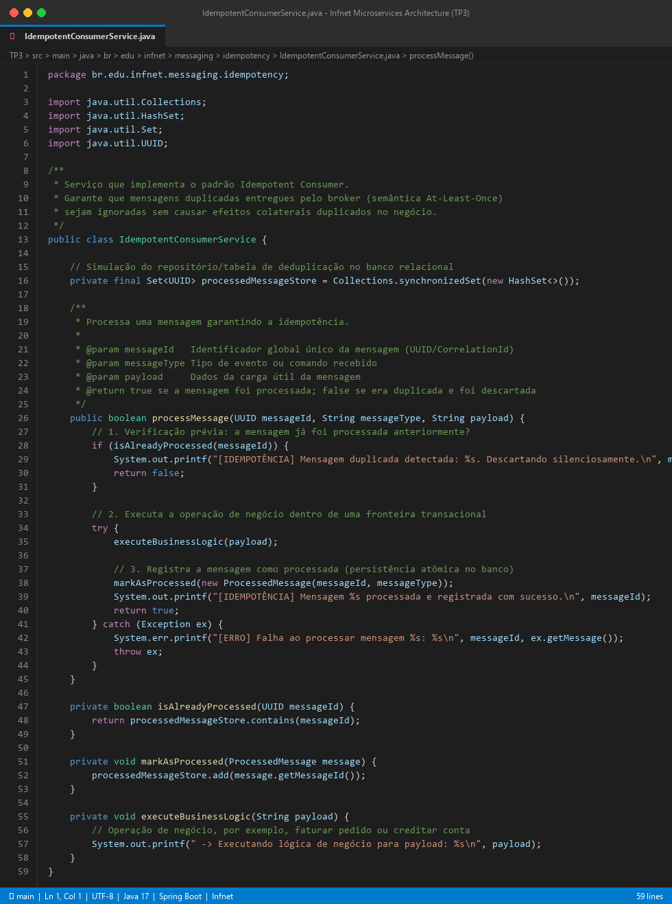
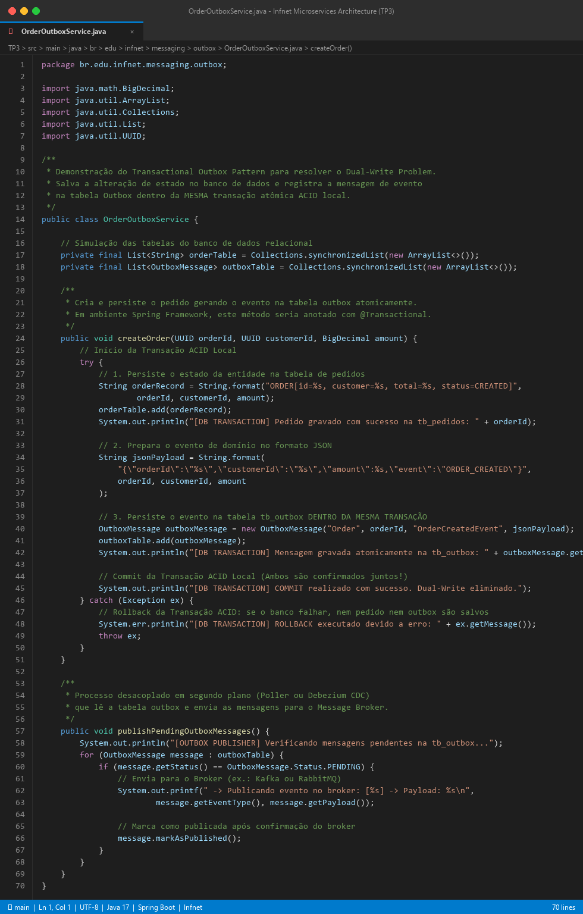
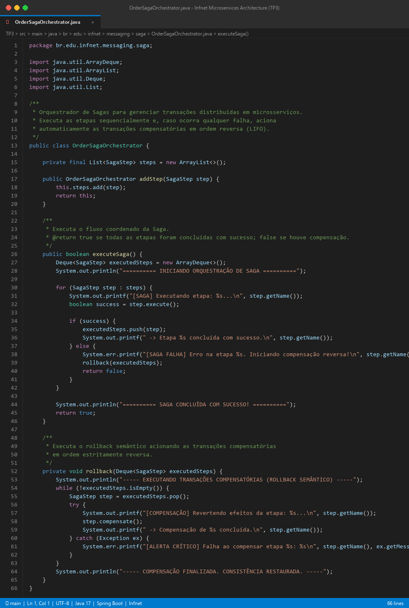

# Trabalho Prático 3 (TP3) - Arquitetura de Microsserviços: Padrões de Comunicação e Mensageria

**Disciplina:** Engenharia Disciplinada de Software / Arquitetura de Microsserviços  
**Aluno:** Marcus Galvão  
**Instituição:** Instituto Infnet  

---

### Questão 1
**Enunciado:** Explique os padrões de comunicação utilizados em uma arquitetura de microsserviços.

**Resposta:**  
Em uma arquitetura monolítica tradicional, os módulos do sistema comunicam-se entre si por meio de chamadas de métodos diretamente na memória do processo (*in-process communication*). Em contrapartida, em uma arquitetura de microsserviços, o sistema é decomposto em múltiplos processos autônomos que operam em nós ou contêineres fisicamente separados. Com isso, a comunicação entre serviços passa a ocorrer obrigatoriamente através da rede (*Inter-Process Communication - IPC*).

Os principais padrões de comunicação entre microsserviços estruturam-se em diferentes dimensões fundamentais:

#### 1. Dimensão Temporal: Síncrona vs. Assíncrona
* **Comunicação Síncrona (Request/Response):** O serviço cliente emite uma solicitação através da rede e permanece bloqueado (ou com uma thread dedicada em espera) aguardando o retorno da resposta pelo serviço de destino antes de prosseguir com seu fluxo de execução. Exemplos: **HTTP/REST** (com payloads JSON/XML), **gRPC** (com serialização binária Protocol Buffers sobre HTTP/2) e **GraphQL**.
* **Comunicação Assíncrona (Event-driven / Message-driven):** O serviço remetente envia uma mensagem ou evento para a infraestrutura de rede e retoma imediatamente seu fluxo sem esperar a conclusão do processamento pelo destinatário. O processamento ocorre em momento oportuno pelos serviços consumidores.

#### 2. Dimensão de Cardinalidade: Ponto a Ponto vs. Publicador/Assinante
* **Ponto a Ponto (Point-to-Point / 1-to-1):** Cada solicitação ou mensagem é direcionada e consumida por exatamente um único destinatário. Pode ser implementada via chamadas diretas REST ou por meio de filas exclusivas em um message broker (onde apenas um trabalhador de um pool de consumidores processa cada mensagem).
* **Publicador/Assinante (Publish/Subscribe / 1-to-Many):** Um serviço produtor publica uma mensagem (frequentemente um evento de domínio) em um canal ou tópico compartilhado, e múltiplos serviços consumidores que tenham interesse naquele fato recebem e processam uma cópia independente da mensagem de forma paralela.

#### 3. Dimensão Topológica: Comunicação Direta vs. Intermediada
* **Comunicação Direta (Peer-to-Peer):** Os serviços comunicam-se conectando-se diretamente aos endereços de rede dos pares (frequentemente auxiliados por mecanismos de *Service Discovery* como Consul ou Eureka, e controlados por *API Gateways* e *Service Meshes*).
* **Comunicação Intermediada por Message Broker:** Os serviços não conhecem os endereços de rede uns dos outros. Todas as mensagens são encaminhadas a um intermediário central (*broker* como Apache Kafka ou RabbitMQ), responsável pelo armazenamento temporário, roteamento e garantia de entrega.

---

### Questão 2
**Enunciado:** Qual a diferença entre a comunicação síncrona e a comunicação assíncrona em uma arquitetura de microsserviços?

**Resposta:**  
A diferença fundamental reside no **acoplamento temporal, espacial e de execução** entre o serviço remetente (*produtor*) e o serviço destinatário (*consumidor*):

1. **Bloqueio de Threads e Uso de Recursos:**
   * *Síncrona:* O remetente aloca uma thread de execução e a mantém retida em estado ocioso/bloqueado enquanto aguarda os dados atravessarem a rede, serem processados no destino e retornarem. Se o serviço de destino estiver lento, as threads do remetente esgotam-se rapidamente (*thread starvation*), provocando a indisponibilidade de todo o serviço chamador.
   * *Assíncrona:* O remetente posta a mensagem no buffer de rede ou broker e libera sua thread imediatamente. A latência percebida pelo cliente final limita-se ao tempo de despacho local da mensagem.

2. **Acoplamento Temporal e Disponibilidade:**
   * *Síncrona:* Requer que **ambos os serviços estejam 100% operacionais e disponíveis no exato momento da chamada**. Se o serviço receptor estiver reiniciando, atualizando ou fora do ar, a chamada falha de imediato, a menos que haja tratamento com retries e circuit breakers. A disponibilidade combinada de uma cadeia de $N$ serviços síncronos degrada exponencialmente ($Disponibilidade = D_1 \times D_2 \times \dots \times D_N$).
   * *Assíncrona:* Há **desacoplamento temporal completo**. Se o serviço consumidor estiver temporariamente inoperante, as mensagens aguardam com segurança no broker. Quando o consumidor restabelece sua operação, ele retoma a leitura das mensagens acumuladas sem qualquer perda de dados.

3. **Propagação de Latência em Cascata:**
   * *Síncrona:* As latências individuais de cada serviço chamado em sequência somam-se diretamente na requisição original do usuário.
   * *Assíncrona:* As etapas posteriores são executadas em segundo plano de forma paralela, isolando o tempo de resposta do cliente.

#### Tabela Comparativa: Síncrona vs. Assíncrona

| Característica | Comunicação Síncrona | Comunicação Assíncrona |
|---|---|---|
| **Bloqueio do Emissor** | Sim (bloqueante / thread ocupada aguardando) | Não (não-bloqueante / libera imediatamente) |
| **Acoplamento Temporal** | Alto (ambos devem estar online juntos) | Baixo (totalmente desacoplados no tempo) |
| **Protocolos Comuns** | HTTP/1.1, HTTP/2, REST, gRPC | AMQP, Kafka Protocol, MQTT, STOMP |
| **Resiliência a Falhas** | Frágil (sujeita a falhas em cascata) | Alta (tolerante a quedas temporárias de nós) |
| **Picos de Tráfego** | Pode sobrecarregar o receptor (*overwhelm*) | Amortecidos por buffer (*load leveling*) |
| **Complexidade** | Simples de entender, rastrear e depurar | Maior (consistência eventual, tracing distribuído) |

---

### Questão 3
**Enunciado:** Apresente um exemplo real da diferença da comunicação síncrona e assíncrona em uma arquitetura de microsserviços.

**Resposta:**  
Para ilustrar a diferença prática, analisamos o fluxo de **Finalização de Compra (Checkout) em uma plataforma de E-commerce moderna**:

```
FLUXO SÍNCRONO (Acoplamento Frágil e Latência Acumulada):
[Usuário] ──(HTTP POST /checkout)──► [Serviço Checkout]
                                            │
                                            ├──(HTTP POST)──► [Serviço Pagamento]   (espera 1.2s)
                                            ├──(HTTP POST)──► [Serviço Estoque]     (espera 0.8s)
                                            ├──(HTTP POST)──► [Serviço Fiscal (NF)] (espera 2.5s)
                                            ├──(HTTP POST)──► [Serviço Notificação] (espera 0.9s)
                                            └──(HTTP POST)──► [Serviço Logística]   (espera 1.5s)
Tempo Total de Espera do Usuário: ~6.9 segundos
* Se a SEFAZ ou o Serviço Fiscal falhar, todo o checkout aborta com erro!

────────────────────────────────────────────────────────────────────────────

FLUXO ASSÍNCRONO BASEADO EM MENSAGENS (Desacoplamento e Alta Performance):
[Usuário] ──(HTTP POST /checkout)──► [Serviço Checkout]
                                            │
                                            ├──(HTTP Síncrono)──► [Gateway Cartão] (500ms - aprova crédito)
                                            │
                                            └──(Publica Evento)─► ┌────────────────────────────────┐
                                                                  │ TÓPICO: pedidos-aprovados      │ (Message Broker)
                                                                  └───────┬──────────────┬─────────┘
[Resposta Imediata ao Usuário: HTTP 200 "Pedido Recebido!"]               │              │
                                                       ┌──────────────────┴──┐           │
                                                       ▼                     ▼           ▼
                                              [Serviço Estoque]     [Serviço Fiscal]  [Serviço Logística]
                                              (Reserva itens)      (Emite NF no seu   (Gera etiqueta
                                                                    próprio ritmo)     de despacho)
```

#### 1. Cenário Puramente Síncrono (Anti-pattern quando estendido para todas as etapas):
O usuário clica em "Finalizar Compra". O `Serviço de Checkout` executa chamadas HTTP sequenciais:
1. Chama o `Serviço de Pagamento` para debitar o cartão (espera 1.2s);
2. Chama o `Serviço de Estoque` para baixar os itens (espera 0.8s);
3. Chama o `Serviço Fiscal` para gerar a Nota Fiscal na SEFAZ (espera 2.5s);
4. Chama o `Serviço de Notificação` para enviar o e-mail de confirmação (espera 0.9s);
5. Chama o `Serviço de Logística` para despachar o pedido (espera 1.5s).

*Problemas:* O usuário fica esperando quase **7 segundos** olhando uma tela de carregamento. Se o Serviço Fiscal cair ou a SEFAZ estiver com instabilidade temporária, o checkout falha inteiramente, a compra não é concretizada e o cliente abandona o carrinho.

#### 2. Cenário Assíncrono com Padrão de Mensageria (Arquitetura Recomendada):
1. O `Serviço de Checkout` executa de forma **síncrona apenas o estritamente essencial**: valida os dados e chama o gateway de pagamento para autorizar a transação financeira (resposta em 500ms).
2. Assim que o pagamento é autorizado, o serviço grava o pedido no banco e publica o evento **`PedidoPagoEvent`** em um Message Broker (Kafka ou RabbitMQ).
3. O serviço responde imediatamente ao cliente: **`HTTP 200 OK - Pedido confirmado com sucesso!`**, liberando o usuário em menos de 1 segundo.
4. De forma **assíncrona e em paralelo**, os microsserviços de `Estoque`, `Fiscal`, `Logística` e `Notificações` consom o evento do broker. Se o serviço de emissão fiscal demorar alguns segundos a mais para contatar a SEFAZ, o cliente nem percebe; a mensagem aguarda na fila e a nota é emitida com resiliência total.

---

### Questão 4
**Enunciado:** Explique os tipos de comunicação assíncrona em uma arquitetura de microsserviços.

**Resposta:**  
A comunicação assíncrona manifesta-se através de diferentes padrões arquiteturais, classificados conforme o propósito e o fluxo da informação:

1. **One-Way Messaging (*Fire-and-Forget* / Enviar e Esquecer):**
   * O emissor publica um comando ou notificação em uma fila e prossegue sua execução sem qualquer expectativa de retorno ou confirmação do destinatário.
   * *Uso típico:* Envio de logs de auditoria, métricas de telemetria, indexação em motores de busca (Elasticsearch) ou disparo de webhooks externos.

2. **Publish/Subscribe (Pub/Sub):**
   * Padrão baseado em difusão onde o produtor emite mensagens em um canal compartilhado (*tópico*) sem conhecer a quantidade ou a identidade dos receptores. O broker encarrega-se de replicar cada mensagem para as caixas de entrada de todos os serviços assinantes cadastrados.
   * *Uso típico:* Disseminação de eventos de domínio de negócio (ex.: quando um pedido é faturado, os serviços de rastreamento, contabilidade e CRM são notificados simultaneamente).

3. **Request / Asynchronous Response (Mensageria com Resposta Assíncrona):**
   * O emissor necessita de uma resposta, mas não deseja manter conexões ou sockets de rede bloqueados. Ele posta a requisição em uma fila contendo metadados no cabeçalho: um identificador único da chamada (`CorrelationId`) e o nome da fila de retorno (`ReplyTo`).
   * O destinatário processa a tarefa quando estiver livre e publica o resultado na fila indicada em `ReplyTo`, incluindo o mesmo `CorrelationId`. O emissor consome a resposta de forma desvinculada no tempo, correlacionando-a com a transação original.

4. **Event-Carried State Transfer (ECST):**
   * O produtor publica um evento que contém não apenas o aviso da mudança, mas **todos os dados completos necessários sobre o novo estado da entidade** (*payload rico*).
   * *Vantagem:* Os serviços consumidores atualizam suas próprias réplicas locais de dados sem precisar fazer chamadas síncronas de volta à API do produtor para obter detalhes adicionais, maximizando a autonomia e a resiliência.

5. **Notification Events (Eventos de Notificação):**
   * O evento transmite apenas uma sinalização concisa da ocorrência acompanhada do identificador do recurso (ex.: `{"evento": "PEDIDO_ALTERADO", "pedidoId": "123"}`). Se algum consumidor precisar de informações detalhadas, ele deve consultar a API do microsserviço proprietário da entidade.

---

### Questão 5
**Enunciado:** Explique a comunicação assíncrona em uma arquitetura de microsserviços utilizando o padrão de mensagens.

**Resposta:**  
A comunicação assíncrona baseada no **Padrão de Mensagens** (*Messaging Pattern*) fundamenta-se no envio e recepção de pacotes de dados autocontidos e estruturados denominados **Mensagens**.

Em vez de microsserviços dependerem de acoplamento direto por interfaces de programação ou chamadas remotas de procedimentos (RPC), eles trocam mensagens através de canais de comunicação virtuais. Uma mensagem típica é composta por duas seções fundamentais:

```
┌─────────────────────────────────────────────────────────────────────────────┐
│                            ENVELOPE DA MENSAGEM                             │
├─────────────────────────────────────────────────────────────────────────────┤
│ CABEÇALHO (Headers / Metadados de Roteamento e Governança)                  │
│  - MessageId:      UUID único da mensagem (ex.: a3f1e9b2-...)               │
│  - CorrelationId:  Identificador para rastreamento distribuído (Tracing)    │
│  - Timestamp:      Data/hora exata da geração no produtor                   │
│  - MessageType:    Tipo do evento ou comando (ex.: "OrderCreated")          │
│  - ContentType:    Formato de serialização (ex.: "application/json")        │
├─────────────────────────────────────────────────────────────────────────────┤
│ CORPO (Payload / Carga Útil do Domínio de Negócio)                          │
│  {                                                                          │
│    "orderId": "ORD-98214",                                                  │
│    "customerId": "CUST-410",                                                │
│    "amount": 289.50,                                                        │
│    "items": [ {"sku": "PET-01", "qty": 2, "price": 144.75} ]               │
│  }                                                                          │
└─────────────────────────────────────────────────────────────────────────────┘
```

#### Características Chave do Padrão:
* **Autocontenção:** A mensagem transporta todas as informações necessárias para que o destinatário tome conhecimento da intenção ou fato sem ambiguidades.
* **Desacoplamento de Protocolo e Tecnologia:** O remetente pode ser desenvolvido em Python e o consumidor em Java ou Go. O único contrato compartilhado entre eles é a estrutura formal do esquema de dados da mensagem (JSON Schema, Protobuf ou Apache Avro).
* **Bufferização e Persistência:** A mensagem é entregue ao canal de mensagens e permanece armazenada com segurança até que o consumidor a requisite e confirme o processamento bem-sucedido.

---

### Questão 6
**Enunciado:** Explique a comunicação assíncrona em uma arquitetura de microsserviços utilizando um message broker.

**Resposta:**  
O **Message Broker** (Corretor de Mensagens) atua como um componente de infraestrutura central (*middleware*) responsável pela recepção, validação, armazenamento em buffer, roteamento inteligente e despacho confiável de mensagens entre múltiplos microsserviços independentes.

Em uma arquitetura com Message Broker:
1. **Papel de Intermediário Confiável:** Os microsserviços produtores nunca enviam dados diretamente para os endereços IP dos serviços consumidores. Toda mensagem é despachada para o broker, que atua como uma fronteira de desacoplamento.
2. **Canais de Roteamento (Filas e Tópicos):**
   * O broker provê **Filas (*Queues*)**, que entregam mensagens para apenas um consumidor dentre vários trabalhadores concorrentes (modelo de distribuição de carga de trabalho - *Work Queue*).
   * O broker provê **Tópicos (*Topics/Exchanges*)**, que implementam o modelo Publish/Subscribe, transmitindo cópias das mensagens para diferentes filas inscritas de acordo com critérios de filtragem ou chaves de roteamento (*routing keys*).
3. **Mecanismo de Confirmação de Entrega (Acks/Nacks):**
   * O consumidor só tem a mensagem removida da fila do broker quando envia um sinal explícito de confirmação de sucesso (**ACK** - *Acknowledgement*).
   * Se o consumidor falhar durante o processamento (queda do servidor ou exceção de banco), a mensagem não é perdida: o broker detecta a perda de conexão, gera um **NACK** (*Negative Acknowledgement*) e reatribui a mensagem para outra instância saudável do microsserviço.
4. **Dead Letter Queues (DLQ):**
   * Mensagens que falham sucessivamente após um número configurado de tentativas (*poison messages*) são automaticamente desviadas para uma fila de cartas mortas (DLQ), impedindo que travem a esteira de processamento dos demais registros normais.

---

### Questão 7
**Enunciado:** Apresente as vantagens e desvantagens da comunicação assíncrona em uma arquitetura de microsserviços utilizando um message broker.

**Resposta:**  

#### Vantagens:
1. **Desacoplamento Espacial e Temporal Completo:** Emissores e receptores não precisam conhecer a localização física uns dos outros nem estar operacionais no mesmo instante de tempo.
2. **Nivelamento de Carga (*Load Leveling / Traffic Smoothing*):** Durante picos sazonais imprevistos (ex.: Black Friday), o broker atua como um pulmão de armazenamento elástico. O volume massivo de requisições acumula-se no buffer do broker, permitindo que os microsserviços consumidores continuem trabalhando na sua taxa máxima de vazão suportada, sem colapsar sob sobrecarga (*backpressure*).
3. **Alta Resiliência e Tolerância a Falhas:** Falhas transientes de infraestrutura, bancos de dados em manutenção ou manutenções programadas de serviços não causam perda de mensagens nem quebra no serviço produtor.
4. **Escalabilidade Horizontal Elástica:** Para aumentar o poder de processamento de uma fila saturada, basta instanciar novos contêineres do microsserviço consumidor sem alterar qualquer linha de código ou configuração no serviço produtor.
5. **Evolução Independente e Novos Consumidores Livres:** Novos microsserviços podem ser conectados para consumir os mesmos tópicos já existentes sem impacto ou necessidade de refatoração nos serviços emissores.

#### Desvantagens:
1. **Complexidade Operacional de Infraestrutura:** A adição de clusters de brokers (Kafka, RabbitMQ) exige monitoramento de alta disponibilidade, replicação de nós, dimensionamento de storage em disco, gerenciamento de partições e manutenção contínua.
2. **Adoção Obrigatória de Consistência Eventual:** As alterações propagadas assincronamente não se refletem instantaneamente em todos os bancos de dados dos serviços. Há uma janela de latência de sincronização, onde dados recém-gravados podem não ser imediatamente visíveis em consultas de outros nós (*eventual consistency*).
3. **Dificuldade de Depuração e Observabilidade:** Rastrear uma transação distribuída que transita por 5 tópicos e múltiplos consumidores assíncronos é muito mais difícil do que debugar uma pilha de chamadas síncrona, exigindo soluções corporativas de Tracing Distribuído (como OpenTelemetry, Jaeger ou Zipkin).
4. **Risco de Mensagens Duplicadas e Reordenação:** Falhas temporárias de confirmação de entrega de rede podem acarretar reentregas de mensagens pelo broker, obrigando a equipe a implementar lógica rígida de idempotência em todos os nós consumidores.

---

### Questão 8
**Enunciado:** Dê exemplos de, pelo menos, três message brokers de código aberto. Explique o funcionamento e as vantagens de um deles.

**Resposta:**  

#### Três Exemplos de Message Brokers de Código Aberto (Open Source):
1. **Apache Kafka**
2. **RabbitMQ**
3. **Apache Pulsar** (ou **Apache ActiveMQ**)

---

#### Detalhamento Aprofundado: Apache Kafka

```
ARQUITETURA DO APACHE KAFKA:
                                 TÓPICO: pedidos
            ┌────────────────────────────────────────────────────────┐
            │ PARTIÇÃO 0: [msg 0][msg 1][msg 2][msg 3][msg 4]...     │ ◄── Consumidor A (Instância 1)
            ├────────────────────────────────────────────────────────┤
PRODUTORES  │ PARTIÇÃO 1: [msg 0][msg 1][msg 2][msg 3]...            │ ◄── Consumidor B (Instância 2)
 ───────►   ├────────────────────────────────────────────────────────┤
            │ PARTIÇÃO 2: [msg 0][msg 1][msg 2][msg 3][msg 4]...     │ ◄── Consumidor C (Instância 3)
            └────────────────────────────────────────────────────────┘
                    ▲
            Commit Log Imutável Gravado em Disco Sequencial
```

##### 1. Princípio de Funcionamento:
* **Log de Eventos Distribuído e Imutável (*Distributed Commit Log*):** Ao contrário dos brokers tradicionais de filas onde as mensagens são apagadas após a entrega, o Kafka armazena mensagens em arquivos de log em disco ordenados de forma estritamente sequencial (*append-only*).
* **Tópicos, Partições e Offsets:** Cada **Tópico** é dividido em múltiplas **Partições**, distribuídas pelos servidores (*Brokers*) do cluster. Cada mensagem em uma partição recebe um identificador monotônico contínuo chamado **Offset**.
* **Modelo Pull de Consumo:** Os consumidores (agrupados em *Consumer Groups*) ativamente realizam requisições de leitura (*pull*) no seu próprio ritmo e guardam a posição do ponteiro do offset que já processaram. O broker não rastreia individualmente quais clientes já leram cada registro.
* **Retenção Configurável:** As mensagens permanecem armazenadas no disco durante um tempo determinado (ex.: 7 dias) ou limite de tamanho, independentemente de já terem sido lidas.

##### 2. Principais Vantagens do Apache Kafka:
* **Capacidade de Throughput Massivo:** Capaz de processar centenas de milhares a milhões de eventos por segundo com latência na faixa de milissegundos, utilizando otimizações do kernel Linux (operações sequenciais em disco, *page cache* de memória e chamada de sistema *zero-copy* via `sendfile`).
* **Capacidade de Replay de Histórico (*Time-Travel*):** Caso um microsserviço consumidor sofra um bug em produção, ele pode ser corrigido e simplesmente "voltar no tempo" redefinindo seu *offset* para processar novamente todas as mensagens dos últimos dias.
* **Escalabilidade Horizontal Nativa:** A adição de novas partições e nós no cluster divide uniformemente o tráfego de leitura e gravação entre centenas de máquinas.
* **Garantia Estrita de Ordenação:** Dentro de uma mesma partição, a ordem dos eventos é 100% garantida pelo log sequencial.

---

### Questão 9
**Enunciado:** Dê um exemplo de message broker oferecido por um provedor de nuvem. Explique o seu funcionamento e suas vantagens.

**Resposta:**  

#### Exemplo em Nuvem: AWS SQS (Simple Queue Service) e AWS SNS (Simple Notification Service)
Na Amazon Web Services (AWS), o padrão ouro corporativo para mensageria assíncrona é a combinação de **AWS SNS** e **AWS SQS**, implementando a arquitetura clássica de **SNS + SQS Fan-Out**:

```
PADRÃO AWS SNS + SQS FAN-OUT (Totalmente Serverless):
                                                ┌───────────────────────┐
                                      ┌────────►│ FILA SQS: faturamento │──► [Serviço Faturamento]
                                      │         └───────────────────────┘
┌────────────────┐     ┌──────────────┴───┐
│ Produtor       │────►│ TÓPICO AWS SNS   │
│ (Microsserviço)│     │ "pedido-criado"  │
└────────────────┘     └──────────────┬───┘
                                      │         ┌───────────────────────┐
                                      └────────►│ FILA SQS: estoque     │──► [Serviço Estoque]
                                                └───────────────────────┘
```

##### 1. Princípio de Funcionamento:
* **AWS SNS (Pub/Sub):** Atua como o distribuidor central de tópicos. Quando um microsserviço publica um evento no tópico SNS, o serviço replica a mensagem quase instantaneamente para todos os destinos inscritos.
* **AWS SQS (Filas Buffer):** Cada microsserviço consumidor cria sua própria fila SQS durável conectada ao tópico SNS. As mensagens recebidas do SNS ficam gravadas em storage distribuído redundante replicado automaticamente em múltiplas Zonas de Disponibilidade (*Multi-AZ*).
* **Consumo e Visibilidade:** O serviço consumidor busca mensagens da fila através de requisições de *Long Polling*. Quando uma mensagem é lida, ela não é removida de imediato, mas entra em um estado temporário oculto chamado **Visibility Timeout** (ex.: 30 segundos). Se o consumidor processar com êxito, ele envia um comando `DeleteMessage`. Se o consumidor quebrar antes de terminar, o tempo expira e a mensagem volta a ficar visível na fila para ser repassada a outro trabalhador.
* **Dead Letter Queue (DLQ) Integrada:** Se a mensagem atingir um número máximo de tentativas de falha (`maxReceiveCount`), o SQS a move automaticamente para uma DLQ sem necessidade de infraestrutura adicional.

##### 2. Principais Vantagens:
* **Natureza 100% Serverless e Zero Gestão de Servidores:** Não há instâncias EC2, clusters para manter, versões para atualizar, particionamentos manuais ou patches de sistema operacional. A AWS gerencia toda a infraestrutura física e lógica.
* **Escalabilidade Praticamente Infinita Sob Demanda:** Suporta volumes de requisições quase ilimitados por segundo, escalando automaticamente de zero a centenas de milhares de mensagens sem qualquer pré-provisionamento.
* **Alta Disponibilidade e Durabilidade Nativa Multi-AZ:** Cada mensagem gravada no SQS é automaticamente replicada em múltiplos data centers independentes da AWS, garantindo 99.999999999% de durabilidade dos dados contra perdas físicas.
* **Modelo Econômico Pay-As-You-Go:** O custo é cobrado estritamente pelo número de requisições realizadas (com uma franquia mensal gratuita perpétua de 1 milhão de requisições), eliminando custos ociosos de máquinas dedicadas.
* **Integração com o Ecossistema AWS:** Integração transparente com IAM (controle de acesso granular), CloudWatch (métricas operacionais e alarmes) e AWS Lambda (gatilhos assíncronos orientados a eventos).

---

### Questão 10
**Enunciado:** Quais os desafios e as soluções para o processamento concorrente de mensagens para garantir a ordenação das mensagens?

**Resposta:**  

#### Os Desafios da Concorrência na Ordenação:
Em uma arquitetura corporativa distribuída, os microsserviços consumidores operam escalados horizontalmente com múltiplas instâncias concorrentes ou múltiplos threads em execução paralela. Se uma fila tradicional despachar mensagens indistintamente para qualquer consumidor livre:
* A **Mensagem 1** (`PedidoCriado`) é despachada para o *Consumidor A*.
* A **Mensagem 2** (`PedidoCancelado`) é despachada um milissegundo depois para o *Consumidor B*.
* Se o *Consumidor A* sofrer uma pausa de coleta de lixo (*Garbage Collection*), latência de I/O em disco ou disputa de conexão de banco, o *Consumidor B* pode concluir o processamento da Mensagem 2 **antes** que a Mensagem 1 termine.
* *Resultado:* O sistema tenta cancelar um pedido que formalmente ainda "não existe" no banco de dados e, logo em seguida, recria o pedido como ativo, gerando inconsistência crítica no negócio.

#### As Soluções Arquiteturais:

##### 1. Particionamento Determinístico por Chave de Negócio (*Partition Key / Sharding*)
A solução definitiva adotada em brokers modernos como **Apache Kafka** e **AWS SQS FIFO**:
* O serviço produtor define obrigatoriamente uma **Chave de Partição (*Partition Key*)** ligada à identidade da entidade de negócio (por exemplo: `orderId` ou `customerId`).
* O broker aplica um algoritmo de dispersão matemática determinístico (como MurmurHash2):
$$\text{Partição Destino} = \text{hash}(\text{PartitionKey}) \pmod{\text{Total de Partições}}$$
* **Garantia:** Todas as mensagens referentes ao **mesmo pedido** cairão garantidamente na **mesma partição física** do tópico, em ordem cronológica estrita.
* Como cada partição é lida por exatamente um único consumidor ativo de cada vez, as mensagens daquela entidade são processadas estritamente em sequência, eliminando corridas concorrentes.
* Simultaneamente, mensagens de outros pedidos com chaves diferentes caem em outras partições e continuam sendo processadas concorrentemente em paralelo, unindo **ordenação absoluta por entidade e alta escalabilidade global**.

##### 2. Versionamento Lógico das Entidades (*State Versioning*)
* Cada mensagem emitida carrega um número de sequência monotônico (`version=1`, `version=2`, ...).
* Ao receber uma mensagem, o consumidor consulta a versão atual da entidade no banco:
  * Se a mensagem recebida tiver versão $\text{versao\_banco} + 1$, ela é aceita e aplicada.
  * Se a versão for posterior (ex.: recebeu a versão 3 quando o banco ainda está na versão 1), o consumidor rejeita temporariamente a mensagem ou a coloca em um buffer de espera (*staging area*), aguardando a chegada da mensagem intermediária faltante.

##### 3. Filas com Consumidor Exclusivo Ativo (*Single Active Consumer*)
* No RabbitMQ, pode-se habilitar a funcionalidade *Single Active Consumer*. Mesmo havendo várias instâncias conectadas à fila para fins de redundância (*failover*), apenas uma instância consome as mensagens por vez sequencialmente.

---

### Questão 11
**Enunciado:** Quais os desafios e as soluções para o processamento concorrente de mensagens para o tratamento de mensagens duplicadas?

**Resposta:**  

#### Os Desafios das Mensagens Duplicadas:
Em sistemas de redes distribuídas sob o Teorema CAP, falhas de conectividade física, timeouts e rebalanceamentos de nós são inevitáveis. Por essa razão, os message brokers de alto desempenho adotam por padrão a garantia de entrega **At-Least-Once** (pelo menos uma vez):
* Se um consumidor processa uma mensagem com sucesso no banco de dados, mas a conexão de rede cai **uma fração de segundo antes** que o ACK de confirmação chegue ao broker, o broker assume que o consumidor morreu sem concluir o trabalho.
* O broker imediatamente reentrega a mesma mensagem para outro nó ou para o mesmo nó assim que ele reconecta.
* *Impacto catastrófico sem tratamento:* Cobrança dupla no cartão de crédito do cliente, duas notas fiscais emitidas para o mesmo pedido ou duplicação de pontos de fidelidade.

#### As Soluções Arquiteturais:

##### 1. O Padrão Consumidor Idempotente (*Idempotent Consumer Pattern*)
Uma operação é dita **idempotente** quando sua execução repetida múltiplas vezes produz exatamente o mesmo resultado e estado do sistema que uma única execução.

A implementação clássica baseia-se no uso de uma **Tabela de Mensagens Processadas** (*Deduplication Store*) no banco de dados relacional:
1. Toda mensagem carrega no seu cabeçalho um identificador único universal (**MessageId** / UUID), atribuído na sua criação pelo produtor.
2. Ao receber a mensagem, o consumidor abre uma transação local no banco de dados e consulta a tabela `tb_processed_messages`.
3. Se o `message_id` já estiver registrado, o consumidor detecta a duplicata e descarta o processamento de imediato, enviando o ACK ao broker.
4. Se o `message_id` for inédito, a rotina executa as operações de negócio e insere o novo ID na tabela `tb_processed_messages` **dentro da mesma transação ACID**, protegida por uma restrição `PRIMARY KEY` ou `UNIQUE(message_id)`. Se duas threads concorrentes tentarem processar a mesma mensagem simultaneamente, uma delas sofrerá uma violação de chave primária e sofrerá rollback seguro.

##### 2. Modelagem de Operações de Negócio Comutativas e Baseadas em Estado
* Em vez de modelar eventos como instruções de delta (ex.: `adicionar_pontos(50)`), modela-se o evento como afirmação de estado absoluto ou comutativo (ex.: `definir_saldo_para(150)` ou `definir_status_como('FATURADO')`). Aplicar essa instrução uma ou cinco vezes resulta no mesmo estado final no banco de dados.

---

#### Implementação de Código Java e Print de Tela da IDE

Abaixo apresentamos a implementação da entidade `ProcessedMessage` e do serviço `IdempotentConsumerService` desenvolvidos para garantir a idempotência no processamento assíncrono:

```java
package br.edu.infnet.messaging.idempotency;

import java.util.Collections;
import java.util.HashSet;
import java.util.Set;
import java.util.UUID;

/**
 * Serviço que implementa o padrão Idempotent Consumer.
 * Garante que mensagens duplicadas entregues pelo broker (semântica At-Least-Once)
 * sejam ignoradas sem causar efeitos colaterais duplicados no negócio.
 */
public class IdempotentConsumerService {

    // Simulação do repositório/tabela de deduplicação no banco relacional
    private final Set<UUID> processedMessageStore = Collections.synchronizedSet(new HashSet<>());

    /**
     * Processa uma mensagem garantindo a idempotência.
     *
     * @param messageId   Identificador global único da mensagem (UUID/CorrelationId)
     * @param messageType Tipo de evento ou comando recebido
     * @param payload     Dados da carga útil da mensagem
     * @return true se a mensagem foi processada; false se era duplicada e foi descartada
     */
    public boolean processMessage(UUID messageId, String messageType, String payload) {
        // 1. Verificação prévia: a mensagem já foi processada anteriormente?
        if (isAlreadyProcessed(messageId)) {
            System.out.printf("[IDEMPOTÊNCIA] Mensagem duplicada detectada: %s. Descartando silenciosamente.\n", messageId);
            return false;
        }

        // 2. Executa a operação de negócio dentro de uma fronteira transacional
        try {
            executeBusinessLogic(payload);

            // 3. Registra a mensagem como processada (persistência atômica no banco)
            markAsProcessed(new ProcessedMessage(messageId, messageType));
            System.out.printf("[IDEMPOTÊNCIA] Mensagem %s processada e registrada com sucesso.\n", messageId);
            return true;
        } catch (Exception ex) {
            System.err.printf("[ERRO] Falha ao processar mensagem %s: %s\n", messageId, ex.getMessage());
            throw ex;
        }
    }

    private boolean isAlreadyProcessed(UUID messageId) {
        return processedMessageStore.contains(messageId);
    }

    private void markAsProcessed(ProcessedMessage message) {
        processedMessageStore.add(message.getMessageId());
    }

    private void executeBusinessLogic(String payload) {
        // Operação de negócio, por exemplo, faturar pedido ou creditar conta
        System.out.printf(" -> Executando lógica de negócio para payload: %s\n", payload);
    }
}
```

##### Captura de Tela da IDE com o Código-Fonte:


*Caminho do arquivo local:* `TP3/src/main/java/br/edu/infnet/messaging/idempotency/IdempotentConsumerService.java`

---

### Questão 12
**Enunciado:** Quais os desafios e as soluções para o tratamento de transações de mensagens em bancos de dados em uma arquitetura de microsserviços?

**Resposta:**  

#### O Desafio Crítico do "Dual-Write Problem":
Em microsserviços orientados a eventos, uma operação comum exige duas etapas contíguas:
1. Atualizar o estado de uma entidade no banco de dados local (ex.: salvar um novo pedido na tabela `tb_pedidos`).
2. Publicar um evento informando a criação no Message Broker (ex.: enviar `PedidoCriadoEvent` ao Kafka/RabbitMQ).

Como o banco de dados e o broker são sistemas distribuídos heterogêneos e independentes, **não é possível compartilhar uma transação atômica ACID local tradicional entre eles**. Isso gera o dilema do **Dual-Write**:
* *Se comitar no banco de dados primeiro:* A transação do banco conclui com sucesso, mas o servidor ou o broker falham antes da publicação da mensagem. O dado existe no banco, mas nenhum outro microsserviço fica sabendo do evento (**evento perdido permanentemente**).
* *Se publicar no broker primeiro:* O evento é entregue ao broker e os outros microsserviços iniciam ações subsequentes (como emissão de nota ou débito em conta). No entanto, o banco de dados local falha ao persistir a entidade devido a uma violação de chave ou queda do servidor. O sistema agora reage a um "pedido fantasma" que nunca existiu no banco (**inconsistência catastrófica**).
* *Por que não usar 2PC (Two-Phase Commit / XA)?* O protocolo de commit em duas fases é extremamente lento, bloqueante, reduz drasticamente a disponibilidade do sistema e não é suportado pela maioria dos brokers modernos de alto desempenho.

```
O DILEMA DO DUAL-WRITE:
                     ┌───────────────────────────────┐
                     │     Microsserviço Pedidos     │
                     └───────┬───────────────┬───────┘
                             │               │
               (Operação 1)  │               │  (Operação 2)
              Gravar no Banco│               │Publicar Mensagem
                             ▼               ▼
                   ┌────────────────┐  ┌──────────────┐
                   │ BANCO DE DADOS │  │MESSAGE BROKER│
                   │     LOCAL      │  │ (Kafka/Queue)│
                   └────────────────┘  └──────────────┘
            * Se uma operação falhar e a outra passar: DADOS CORROMPIDOS!
```

#### A Solução Corporativa Definitiva: O Padrão Transactional Outbox (*Outbox Pattern*)
A solução consagrada na engenharia de software distribuída consiste em eliminar a escrita direta no broker durante a requisição de negócio:

1. Cria-se uma tabela auxiliar no mesmo banco de dados relacional chamada **`tb_outbox`**.
2. Quando a operação de negócio ocorre, a entidade do domínio (ex.: `Pedido`) e a representação do evento (serializado em JSON) são inseridas na tabela `tb_outbox` **DENTRO DA MESMA TRANSAÇÃO ACID LOCAL DO BANCO**.
3. Como ambas as gravações ocorrem no mesmo banco relacional, o princípio da **Atomicidade (ACID)** aplica-se: ou ambos são gravados com sucesso, ou ambos sofrem rollback completo.
4. Um processo separado e desacoplado publica as mensagens com segurança no Message Broker através de uma das duas estratégias:
   * **Outbox Poller / Scheduler:** Um worker em background consulta periodicamente mensagens com status `PENDING` na tabela `tb_outbox`, envia para o broker e marca como `PUBLISHED`.
   * **Change Data Capture (CDC - ex.: Debezium):** O motor de CDC monitora diretamente o log de transações em disco do banco de dados (Write-Ahead Log no PostgreSQL ou Binlog no MySQL) e publica as mudanças automaticamente no broker sem gerar qualquer overhead de consultas SQL na aplicação.

---

#### Implementação de Código Java e Print de Tela da IDE

Abaixo está a implementação das classes `OutboxMessage` e `OrderOutboxService` demonstrando a gravação atômica ACID da entidade e do evento na mesma transação:

```java
package br.edu.infnet.messaging.outbox;

import java.math.BigDecimal;
import java.util.ArrayList;
import java.util.Collections;
import java.util.List;
import java.util.UUID;

/**
 * Demonstração do Transactional Outbox Pattern para resolver o Dual-Write Problem.
 * Salva a alteração de estado no banco de dados e registra a mensagem de evento
 * na tabela Outbox dentro da MESMA transação atômica ACID local.
 */
public class OrderOutboxService {

    // Simulação das tabelas do banco de dados relacional
    private final List<String> orderTable = Collections.synchronizedList(new ArrayList<>());
    private final List<OutboxMessage> outboxTable = Collections.synchronizedList(new ArrayList<>());

    /**
     * Cria e persiste o pedido gerando o evento na tabela outbox atomicamente.
     * Em ambiente Spring Framework, este método seria anotado com @Transactional.
     */
    public void createOrder(UUID orderId, UUID customerId, BigDecimal amount) {
        // Início da Transação ACID Local
        try {
            // 1. Persiste o estado da entidade na tabela de pedidos
            String orderRecord = String.format("ORDER[id=%s, customer=%s, total=%s, status=CREATED]", 
                    orderId, customerId, amount);
            orderTable.add(orderRecord);
            System.out.println("[DB TRANSACTION] Pedido gravado com sucesso na tb_pedidos: " + orderId);

            // 2. Prepara o evento de domínio no formato JSON
            String jsonPayload = String.format(
                "{\"orderId\":\"%s\",\"customerId\":\"%s\",\"amount\":%s,\"event\":\"ORDER_CREATED\"}",
                orderId, customerId, amount
            );

            // 3. Persiste o evento na tabela tb_outbox DENTRO DA MESMA TRANSAÇÃO
            OutboxMessage outboxMessage = new OutboxMessage("Order", orderId, "OrderCreatedEvent", jsonPayload);
            outboxTable.add(outboxMessage);
            System.out.println("[DB TRANSACTION] Mensagem gravada atomicamente na tb_outbox: " + outboxMessage.getId());

            // Commit da Transação ACID Local (Ambos são confirmados juntos!)
            System.out.println("[DB TRANSACTION] COMMIT realizado com sucesso. Dual-Write eliminado.");
        } catch (Exception ex) {
            // Rollback da Transação ACID: se o banco falhar, nem pedido nem outbox são salvos
            System.err.println("[DB TRANSACTION] ROLLBACK executado devido a erro: " + ex.getMessage());
            throw ex;
        }
    }

    /**
     * Processo desacoplado em segundo plano (Poller ou Debezium CDC)
     * que lê a tabela outbox e envia as mensagens para o Message Broker.
     */
    public void publishPendingOutboxMessages() {
        System.out.println("[OUTBOX PUBLISHER] Verificando mensagens pendentes na tb_outbox...");
        for (OutboxMessage message : outboxTable) {
            if (message.getStatus() == OutboxMessage.Status.PENDING) {
                // Envia para o Broker (ex.: Kafka ou RabbitMQ)
                System.out.printf(" -> Publicando evento no broker: [%s] -> Payload: %s\n", 
                        message.getEventType(), message.getPayload());
                
                // Marca como publicada após confirmação do broker
                message.markAsPublished();
            }
        }
    }
}
```

##### Captura de Tela da IDE com o Código-Fonte:


*Caminho do arquivo local:* `TP3/src/main/java/br/edu/infnet/messaging/outbox/OrderOutboxService.java`

---

### Questão 13
**Enunciado:** Quais os problemas relacionados ao uso de banco de dados em uma arquitetura de microsserviços assíncronos?

**Resposta:**  
Ao transicionar de um monólito para microsserviços assíncronos, o princípio básico da arquitetura exige o padrão **Database-per-Service** (cada microsserviço possui seu próprio banco de dados isolado e inacessível diretamente por outros nós). Essa descentralização traz severos desafios de engenharia de dados:

1. **Perda das Garantias de Transações ACID Globais:**
   * Em bancos relacionais unificados, operações complexas envolvendo clientes, pedidos, faturas e estoque executam sob um único bloco `BEGIN TRANSACTION ... COMMIT`. Em microsserviços assíncronos com bancos heterogêneos (ex.: Postgres no Faturamento, MongoDB no Catálogo e Cassandra na Logística), transações globais atômicas são inviáveis.

2. **Inconsistência Temporária e Atrasos de Propagação (*Lag* de Consistência Eventual):**
   * Como a comunicação ocorre por mensagens enfileiradas, há um intervalo temporal mensurável entre o instante em que um dado é gravado no banco de origem e a atualização reflexa nos bancos dos microsserviços downstream.
   * *O problema do Read-Your-Own-Writes:* Um cliente pode criar um pedido com sucesso e, imediatamente na tela seguinte, consultar a lista de pedidos e não vê-lo, pois a mensagem de projeção ainda está no meio do buffer do broker.

3. **Impossibilidade de Consultas Relacionais Complexas (*JOINs* Distribuídos):**
   * Operações cotidianas de negócios (como gerar relatórios de "pedidos com dados cadastrais do cliente e status da transportadora") não podem mais ser resolvidas com um `SELECT ... JOIN`. Os dados estão distribuídos em esquemas e servidores totalmente distintos.
   * *Mitigação:* Exige a adoção de padrões arquiteturais avançados como **API Composition** (agregação de chamadas síncronas em memória) ou **CQRS (Command Query Responsibility Segregation)**, onde eventos assíncronos alimentam um banco de leitura desnormalizado e otimizado para consultas (ex.: Elasticsearch).

4. **Gerenciamento Complexo de Falhas Parciais:**
   * Se um fluxo assíncrono envolve 4 microsserviços e a gravação falha no quarto serviço, as gravações nos três primeiros já foram comitadas em seus respectivos bancos de dados. Como o banco de dados não tem conhecimento das operações externas, o rollback nativo é impossível, exigindo fluxos manuais ou automatizados de compensação.

5. **Evolução Descentralizada e Versionamento de Schemas:**
   * Alterações estruturais em tabelas e esquemas de dados refletem em mudanças no payload das mensagens emitidas. Se um serviço consumidor defasado não souber desserializar o novo esquema, o banco do consumidor é corrompido ou o consumo é interrompido (*poison message*), exigindo o uso de Schema Registries (ex.: Confluent Schema Registry com Apache Avro).

---

### Questão 14
**Enunciado:** Explique o gerenciamento de transações utilizando o padrão Sagas para manter a consistência dos dados em uma arquitetura de microsserviços assíncronos.

**Resposta:**  

#### O Conceito Fundamental do Padrão SAGAS:
O padrão **Saga** é o mecanismo padrão da indústria para garantir a consistência eventual de dados em transações de negócios que abrangem múltiplos microsserviços, sem recorrer a bloqueios distribuídos ou protocolos pesados de duas fases (2PC).

Uma Saga é modelada como uma **sequência ordenada de transações locais**:
* Cada etapa da Saga atualiza os dados no banco de dados local de um microsserviço e emite uma mensagem ou evento assíncrono.
* Essa mensagem dispara o início da transação local no microsserviço seguinte.

#### Transações Compensatórias (*Rollback Semântico*):
Em uma transação de banco de dados ACID tradicional, se um erro ocorre, executa-se o `ROLLBACK` automático e a memória/disco é revertida ao estado inicial. No padrão Sagas, como cada transação local já comitou suas alterações no seu respectivo banco, o rollback físico tradicional é impossível.

Para contornar isso, a Saga utiliza o conceito de **Transação Compensatória**:
* Para cada etapa que altera dados ($T_i$), deve existir uma transação compensatória correspondente ($C_i$) capaz de **desfazer semanticamente** as modificações causadas por $T_i$.
* Se a etapa $N$ falhar (ex.: pagamento recusado), a Saga interrompe o fluxo de avanço e executa as transações compensatórias em **ordem estritamente reversa (LIFO)** ($C_{N-1}, C_{N-2}, \dots, C_1$).
* *Exemplo Semântico:* Se a transação $T_1$ reservou o estoque de um produto e a transação $T_2$ falhou ao processar o pagamento, a compensação $C_1$ executa uma instrução que **estorna a reserva**, devolvendo os itens ao saldo do estoque.

```
FLUXO DE UMA SAGA COM FALHA E TRANSAÇÕES COMPENSATÓRIAS:
  [Etapa 1: Criar Pedido]      ──► Sucesso (T1 comitada)
             │
  [Etapa 2: Reservar Estoque]  ──► Sucesso (T2 comitada)
             │
  [Etapa 3: Processar Cartão]  ──► FALHA! (Saldo Insuficiente)
             │
    DISPARO DO ROLLBACK SEMÂNTICO EM ORDEM REVERSA:
             │
  [Compensar Etapa 2]          ──► Executa C2: Desfaz reserva de estoque
             │
  [Compensar Etapa 1]          ──► Executa C1: Marca pedido como cancelado
             │
     CONSISTÊNCIA DE DADOS RESTAURADA EM TODOS OS MICROSSERVIÇOS!
```

#### As Duas Abordagens de Implementação:

##### 1. Saga por Coreografia (*Choreography-based Saga*)
* **Funcionamento:** Não existe um coordenador central. Cada microsserviço ouve os eventos emitidos pelos pares e decide autonomamente executar sua transação local e emitir seus próprios eventos em cadeia.
* **Vantagens:** Simplicidade de início, ausência de ponto único de falha no fluxo, adequado para fluxos simples com apenas 2 a 3 etapas.
* **Desvantagens:** Alto risco de dependências cíclicas à medida que o sistema cresce; extrema dificuldade de visualizar, depurar e auditar o fluxo global do negócio.

##### 2. Saga por Orquestração (*Orchestration-based Saga*)
* **Funcionamento:** Um microsserviço especializado atua como o **Orquestrador da Saga** (frequentemente implementado como uma Máquina de Estados Finita). O orquestrador envia comandos assíncronos diretamente aos microsserviços participantes, processa as respostas de conclusão e, em caso de erro, comanda a execução das transações compensatórias em ordem reversa.
* **Vantagens:** Centralização da lógica de negócios complexa, clareza total do estado atual da transação, facilidade de implementação de timeouts, retries e auditoria corporativa.
* **Desvantagens:** Risco de centralizar regras excessivas de negócio no orquestrador caso os participantes sejam reduzidos a meros executores anêmicos.

---

#### Implementação de Código Java e Print de Tela da IDE

Abaixo apresentamos a implementação da interface `SagaStep` e do orquestrador `OrderSagaOrchestrator`, contendo o fluxo de avanço coordenado e o rollback automático por transações compensatórias em ordem reversa:

```java
package br.edu.infnet.messaging.saga;

import java.util.ArrayDeque;
import java.util.ArrayList;
import java.util.Deque;
import java.util.List;

/**
 * Orquestrador de Sagas para gerenciar transações distribuídas em microsserviços.
 * Executa as etapas sequencialmente e, caso ocorra qualquer falha, aciona
 * automaticamente as transações compensatórias em ordem reversa (LIFO).
 */
public class OrderSagaOrchestrator {

    private final List<SagaStep> steps = new ArrayList<>();

    public OrderSagaOrchestrator addStep(SagaStep step) {
        this.steps.add(step);
        return this;
    }

    /**
     * Executa o fluxo coordenado da Saga.
     * @return true se todas as etapas foram concluídas com sucesso; false se houve compensação.
     */
    public boolean executeSaga() {
        Deque<SagaStep> executedSteps = new ArrayDeque<>();
        System.out.println("========== INICIANDO ORQUESTRAÇÃO DE SAGA ==========");

        for (SagaStep step : steps) {
            System.out.printf("[SAGA] Executando etapa: %s...\n", step.getName());
            boolean success = step.execute();

            if (success) {
                executedSteps.push(step);
                System.out.printf(" -> Etapa %s concluída com sucesso.\n", step.getName());
            } else {
                System.err.printf("[SAGA FALHA] Erro na etapa %s. Iniciando compensação reversa!\n", step.getName());
                rollback(executedSteps);
                return false;
            }
        }

        System.out.println("========== SAGA CONCLUÍDA COM SUCESSO! ==========");
        return true;
    }

    /**
     * Executa o rollback semântico acionando as transações compensatórias
     * em ordem estritamente reversa.
     */
    private void rollback(Deque<SagaStep> executedSteps) {
        System.out.println("----- EXECUTANDO TRANSAÇÕES COMPENSATÓRIAS (ROLLBACK SEMÂNTICO) -----");
        while (!executedSteps.isEmpty()) {
            SagaStep step = executedSteps.pop();
            try {
                System.out.printf("[COMPENSAÇÃO] Revertendo efeitos da etapa: %s...\n", step.getName());
                step.compensate();
                System.out.printf(" -> Compensação de %s concluída.\n", step.getName());
            } catch (Exception ex) {
                System.err.printf("[ALERTA CRÍTICO] Falha ao compensar etapa %s: %s\n", step.getName(), ex.getMessage());
            }
        }
        System.out.println("----- COMPENSAÇÃO FINALIZADA. CONSISTÊNCIA RESTAURADA. -----");
    }
}
```

##### Captura de Tela da IDE com o Código-Fonte:


*Caminho do arquivo local:* `TP3/src/main/java/br/edu/infnet/messaging/saga/OrderSagaOrchestrator.java`

---

### Referência aos Códigos-Fonte do Trabalho
Todos os códigos implementados encontram-se estruturados sob o diretório do projeto para abertura na IDE e versionamento no repositório Git:
* **Questão 11 (Idempotência de Mensagens):**
  * `TP3/src/main/java/br/edu/infnet/messaging/idempotency/ProcessedMessage.java`
  * `TP3/src/main/java/br/edu/infnet/messaging/idempotency/IdempotentConsumerService.java`
* **Questão 12 (Transactional Outbox Pattern):**
  * `TP3/src/main/java/br/edu/infnet/messaging/outbox/OutboxMessage.java`
  * `TP3/src/main/java/br/edu/infnet/messaging/outbox/OrderOutboxService.java`
* **Questão 14 (Padrão Sagas com Transações Compensatórias):**
  * `TP3/src/main/java/br/edu/infnet/messaging/saga/SagaStep.java`
  * `TP3/src/main/java/br/edu/infnet/messaging/saga/OrderSagaOrchestrator.java`
